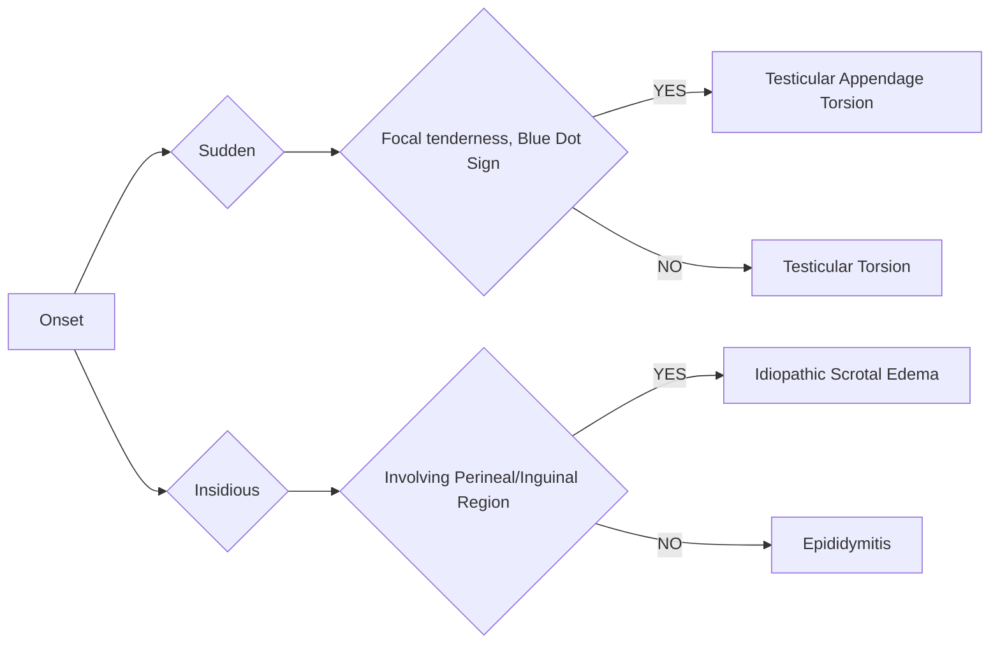

```markdown
# Standard Treatment Workflow (STW)
ACUTE SCROTUM IN CHILDREN

ICD-10-N50.8

Acute painful
swelling of the
scrotum or its
contents.

DEFINITION
Accompanied by
local signs and
general
symptoms

## DIFFERENTIAL DIAGNOSIS OF ACUTE SCROTUM

| PATHOLOGY | FREQUENCY | AGE AT REPRESENTATION |
|-----------------------------------|------------|-----------------------------|
| Extravaginal torsion of testis | Uncommon | Perinatal period |
| Intravaginal torsion of testis | Common | Anytime, peak at 13-16 yrs |
| Testicular appendage torsion | Very Common | Anytime, peak at 11 yrs |
| Epididymitis/Epididymo-orchitis | Rare | 0-6 months |
| Mumps orchitis | Uncommon | Only after puberty |
| Idiopathic scrotal edema | Uncommon | 0-5 yrs |
| Fat necrosis of scrotum | Rare | 5-15 yrs |
| Henoch Schonlein Purpura | Rare | 4-10 yrs |
| Testicular Trauma | Uncommon | Anytime, common in 5-15 yrs |

## PAINFUL SCROTAL SWELLING - DECISION TREE



## DIFFERENTIATING CLINICAL FEATURES

### TORSION TESTIS
*   Sudden onset of pain in testis, lower abdomen or groin
*   Associated with nausea and vomiting
*   Local palpation - Very painful
*   Hemiscrotum - Red and edematous, bluish discoloration (Infarction of testis)
*   Transverse lie of testis
*   Absent cremastric reflex

### TORSION OF TESTICULAR APPENDAGE
*   Sudden onset pain but of less severe degree.
*   A bluish black spot (blue-dot) seen at the upper pole of the testis through the skin
*   Palpation of the testis less painful

### EPIDIDYMITIS/EPIDIDYMO-ORCHITIS
*   Inflammatory condition of the scrotum
*   Epididymis alone is usually affected before puberty (0-6 months)
*   Epididymo-orchitis is more common after puberty
*   History suggestive of -Urinary tract abnormalities or urethral instrumentation
*   Infecting organism - Usually Escherichia coli

### MUMPS ORCHITIS
*   Affects post-pubertal testis

### IDIOPATHIC SCROTAL EDEMA
*   Confused with torsion of testis or its appendages
*   Edema of scrotum with spread to or from inguinal region, penis, or perineum
*   Cause of edema - may be bacterial cellulitis or a topical allergy

### FAT NECROSIS
*   Sudden appearance of tender bilateral lumps in scrotal skin
*   Affected boys are often obese
*   History of swimming in cold water

### HENOCH SCHONLEIN PURPURA
*   Present with signs of acute scrotal swelling
*   Before or after other systemic signs and symptoms
*   Most commonly bilateral and rarely painful

## INVESTIGATIONS

### TESTICULAR TORSION IS MOST IMPORTANT CONDITION TO RULE OUT
*   Unequivocal cases
*   No investigations- Immediate scrotal exploration
*   Equivocal cases
    *   Doppler study of scrotum
    *   Radionuclide testicular scan

### TORSION OF TESTICULAR APPENDAGE
*   Mandatory- USG scrotum and Doppler scrotum
*   Desirable-Urine analysis

### EPIDIDYMO-ORCHITIS
*   Mandatory- Urine analysis
*   Desirable Ultrasonography of scrotum

### TESTICULAR TRAUMA
*   Mandatory: USG scrotum

## TREATMENT

### TESTICULAR TORSION
*   Immediate scrotal exploration in golden window of 4-8 hours if investigative facilities not available
*   Clinical exploration if bell clapper deformity seen
*   Contralateral orchiopexy if bell clapper anomaly on affected side
*   Orchidectomy preferable in older children if other testis is normal
*   Refer if no surgical facility available
*   Testicular prosthesis at a later date

### TORSION OF TESTICULAR APPENDAGE
*   Restricted activity
*   Warm compression
*   Anti inflammatory drugs
*   If not differentiable from torsion testis- Exploration and excision of necrotic appendage

### IDIOPATHIC SCROTAL EDEMA
*   Anti-histaminics
*   Topical corticosteroids

### HENOCH-SCHONLEIN PURPURA
*   Supportive treatment
*   Rarely systemic corticosteroids

### TESTICULAR INJURY
*   Mostly supportive
*   Surgery if large hematoma/ tunica albuginea rupture on USG

## REFERENCES
1.  Cavusoglu YH, et al. Acute scrotum - etiology and management. Ind J Pediatr 2005;72:201.
2.  McAndrew HF et al. The incidence and investigation of acute scrotal problems in children. Pediatr Surg Int 2002;18:435.
3.  Tekgul S, Dogan HS, Hoebeke P et al. EAU guidelines on Pediatric Urol. 2016;3.4:19-21.

KEEP A HIGH THRESHOLD FOR INVASIVE PROCEDURES

This STW has been prepared by national experts of India with feasibility considerations for various levels of healthcare system in the country. These broad guidelines are advisory, and are based on expert opinions and available scientific evidence. There may be variations in the management of an individual patient based on his/her specific condition, as decided by the treating physician. There will be no indemnity for direct or indirect consequences. Kindly visit the website of DHR for more information: (stw.icmr.org.in) for more information.

Department of Health Research, Ministry of Health & Family Welfare, Government of India.
