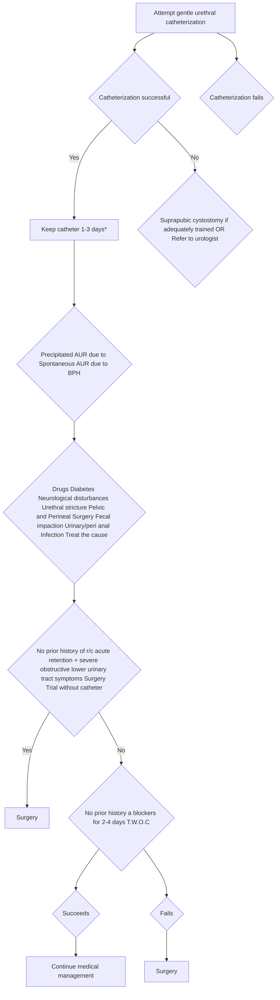

```markdown
# Standard Treatment Workflow (STW) for the Management of
**ACUTE URINARY RETENTION IN MEN (AUR)**
ICD-10-R33.9

### HISTORY
*   Nature and duration of urinary symptoms prior to AUR
*   Associated symptoms like fever, weight loss, sensory loss or weakness of lower limbs
*   Past history of retentions
*   Rule out precipitating causes like diabetes mellitus, alcohol consumption, recent surgery, **UTI**, constipation, cold exposure, prolonged travel and neurological conditions
*   Medication history
*   Look for risk factors

### DEFINITION
Emergency condition characterized by a sudden and painful inability to void voluntarily despite having a full bladder

### EXAMINATION
*   Fever
*   Enlarged tender palpable bladder dull on percussion
*   Phimosis, meatal stenosis, urethral induration, stone, urethral discharge
*   DRE for estimating prostatic size, consistency, tenderness; exclude fecal impaction
*   Focused neurological examination-anal tone, perianal sensation and bulbocavernous reflex

### RISK FACTORS OF SPONTANEOUS AUR DUE TO **BPH**
*   Old age
*   Severe lower urinary tract symptoms (**LUTS**)
*   Low peak flow rate
*   High postvoid residual urine (**PVR**)
*   Enlarged prostate or large median lobe
*   High serum **PSA**
*   Symptom worsening
*   Increasing **PVR** during medical therapy

### RISK FACTORS OF PRECIPITATED AUR
*   Surgical procedure with general or loco-regional anaesthesia
*   Bladder over-distension (eg prolonged journey)
*   Exposure to cold
*   Medications with sympathomimetic or anticholinergic effects, diuretics, alcohol intake
*   Feacal impaction

### CAUSES
*   **THAT BLOCK THE PASSAGE**
    *   **BPH**
    *   Urethral Calculus
    *   Urethral Stricture
    *   Acute Prostatitis
    *   Ca Prostate
    *   Vesical Calculus
    *   Faecal impaction
*   **THAT PARALYSE DETRUSOR**
    *   Neurological diseases e.g. spinal cord compression, transverse myelitis, stroke, head injury
    *   Drug induced eg. opiods, anticholinergics, anti-histaminics, anti-diarrhoeals, flavoxate

### INVESTIGATIONS
As **AUR** is an acute emergency, no investigation is required before catheterization to relieve symptoms. The volume of urine drained should be documented.
*   **DESIRABLE**
    *   **CBC**, S. Glucose, S. Creatinine and Electrolytes, **USG** KUB Urine analysis& Urine culture of the drained urine
*   **OPTIONAL (ONLY BY SPECIALISTS)**
    *   **NOT TO BE DONE ROUTINELY**
    *   Cystoscopy, **CT** / **MRI**, **RGU** + **MCU**, Urodynamic studies

### MANAGEMENT ALGORITHM


### FOR CATHETERIZATION
*   Use a 14 or 12 Fr Foley urethral catheter
*   Do not remove catheter earlier than a day

### COMPLICATIONS DUE TO AUR
*   Urinary tract infection
*   Acute kidney injury

### COMPLICATIONS DUE TO CATHETERIZATION
*   Post obstructive diuresis with dys-electrolytemia
*   Transient decompression hematuria
*   Urethral injury during catheterization

### INDICATIONS FOR HOSPITALIZATION
*   Patients of **AUR** with significant comorbidities
*   Patient of **AUR** with complications listed above

### ABBREVIATIONS
*   **BPH**: Benign Prostatic Hyperplas
*   **IPSS**: International Prostate Symptom Score
*   **TWOC**: Trial Without Catheter
*   **WW**: Watchful waiting

**KEEP A HIGH THRESHOLD FOR INVASIVE PROCEDURES**

This **STW** has been prepared by national experts of India with feasibility considerations for various levels of healthcare system in the country. These broad guidelines are advisory, and are based on expert opinions and available scientific evidence. There may be variations in the management of an individual patient based on his/her specific condition, as decided by the treating physician. There will be no indemnity for direct or indirect consequences. Kindly visit our web portal (stw.icmr.org.in) for more information.

Indian Council of Medical Research and Department of Health Research, Ministry of Health & Family Welfare, Government of India.
