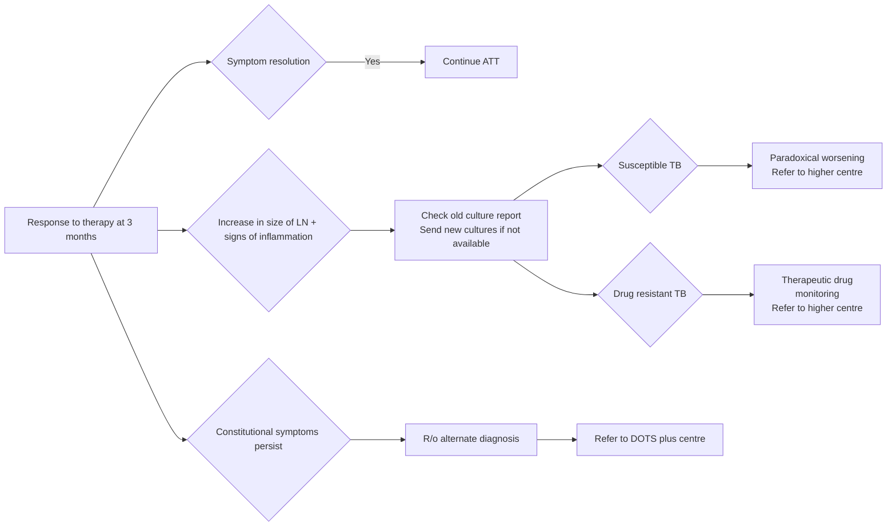

```markdown
March/2022

सत्यमेव जयते
Department of Health Research
Ministry of Health and Family Welfare, Government of India

icma
INDIAN COUNCIL OF
MEDICAL RESEARCH
Serving the nation since 1911

# Standard Treatment Workflow (STW) for the Management of
**ADULT LYMPH NODE TUBERCULOSIS**
ICD-10-A18.2

WHEN TO
SUSPECT?

## WHEN TO SUSPECT?
*   Swelling (>1 cm) in neck, armpit or groin (>2 cm) +/- redness, fluctuation, sinus
discharge
*   May or may not be associated with fever, weight loss, night sweats or cough
*   History of similar swelling in the past / past history of tuberculosis
*   History of contact with a patient with a diagnosis of TB

## DIAGNOSTIC ALGORITHM
Lymphnode enlargement > 1cm ± systemic symptoms*

```mermaid
graph LR
    A[Lymphnode enlargement > 1cm ± systemic symptoms*] --> B{FNAC / LN aspirate};
    A --> C{ABDOMINAL/MEDIASTINAL (INACCESSIBLE)};
    B -- "+ve" --> D[Send for NAAT#];
    B -- "-ve" --> E[LN biopsy (refer if indicated)];
    C --> F{Sputum / induced sputum};
    F -- "+ve" --> G[Send for NAAT#];
    F -- "-ve" --> H[Refer for FNAB];
    D -- "+ve" --> I[Treat as LN TB];
    D -- "-ve" --> E;
    G -- "+ve" --> I;
    G -- "-ve" --> H;
```

*   Tender LN, fluctuation, pain, fever, weight loss, night sweats
#Xpert/TrueNat/ICMR or CTD approved test
$MGIT/LJ

## Treatment : As per NTEP Guidelines
## ASSESS RESPONSE TO THERAPY AT 3-4 MONTHS



*   Resolution: Decrease in size of LN with
settling of systemic symptoms
*   Delayed response -Paradoxical reaction:
Increase in size of LN or new signs of
inflammation (up to 3 months of starting
treatment) OR appearance of new LN at
same/other site
*   May require tissue cultures, if not done, to
rule out treatment failure/resistance
*   Therapeutic drug monitoring to ensure
adequate drug levels
*   If cultures reveal susceptible TB it is likely
due to paradoxical worsening: May require
anti-inflammatory agents (inaccessible)/
surgical removal (accessible)

## COMPLICATIONS
*   Abscess formation
*   Rupture may lead to sinus formation

## REFER TO HIGHER CENTRE IF
*   Non responders
*   Needs treatment for Drug Resistance
*   Large Nodal Mass/Abscess requiring
surgical intervention

## BCG LYMPHADENITIS
*   Age is usually < 2 years
*   Axillary and/or supraclavicular LN on same side as BCG
vaccination (usually given on left)
*   No systemic symptoms in immunocompetent children
*   Treatment:
    *   Wait & watch if small
    *   If large & suppurative, repeated aspiration or rarely
incision & drainage is required
**NAAT/AFB** smear positivity can not differentiate between **BCG** & **MTB**

## ABBREVIATION
**ATT**: Anti Tubercular Treatment
**BCG**: Bacille Calmette Guerin
**CTD**: Central TB Division
**DOT**: Directly Observed Treatment Short-course
**FNAB**: Fine Needle Aspiration Biopsy
**FNAC**: Fine Needle Aspiration Cytology
**LJ**: Lowenstein Jensen
**LN**: Lymph Node
**LPA**: Line Probe Assay
**MGIT**: Mycobacterial Growth Indicator Tube
**MTB**: Mycobacterium Tuberculosis
**NAAT**: Nucleic Acid Amplification Test
**NTEP**: National TB Elimination Programme
**PCR**: Polymerase Chain Reaction
**TB**: Tuberculosis

## REFERENCES
1.  National TB Elimination Programme, Central TB Division. Training Modules for Programme Managers & Medical Officers. Ministry of Health & Family Welfare, Government of India.
https://tbcindia.gov.in/index1.php?lang=1&level=1&sublinkid=5465&lid=3540 Last accessed on 11 March, 2022.
2.  Guidelines for programmatic management of drug resistant tuberculosis in India March 2021. National TB Elimination Programme, Central TB Division, Ministry of Health & Family Welfare, Government of India.
https://tbcindia.gov.in/showfile.php?lid=3590 Last accessed on 11 March, 2022.
3.  Gaikwad P, Samuel VM, Rupali P. Tb or not Tb. Paradoxical response and the role of selective lymphadenectomy in tuberculous cervical lymphadenitis. Indian J of Applied Research, October 2016; Vol 6(10): 40-43.
4.  Alsultan A, Peloquin CA. Therapeutic drug monitoring in the treatment of tuberculosis: an update. Drugs, 2014 Jun; 74(8):839-54. Erratum in: Drugs. 2014 Jun; 74(9):2061.

This STW has been prepared by national experts of India with feasibility considerations for various levels of healthcare system in the country. These broad guidelines are advisory, and are
based on expert opinions and available scientific evidence. There may be variations in the management of an individual patient based on his/her specific condition, as decided by the
treating physician. There will be no indemnity for direct or indirect consequences. Kindly visit our web portal (stw.icmr.org.in) for more information.
Indian Council of Medical Research and Department of Health Research, Ministry of Health & Family Welfare, Government of India.
```