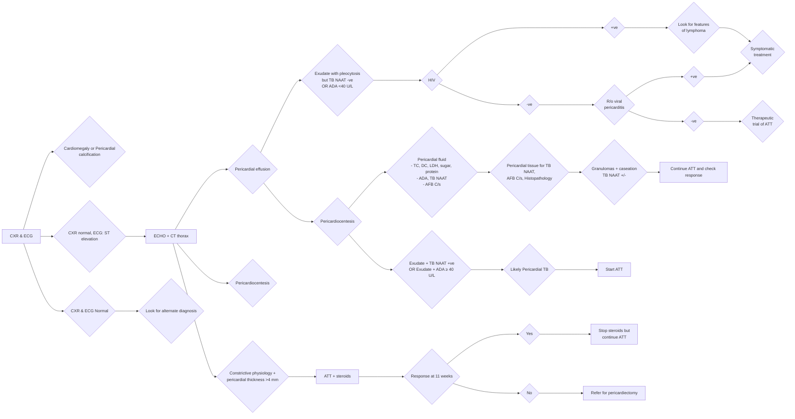

```markdown
March/2022

icme
INDIAN COUNCIL OF
MEDICAL RESEARCH
Serving the nation since 1911
Department of Health Research
Ministry of Health and Family Welfare, Government of India
NEW DELHI

# Standard Treatment Workflow (STW) for the Management of
**ADULT PERICARDIAL TUBERCULOSIS**
ICD-10-A18.84

## WHEN TO SUSPECT
### SYMPTOMS
*   Cough, fever, breathlessness or pleuritic chest pain
*   May be associated with weight loss, night sweats or difficulty lying down
*   Past history or a history of contact with a patient with a diagnosis of tuberculosis
*   Examination reveals tachycardia, increased jugular venous pressure, hepatomegaly, ascites, & peripheral edema
*   A pericardial friction rub and distant heart sounds present on cardiovascular examination
*   If clinical picture +/- heart US suggest pericarditis or pericardial effusion refer for echo-cardiogram

## COMPLICATIONS
### Constrictive pericarditis: Clinical signs for recognition include
*   Kussmaul's sign (lack of an inspiratory decline in jugular venous pressure)
*   Elevated & distended jugular veins with a prominent Y descent (second inward deflection of internal jugular pulse due to diastolic inflow of blood into the right ventricle)
*   Pericardial knock (rare)

### Cardiac tamponade: Clinical signs include
*   Sinus tachycardia
*   Hypotension with a narrow pulse pressure
*   Elevated JVP jugular venous pressure
*   Muffled heart sounds
*   Pulsus paradoxus (a decrease in systolic blood pressure by >10 mmHg on inspiration)
*   Ascites

### Other complications
*   Myopericarditis: Abnormal ejection fraction with evidence of myocarditis and pericarditis (elevated cardiac enzymes & ST elevation on ECG)
*   Effusive constrictive pericarditis: Mixed clinical picture. Main clue is elevated JVP clinically & right atrial pressure on ECHO in spite of removal of pericardial fluid

## INVESTIGATION
### Essential tests
*   Chest X-ray
*   ECG
*   Echocardiogram

### Desirable
*   Cardiac enzymes
*   CT/MRI of Thorax
*   Pericardiocentesis
*   Pericardial biopsy

## DIAGNOSIS
### SUSPICION OF PERICARDIAL TUBERCULOSIS



## MANAGEMENT
### TREATMENT
*   Antitubercular therapy is advised as per NTEP
*   Steroids are recommended in large pericardial effusions, prominent pleocytosis & pericardial fluid with high inflammatory markers or early constriction
*   Give Prednisolone **60 mg/day** for 4 weeks, **30 mg/day** for 4 weeks, **15 mg/day** for 2 weeks & **5 mg/day** for 1 week
*   Total duration of systemic steroids is 11 weeks

### NON RESPONSE TO STEROIDS & ATT
*   Should prompt a referral to a specialist center for confirmation of diagnosis
*   Should prompt an evaluation for alternative causes of effusio-constrictive pericarditis: viral infections, systemic lupus erythematosus, primary effusion lymphomas or pericardial malignancies
*   Non response of cardiac symptoms to anti-tuberculous therapy cardiac surgical evaluation may be required

## ABBREVIATION
*   ADA: Adenosine Deaminase
*   ATT: Antituberculous Therapy
*   CXR: Chest X-ray
*   ECG: Electrocardiogram
*   ECHO: Echocardiogram
*   JVP: Jugular Venous Pressure
*   NTEP: National Tuberculosis Elimination Programme
*   TB: Tuberculosis

## REFERENCES
1.  National TB Elimination Programme, Central TB Division. Training Modules for Programme Managers & Medical Officers. Ministry of Health & Family Welfare, Government of India accessed at https://tbcindia.gov.in/index1.php?lang=1&level=1&sublinkid=5465&lid=3540 Last access on 15 March, 2022.
2.  Guidelines for programmatic management of drug resistant tuberculosis in India March 2021. National TB Elimination Programme, Central TB Division, Ministry of Health & Family Welfare, Government of India https://tbcindia.gov.in/showfile.php?lid=3590 Last access on 15 March, 2022.
3.  Nahid P, Dorman SE, Alipanah N, et al. Official American Thoracic Society/Centers for Disease Control and Prevention/Infectious Diseases Society of America Clinical Practice Guidelines: Treatment of Drug-Susceptible Tuberculosis. Clin Infect Dis. 2016 Oct 1;63(7):e147-e195. doi: 10.1093/cid/ciw376. Epub 2016 Aug 10.

This STW has been prepared by national experts of India with feasibility considerations for various levels of healthcare system in the country. These broad guidelines are advisory, and are based on expert opinions and available scientific evidence. There may be variations in the management of an individual patient based on his/her specific condition, as decided by the treating physician. There will be no indemnity for direct or indirect consequences. Kindly visit our web portal (stw.icmr.org.in) for more information.

Indian Council of Medical Research and Department of Health Research, Ministry of Health & Family Welfare, Government of India.
```