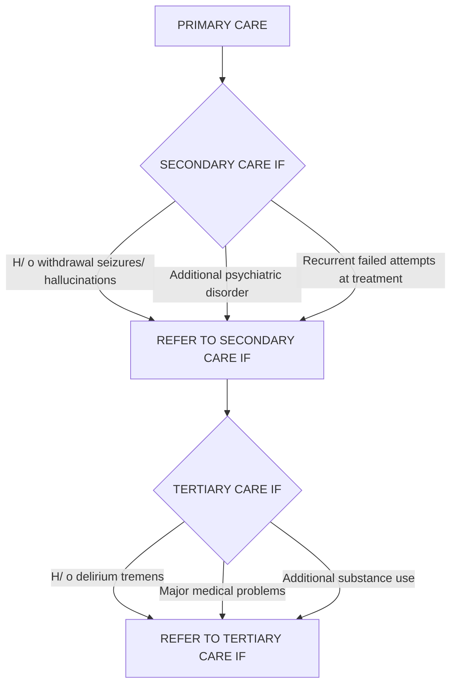

```markdown
October/2019

# Standard Treatment Workflow (STW) for the Management of **ALCOHOL USE DISORDERS**
ICD10-F10

### Special attention to:
(AUDIT can be used for screening)
*   H/o head injury
*   Appearing under influence of alcohol
*   H/o impaired social, occupational functioning
*   Daily alcohol consumption
*   Drinking in large quantities (men: 5 or more drinks/day; women: 4 or more drinks/day)

### ASSESSMENT (DETAILED HISTORY)
*   Age at initiation, quantity, frequency and progression (daily use and/or morning drinking)
*   Time of last alcohol use and amount
*   Binge drinking (men: 5 drinks over 2 hours; women: 4 drinks over 2 hours)
*   Withdrawal state: insomnia, restlessness, anxiety, tremors. Use of alcohol (or benzodiazepines) to relieve or avoid withdrawal symptoms.
*   Tolerance: increased doses of alcohol taken to achieve effects produced by earlier intake
*   Craving
*   Difficulty in controlling duration of drinking or amount of use
*   Preoccupation with alcohol use with neglect of alternative pleasures or interests
*   Increased time spent to obtain/ take alcohol/ recover from its effects
*   Continued use despite patient being aware of evidence of harmful consequences that have occurred
*   Abstinence and treatment attempts in past and reasons for relapse
*   Co-morbid medical illness or psychiatric illness and their treatment
*   Complications:
    *   Physical- gastritis, peripheral neuropathy, hepatic dysfunction, accidents/injuries
    *   Psychosocial - loss of work, fights at home, financial, legal problems

### EXAMINATION

| VITALS | WITHDRAWAL SIGNS | SIGNS OF HEPATIC DYSFUNCTION | NEUROLOGICAL SIGNS |
|---|---|---|---|
| BP | Tremor | Enlarged liver | Cerebellar signs |
| Pulse Rate | Sweating | Icterus | Peripheral neuropathy |
| Temperature | Tachycardia | Abdominal swelling | Confusion |

### DIAGNOSIS
Alcohol dependence (three of the following six criteria to be present for at least one month)

1.  A strong desire or sense of compulsion to take alcohol
2.  Difficulty in controlling alcohol use
3.  Withdrawal state when alcohol use has stopped or been reduced or use of the alcohol (or benzodiazepines) to relieve or avoid withdrawal symptoms
4.  Evidence of tolerance
5.  Preoccupation with alcohol use
6.  Alcohol use persisting despite clear evidence of harmful consequences

### Hazardous or Harmful use
*   Involvement in risky behaviours such as binge drinking, driving under the influence of alcohol
*   It should have resulted in harmful physical or psychosocial consequences

### INVESTIGATIONS
*   CBC
*   Liver function test
*   Blood sugar
*   Electrolytes
*   CT head (in case of seizure/ delirium tremens)

### MANAGEMENT



#### PRIMARY CARE
*   Alcohol Hazardous/ Harmful users - Brief Intervention* to reduce/stop consumption
*   Alcohol Dependent users - Advice to stop use and motivate for treatment using Brief intervention*

#### SECONDARY CARE
*   Treatment of withdrawal symptoms
*   Managment of withdrawal seizure
*   Inpatient management with benzodiazepines (diazepam or lorazepam)
*   Frequent titration of medication. Higher dosage may be required.
*   Closer monitoring and nursing care
*   Treatment of additional psychiatric disorder or substance use disorder

#### TERTIARY CARE
*   Treatment of delirium tremens
*   R/ o head injury, hepatic encephalopathy, Wernicke's encephalopathy
*   R/ o other causes of delirium
*   Manage on similar lines as withdrawal seizures
*   Management in ICU setting when indicated
*   Consult with other medical specialists (like gastroenterology or medicine for hematemesis).
*   Management for suicidality or violence when emergent threat

#### *BRIEF INTERVENTION
Inquire using open ended questions in a non-judgmental manner. Help patient to evaluate the risks versus the perceived benefits and to arrive at a decision to reduce or stop alcohol use.
Includes (FRAMES):
*   Feedback about alcohol related problems
*   Responsibility - acknowledging that the patient is responsible for making the decision about their alcohol use
*   Advice regarding the harms associated with continued use
*   Menu of alternative change options (includes identifying alternative activities such as hobbies, involving the family in treatment)
*   Empathetic attitude
*   Self efficacy - to encourage patients' confidence that they can make changes in their alcohol use and lifestyle

#### WITHDRAWAL MANAGEMENT
*   Tab Diazepam (20-40mg/day in divided doses) based on severity of withdrawals. Monitor and titrate dose.
*   If patient comfortable, reduce dose of medication by 10% to 20% per day, taper within 7 to 10 days
*   Thiamine 100 mg OD
*   Significant liver dysfunction: Lorazepam (2 mg Lorazepam equal to 5 mg Diazepam)

#### RELAPSE PREVENTION
(Long term goals- abstinence and socio-occupational integration)
*   Disulfiram (250 mg OD)

##### Pre-requisites:
*   Motivated patient
*   Patient's written consent
*   Under supervision of family members.
*   Inform patient and family about unpleasant, potentially serious reaction with even small amounts of alcohol (flushing, headache, vomiting, reduction of blood pressure, arrhythmias)
*   Ability of health personnel in the area to handle a potential reaction
*   Relapse prevention counselling:
*   Identify cues leading to craving (like person, place, situation etc)
*   Develop strategies to deal with them effectively

### INDICATIONS FOR ADMISSION
| Failure of outpatient treatment | H/o withdrawal seizures/ delirium tremens | Co-morbid significant medical illness and/or psychiatric illness | Poly-substance use |

### KEEP A HIGH THRESHOLD FOR INVASIVE PROCEDURES
This STW has been prepared by national experts of India with feasibility considerations for various levels of healthcare system in the country. These broad guidelines are advisory, and are based on expert opinions and available scientific evidence. There may be variations in the management of an individual patient based on his/her specific condition, as decided by the treating physician. There will be no indemnity for direct or indirect consequences. Kindly visit our web portal (stw.icmr.org.in) for more information.
Indian Council of Medical Research and Department of Health Research, Ministry of Health & Family Welfare, Government of India.
