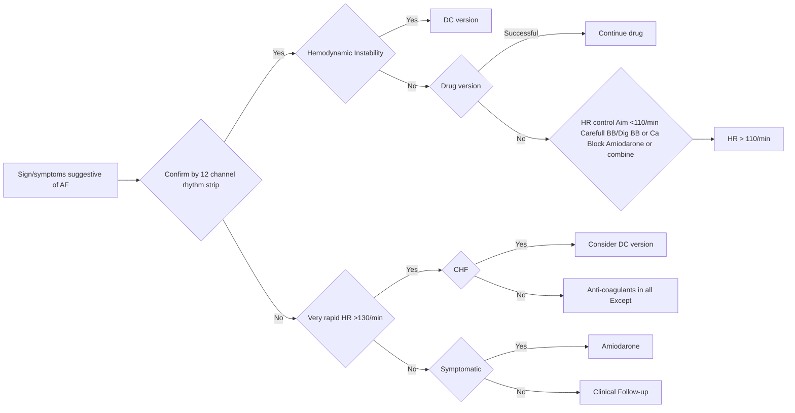

```markdown
# Standard Treatment Workflow (STW) for the Management of **ATRIAL FIBRILLATION**
ICD-10-148.91

October/2019
Department of Health Research
Ministry of Health and Family Welfare, Government of India
NEW DELHI
icmr
INDIAN COUNCIL OF
MEDICAL RESEARCH

## WHEN TO SUSPECT ?
9

### SYMPTOMS
*   Rapid irregular heart beat with or without
*   General fatigue or weakness or exhaustion
*   Dizziness, near syncope or syncope
*   Shortness of breath
*   Chest pain
*   More marked on exertion

### SIGNS
*   Irregularly irregular pulse
*   Variable heart sound

### LOOK FOR RISK FACTORS
*   Prior valvular heart disease or CHF or MI
*   Prior TIA or stroke or embolic episode
*   Hypertension, DM, COPD,CKD, Obesity

### LOOK FOR PRECIPITATING FACTORS:
*   Post (cardiac) surgery
*   Alcoholism or binge drinking
*   Myo-pericarditis or ACS
*   Pneumonitis or pulmonary embolism
*   Sepsis, hyperthyroidism

### MANAGEMENT PRINCIPLES:
*   Categorize AF
*   Look for immediate intervention indicators
*   Assess stroke risk & need for anti-coagulation
*   Assess bleeding risk
*   Need for rate control
*   Consideration for rhythm control

### CATEGORIZE AF
*   Paroxysmal AF: Episodes of AF for less than 7 days
*   Persistent AF: AF lasing from 7 days to 1 year
*   Long standing perssistent AF: AF lasting for > 1 year
*   Permanent AF: AF with heart rate control as only option

### LOOK FOR IMMEDIATE INTERVENTION INDICATORS:
*   Systolic BP 90 mmHg, HR > 150 or <50/min
*   Ongoing Angina
*   CHF or TIA or stroke
*   Major bleed on OAC (define)

## STROKE RISK SCORE
CHA2DS2-VASc

|  | SCORE |
| ------------- |:-------------:|
| Congestive heart failure/LV dysfunction | 1 |
| Hypertension | 1 |
| Aged > 75 years | 2 |
| Diabetes mellitus | 1 |
| Stroke/TIA/ΤΕ | 2 |
| Vascular disease [prior MI, PAD or aortic plaque] | 1 |
| Age (e.g. >65) | 1 |
| Sex category [i.e. female gender] | 1 |
| Maximum Score | 9 |

## BLEEDING RISK SCORE
HAS-BLED

|  | SCORE |
| ------------- |:-------------:|
| Hypertension i.e. uncontrolled BP | 1 |
| Abnormal renal/ liver function | 1 or 2 |
| Stroke | 1 |
| Bleeding tendency or predisposition | 1 |
| Labile INR | 1 |
| Age (e.g. >65)Aged 65-74 years | 1 |
| Drugs (e.g. concomitant aspirin or NSAIDs or alcohol | 1 |
| Maximum Score | 2 |

## CHOICE OF ANTI-COAGULATION:
*   Vitamin K antagonist
    *   Aim for INR 2-3
*   Assess risk of bleeding
*   Take measures to reduce/ modify risk of bleeding
*   Dietary modification & regular monitoring

## MEASURES TO REDUCE HIGH BLEEDING RISK:
*   Control SBP to less than 140 mmHg
*   Avoid dietary indiscretions
*   Avoid concomitant aspirin, anti platelets, NSAIDs
*   Avoid alcohol
*   Correct anemia

OAC if score >1 in men and >2 in women

Bleeding Risk High in score >3

## HEART RATE CONTROL
In all patients except hemodynamic instability
Beta blocker or calcium blocker or combination
BB + digoxin in HF
Rate aim to be less than 110/min
CONVERSION TO NSR
Patients' preference
Hemodynamic instability
Uncontrolled symptoms despite HR control
Unacceptable rate control drug side effects

## MANAGEMENT

### AT PHC/CHC:
*   Detailed clinical evaluation
*   Basic investigations
*   Careful ECG evaluation
*   Start OAC if indicated (based on Stroke risk)
*   Start Metoprolol if HR >110/min & no evidence of CHF
*   Refer if indicators for early intervention

### AT DISTRICT HOSPITAL:
*   Admit if indicators of early interventions
*   Immediate cardioversion after heparinization,if hemodynamic instability
*   Manage precipitating factors if any
*   Assess stroke, bleeding risk & coagulation parameters
*   Detailed echocardiogram
*   Start OAC, maintain INR around 2-3
*   Control HR by single drug or combination of BB & Ca Blocker
*   Refer HR uncontrolled or CHF or angina

### AT TERTIARY CENTRE:
*   Re-assess clinical status, adequacy of AC
*   Consider need of NOAC
*   Optimise management of underlying cardiac disease
*   Stress life style and AF risk factor modification
*   Assess need for rhythm control and discuss pros & cons
*   Consider RFA in select patient

### BASIC INVESTIGATIONS:
*   Hemograms
*   Blood sugar, Creatinine
*   Electrolytes
*   12 lead ECG

### DESIRABLE INVESTIGATIONS:
*   Plain X-ray chest
*   Thyroid evaluation
*   Liver function test
*   Troponins
*   Prothrombin time, INR (Coagulation profile)
*   Echocardiography

### OPTIONAL INVESTIGATIONS:
*   Prolonged ECG monitoring
*   Trans-esophagial echocardiography
*   Exercise Stress Test
*   CT scan
*   MRI
*   EP study
*   Coronary angiography

### WHAT TO LOOK FOR IN ECG ?
*   Ventricular rate
*   Chamber enlargement
*   Pre-excitation
*   Prior MI
*   Bundle branch block
*   QT interval

### RHYTHM CONTROL

#### Pharmacological Cardioversion

*   CHF
    *   CAD
    *   Amiodarone
    *   Abnormal LVH
*   Normal Heart
    *   Flecainide
    *   Ibutilide
    *   Propafenone
*   Pill in pocket
    *   Flecainide
    *   Propafenone

#### Long Term Rhythm Control
*   Normal Heart
    *   Flecainide
    *   Propafenone
    *   Sotalol
*   CHF
    *   Amiodarone
*   CAD, LVH
    *   Amiodarone
    *   Sotalol

## MANAGEMENT ALGORITHM
Sign/symptoms suugestive of AF
Confirm by 12 channel rhythm strip


*   Keep A HIGH THRESHOLD FOR INVASIVE PROCEDURES

This STW has been prepared by national experts of India with feasibility considerations for various levels of healthcare system in the country. These broad guidelines are advisory, and are based on expert opinions and available scientific evidence. There may be variations in the management of an individual patient based on his/her specific condition, as decided by the treating physician. There will be no indemnity for direct or indirect consequences. Kindly visit our web portal (stw.icmr.org.in) for more information.
Indian Council of Medical Research and Department of Health Research, Ministry of Health & Family Welfare, Government of India.
```