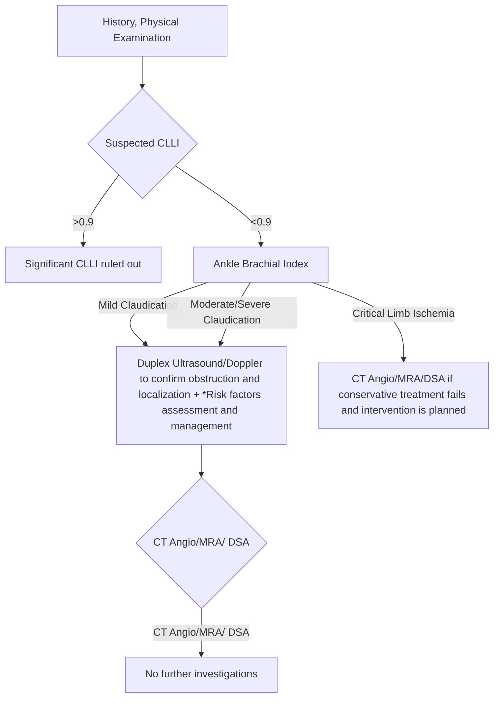
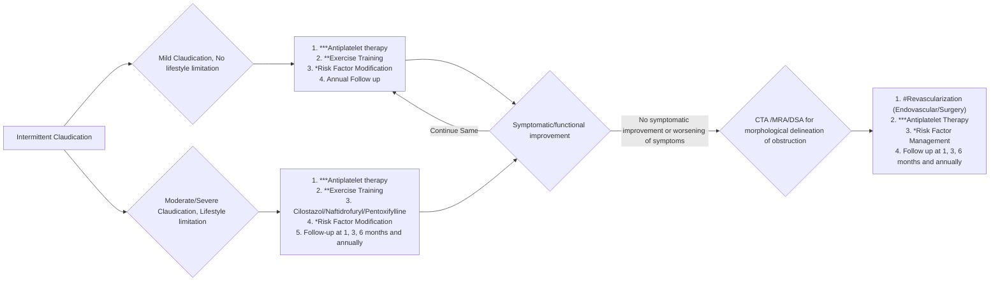
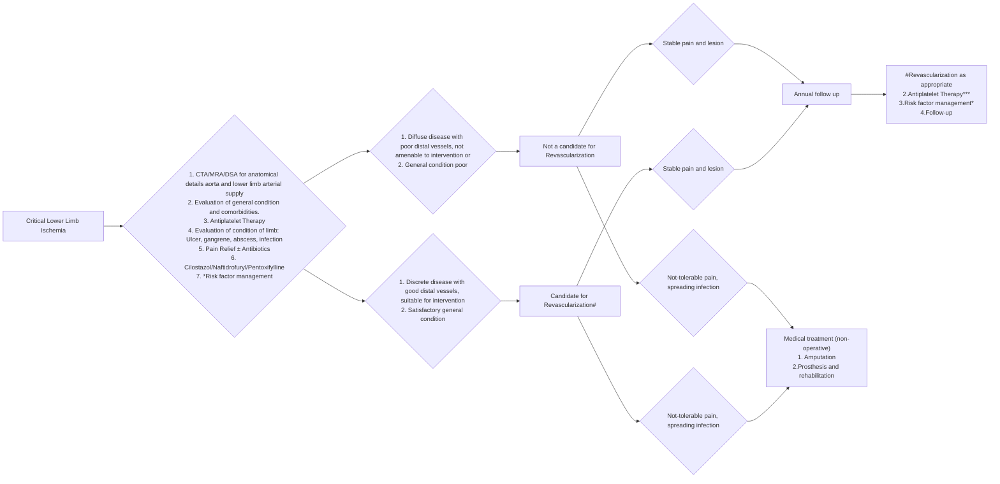

```markdown
# Standard Treatment Workflow
# CHRONIC LOWER LIMB ISCHEMIA (CLLI)
ICD-10-M62.262

## CLINICAL EVALUATION

### PRESENTATION
*   Claudication or pain at rest, paresthesia, with or
    without tissue loss, impaired healing or infection
    (ulcer or gangrene)
*   Absent/weak pulse depending on level of occlusion

### COMMON CAUSES OF CLLI
*   Atherosclerosis: Elderly, smokers with diabetes
    mellitus or chronic renal insufficiency
*   Vasculitis: Buerger’s disease, Takayasu arteritis
*   Aortic coarctation
*   Delayed presentation of an Acute Ischemic Insult:
    Trauma, Thromboembolism, Dissection

### CLINICAL STAGING
The clinical profile is classified into
a) Asymptomatic
b) Mild claudication (No life-style limitation)
c) Moderate or severe claudication (Life style limiting)
d) Chronic severe (or critical) limb ischemia:
Compromised blood flow, causing limb pain at rest+/-
ulcers or gangrene

## DIAGNOSTIC EVALUATION OF A PATIENT WITH CLLI



### DIFFERENTIAL DIAGNOSIS OF CLLI
*   Spinal stenosis, root compression
*   Arthritis
*   Venous Claudication
*   Compartment Syndrome

### DIFFERENTIATING TEST
*   Ankle brachial index (ABI), Doppler
*   ABI, Doppler, X-Ray
*   ABI, Doppler
*   ABI, Doppler, compartment pressure

### MANAGEMENT
*RISK FACTOR MANAGEMENT
*   Lifestyle modification (graded
    exercise)
*   Control of HTN(BP< 140/90),
    Control of Diabetes Mellitus
    (HbA1c< 7.0)
*   Low fat diet, exercise
*   Atherosclerosis : Start statins,
    antiplatelets
**EXERCISE REHABILITATION FOR
CLAUDICATION
Graded and supervised walking
three times a week, beginning
with 30mins and increasing to 1
hour per session, at an intensity
that will induce claudication
within 3-5 mins

MEDICAL MANAGEMENT
*   Antiplatelets*** – Aspirin 75-100mg
    orally/ Clopidogrel 75mg orally OD
*   Analgesic – Paracetamol +Opioid

CIRCULATORY MODULATORS
*   Cilostazol 100mg orally. (C.I. in CHF,
    unstable Angina, Recent M.I.,
    Tachyarrythmias)
*   Naftidrofuryl 200mg orally TDS
*   Pentoxifylline 400mg orally TDS
    (C.I. in recent cerebral/retinal
    haemorrhage, intolerance of
    methyl xanthines)

LOCAL WOUND MANAGEMENT
*   Prevention and treatment of
    infection
*   Leg dependency, off-loading, non-
    adherent dressing, abscess
    drainage, debridement, digital
    amputation$
Co-morbid evaluation: Cardiac, renal
and endocrine work up

### HISTORY
*   Claudication: Pain/cramp in calf/foot/
    thigh/buttock with walking that is
    relieved with rest
*   Duration and progress of symptoms
*   Onset, duration and progress of ulcer/
    gangrene, if any
*   Rest pain
*   Identifying risk factors: Diabetes,
    hypertension, smoking, ischemic heart
    disease, family history, dyslipidaemia
*   Syncope/blackout/stroke/mesenteric
    ischemia
*   History suggestive of cardiac disorder
    (angina/palpitations, shortness of breath/
    loss of consciousness)

### EXAMINATION
*   Blood Pressure (Including ankle-brachial
    index, toe-brachial index in diabetes,
    elderly, renal insufficiency)
*   All peripheral pulses
*   Condition of the limb: temperature,
    colour, hair loss, atrophy, nail bed capillary
    filling, sensation and motor power,
    gangrene/pre-gangrene
*   Wound inspection (if any)
*   Comorbidity evaluation: CVS, Renal
    Diabetes mellitus, CNS, neuropathy
*   Evaluation for possible venous conduits

CLLI is a
manifestation of
objectively
proven Peripheral
Arterial Disease
(PAD) defined by
ankle brachial
index of <0.90.
These are due to
chronic (> 2 week)
inadequate tissue
perfusion

## MANAGEMENT OF INTERMITTENT CLAUDICATION


### MANAGEMENT OF CRITICAL LOWER LIMB ISCHEMIA



#REVASCULARISATION (PREREQUISITES)
*   Good distal vessels (run-off)
*   Able to walk before critical limb
    ischemia
*   Life expectancy of >1 year
*   Satisfactory general condition

AMPUTATION$
*   Non-salvageable limbs, fixed
    contractures, severe
    infected/necrosis, failed
    revascularisation with persistent
    tissue loss

KEEP A HIGH THRESHOLD FOR INVASIVE PROCEDURES

### ABBREVIATIONS
CT: Computed Tomography Angiography
DSA: Digital Subtraction Angiography
MRA: Magnetic Resonance Angiography
PAD: Peripheral Arterial Disease

### REFERENCE
1.  Conte MS, Bradbury AW, Kolh P, White JV, Dick F, Fitridge R, Mills JL, Ricco JB, Suresh KR, Murad MH, Aboyans V, Aksoy M, Alexandrescu VA, Armstrong D, Azuma N, Belch J, Bergoeing M, Bjorck M, Chakfé N, Cheng S, Dawson J, Debus ES, Dueck A,
    Duval S, Eckstein HH, Ferraresi R, Gambhir R, Gargiulo M, Geraghty P, Goode S, Gray B, Guo W, Gupta PC, Hinchliffe R, Jetty P, Komori K, Lavery L, Liang W, Lookstein R, Menard M, Misra S, Miyata T, Moneta G, Munoa Prado JA, Munoz A, Paolini JE, Patel
    M, Pomposelli F, Powell R, Robless P, Rogers L, Schanzer A, Schneider P, Taylor S, De Ceniga MV, Veller M, Vermassen F, Wang J, Wang S; GVG Writing Group for the Joint Guidelines of the Society for Vascular Surgery (SVS), European Society for Vascular
    Surgery (ESVS), and World Federation of Vascular Societies (WFVS). Global Vascular Guidelines on the Management of Chronic Limb-Threatening Ischemia. Eur J Vasc Endovasc Surg. 2019 Jul;58(1S):S1-S109.e33. doi: 10.1016/j.ejvs.2019.05.006. Epub 2019
    Jun 8. Erratum in: Eur J Vasc Endovasc Surg. 2020 Mar;59(3):492-493. doi: 10.1016/j.ejvs.2019.11.025. Erratum in: Eur J Vasc Endovasc Surg. 2020 Jul;60(1):158-159. doi: 10.1016/j.ejvs.2020.04.033. PMID: 31182334; PMCID: PMC8369495.

Department of Health Research
Ministry of Health and Family Welfare, Government of India
July/ 2024
This STW has been prepared by national experts of India with feasibility considerations for various levels of healthcare system in the country. These broad guidelines are advisory, and are based on expert
opinions and available scientific evidence. There may be variations in the management of an individual patient based on his/her specific condition, as decided by the treating physician. There will be no
indemnity for direct or indirect consequences. Kindly visit the website of ICMR for more information: (icmr.gov.in) for more information. ©Indian Council of Medical Research, Ministry of Health & Family
Welfare, Government of India.
```