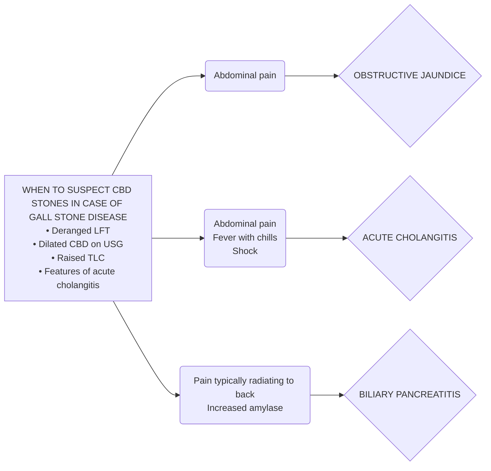
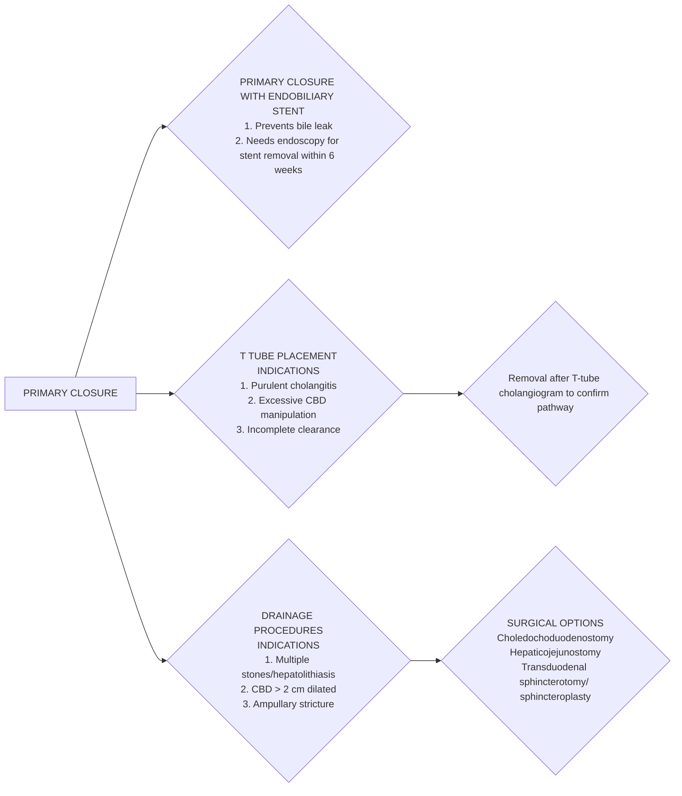

```markdown
July/2022
सत्यमेव जयते
Department of Health Research
Ministry of Health and Family Welfare, Government of India
भारतीय
OF MEDICAL
#icma
NEW DELHI
INDIAN COUNCIL OF
MEDICAL RESEARCH
Serving the nation since 1911
नई दिल्ली

# Standard Treatment Workflow (STW)
## COMMON BILE DUCT STONE
ICD-10-K 80.5

### CLINICAL PRESENTATION OF CBD STONES
**ASYMPTOMATIC/ DETECTED ON WORK UP FOR GALLBLADDER STONES**


### WORK UP OF A PATIENT WITH SUSPECTED CBD STONES
*Palpable Gall bladder with jaundice may be due to malignancy and grossly dilated CBD may be due to choledochal cyst- should be referred to higher centers*

*   **Biochemical investigations**
    *   **Haemogram** (TLC), blood urea, serum creatinine, amylase/lipase
    *   **LFT**- Serum bilirubin, AST/ALT, ALP, PT/INR
    *   Other investigations depending on comorbidities
*   **USG Abdomen**
    *   Gall bladder stones
    *   IHBRD, cholangitic abscess
    *   If CBD stones not seen on USG
*   **MRCP** / **endoscopic USG** - Investigation of choice
    *   Anatomy of biliary tree, IHBRD, stone size, location and CBD diameter
    *   Roadmap for intervention

### MANAGEMENT OPTIONS
*(PREFERABLY AT TERTIARY CARE CENTER)*
```mermaid
graph LR
    A[GALL BLADDER STONES WITH CBD STONES] --> B{Stone > 10 mm}
    A --> C{Stone ≤ 10 mm}
    D[POST CHOLECYSTECTOMY CBD STONES] --> E{ERCP}
    B --> F{Lap/open cholecystectomy + CBD exploration}
    C --> G{ERCP (includes sphincterotomy plus clearance of stones)}
    C --> H{Endoscopic stenting Failure followed by ERCP & cholecystectomy}
    D --> E
    B --> D
    E --> I{Lap/open CBD exploration}
    subgraph 
    J[In case of
1. Cholangitis
2. Biliary pancreatitis with CBD stones on imaging
3. Non-dilated CBD with CBD stones
4. Multiple comorbidities
5. Limited surgeon experience with CBD exploration]
    end
    F -.->J
    G -.->J
    H -.->J
    I -.->J
```

### OPTIONS FOR CBD CLOSURE AFTER CBD EXPLORATION


### ABBREVIATIONS
**ALP**: Alkaline phosphatase

**ALT**: Alanine Transaminase

**AST**: Aspartate transferase

**CBD**: Common Bile Duct

**ERCP**: Endoscopic Retrograde Cholangiopancreatography

**IHBRD**: Intrahepatic Biliary Radical Dilatation

**INR**: International Normalised Ratio

**LFT**: Liver Function Test

**MRCP**: Magnetic Resonance Cholangiopancreatography

**PT**: Prothrombin Time

### KEEP A HIGH THRESHOLD FOR INVASIVE PROCEDURES

*This STW has been prepared by national experts of India with feasibility considerations for various levels of healthcare system in the country. These broad guidelines are advisory, and are based on expert opinions and available scientific evidence. There may be variations in the management of an individual patient based on his/her specific condition, as decided by the treating physician. There will be no indemnity for direct or indirect consequences. Kindly visit the website of DHR for more information: (stw.icmr.org.in) for more information. Department of Health Research, Ministry of Health & Family Welfare, Government of India.*
```