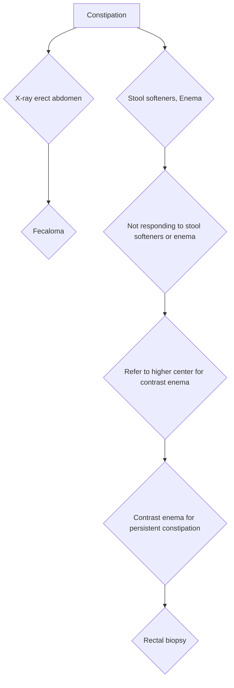

```markdown
July/2022

# Standard Treatment Workflow (STW)
## CONSTIPATION
ICD 10-K59.0

### WHAT IS CONSTIPATION?
*   Decreased frequency of bowel motions(<3 per week)
*   Passage of hard or large stools
*   Painful bowel motions with difficulty in pushing out

### CONSTIPATION IN < 1YEAR OLDS.
*   Not passing stools with abdominal distension
*   Associated vomiting
*   Absent or ectopic anal opening
*   Changes in infant formula, weaning, insufficient fluid intake

### CONSTIPATION IN CHILD OLDER THAN 1 YEAR
*   Starts after a few weeks of life
*   Bottle fed or change of diet
*   Fissures, timing of potty/toilet training
*   Generally weight and height within normal limits
*   History of poor fibre diet and/or insufficient fluid intake

### RED FLAG SIGNS
*   Constipation reported from birth or first few weeks of life
*   Failure to pass meconium/delay (more than 48 hours after birth in term baby)
*   All abnormal location or calibre of anal opening
*   'Ribbon stools' (more likely in <1 year olds)
*   Previously unknown/undiagnosed weakness in legs, locomotor delay, signs of hypothyroidism
*   Abdominal distension with vomiting

## BRISTOL STOOL FORM SCALE

|          |                                         |
|----------|-----------------------------------------|
| Type 1   | Separate hard lumps.                   |
| Type 2   | Lumpy and sausage like                 |
| Type 3   | A sausage shape with cracks in the surface |
| Type 4   | Like a smooth, soft sausage or snake     |
| Type 5   | Soft blobs with clear-cut edges          |
| Type 6   | Mushy consistency with ragged edges      |
| Type 7   | Liquid consistency with no soild pieces |

## HISTORY

| KEY COMPONENT                                                 | LESS THAN 1 YEAR                                                                                                                                    | MORE THAN 1 YEAR                                                                                                                                                                     |
| :------------------------------------------------------------ | :-------------------------------------------------------------------------------------------------------------------------------------------------- | :----------------------------------------------------------------------------------------------------------------------------------------------------------------------------------- |
| STOOL PATTERNS                                                | Fewer than three complete stools per week (Type 3 or 4)  (Exclude exclusively breast fed babies older than 6 months)                                 | Fewer than three complete stools per week (Type 3 or 4) Overflow soiling (Loose, Smelly), Thick, Sticky or Dry                                                                          |
|                                                               | Hard Large Stools                                                                                                                                   | Rabbit Droppings (Type 1)                                                                                                                                                            |
|                                                               | Rabbit Droppings(Type 1)                                                                                                                            | Large infrequent stools that can block toilet                                                                                                                                          |
| SYMPTOMS ASSOCIATED WITH DEFECATION                           | Distress on stooling (Bleeding, Straining)                                                                                                         | Poor appetite improves with passage of stools                                                                                                                                          |
|                                                               | Previous episode of constipation                                                                                                                    | Waxing and waning of abdominal pain with passage of stools                                                                                                                          |
|                                                               | Previous or current anal fissure                                                                                                                    | Retentive posturing, straight legged, tiptoed, anal pain, Straining                                                                                                               |
| PHYSICAL EXAMINATION                                           | IDIOPATHIC CONSTIPATION                                                                                                                             | PATHOLOGICAL DISEASE                                                                                                                                                                 |
| INSPECTION OF PERINEAL AREA                                   | Normal                                                                                                                                              | Abnormal- appearance, position, patency                                                                                                                                            |
| ABDOMINAL EXAMINATION                                         | Soft, Fat or Distension can be explained because of age or excess fat                                                                               | Gross distension                                                                                                                                                                   |
| SPINE/LUMBOSACRAL/GLUTEAL                                     | Normal appearance                                                                                                                                   | Abnormal-asymmetry or flatenning, sacral agenesis, discoloured skin, naevi or sinus, hairy patch, lipoma, central pit                                                                  |
| LOWER LIMB NEUROMUSCULAR EXAMINATION                          | Normal gait, tone and strength                                                                                                                      | Deformity in lower limb such as talipes. Abnormal neuromuscular signs                                                                                                                 |
| REFLEXES (WHEN RED FLAGS (+) IN HISTORY) OR NEW ONSET NEUROLOGICAL IMPAIRMENT | Reflexes present                                                                                                                                    | Abnormal                                                                                                                                                                             |
| INVESTIGATIONS                                                  | X-ray erect abdomen                                                                                                                                 | Anorectal manometry Rectal biopsy                                                                                                                                                      |
|                                                               | X-ray spine: AP and Lateral Contrast enema                                                                                                          |                                                                                                                                                                                     |

## MEDICAL MANAGEMENT

*   Laxatives: **Sodium picosulfate, Bisacodyl, Polyethylene glycol, Lactulose, Senna, Docusate sodium**
*   Dietary modifications: proper weaning, no dilution of milk, reduce milk and increase roughage



## INDICATIONS FOR RECTAL BIOPSY
*   Persistent constipation
*   Contrast enema showing transitional zone
*   Absent ano-rectal reflex on manometry
*   Positive acetylcholinesterase fibers in rectal biopsy
*   Biopsy showing absent ganglion cells

## MANAGEMENT
*   Proper toilet training
*   Adequate liquids and fibre in diet
*   Biofeedback
*   Laxatives
*   Suppositories
*   Evacuant enema
*   Surgical intervention
*   Colostomy
*   Definitive pullthrough surgery (Duhamel's, Scott Boley or Swensons pull through)
*   OR single stage pullthrough in neonates and infants after adequiate decompression

**KEEP A HIGH THRESHOLD FOR INVASIVE PROCEDURES**

This STW has been prepared by national experts of India with feasibility considerations for various levels of healthcare system in the country. These broad guidelines are advisory, and are based on expert opinions and available scientific evidence. There may be variations in the management of an individual patient based on his/her specific condition, as decided by the treating physician. There will be no indemnity for direct or indirect consequences. Kindly visit the website of DHR for more information: (stw.icmr.org.in) for more information. Department of Health Research, Ministry of Health & Family Welfare, Government of India.
