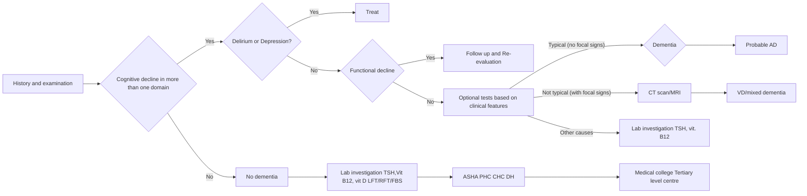

```markdown
October/2019

# Standard Treatment Workflow (STW) for the Management of DEMENTIA
ICD 10 - F02, F03,G30

*   Impaired memory
*   Anxiety
*   Hallucinations
*   Incontinence

## CLINICAL FEATURES OF DEMENTIA

*   Apathy
*   Agression
*   Mood fluctuations
*   Forgetting learned activities
*   Depression
*   Sleep disturbances
*   Personality change

## IMPORTANT POINTS TO CONSIDER
*   Dementia is a complex and variable condition
*   No single test will definitively diagnose dementia
*   The clinical features if present, should be a change from baseline normal functioning in a middle aged to old person
*   Assessment should aim at gathering information about changed behaviours, functional capacity, psychosocial support and medical comorbidities
*   History should be taken from a close caregiver, staying with the patient for a longer duration than the appearance of symptoms

## EVALUATION OF DEMENTIA


## FOLLOW UP OF DIAGNOSED & TREATED PATIENTS INTERVENTION MATRIX FOR DEMENTIA ACROSS PLATFORMS OF CARE

### PRIMARY HEALTH CENTRE (MEDICAL OFFICER)
*   Diagnose history
*   Screeing for:
    *   Treatable causes of dementia - thyroid disorders, B-12 deficiency, subdural hemorrhage.
    *   Depression.
    *   Vascular risk factors
*   Lab investigations- CBC, biochemistry, liver function tests, hemogram, lipd profile, TFT, VDRL, vit B12 level, vit D level
*   Referrals for MRI/CT
*   Initiation of treatment/drugs; treatment for co-morbid conditions (including depression, vision, hearing deficits and gait problems), thyroid, arthritis.
*   Initiate therapy for vascular risk factors
*   Encourage healthy lifestyle
*   Assess for palliative care
*   Learn and share facts about dementia to provide immediate need to the person with severe dementia
*   Follow up and monitor for side effects of drugs/ red flags in patient/signs of danger
*   Follow-up of difficult patients under the guidance of higher centre.

### DISTRICT HOSPITAL (SPECIALIST- PHYSICIAN/ GERIATRIC SPECIALIST/ NEUROLOGIST/ PSYCHIATRIST)
*   Careful evaluation of all the referral patients of dementia
*   Screening for treatable causes for dementia including normal pressure hydrocephalus, B12 deficiency, hypothyroidism, chronic meningitis
*   Neuroimaging CT/MRI- to rule out subdural hematoma/ tumors/NPH(surgically remediable causes of rapid cognitive decline)
*   Lab investigations- CBC, liver function tests, biochemistry, hemogram, lipd profile, vit D levels, TFT, VDRL, retrovirus after counselling (whenever feasible and high index of suspicion)
*   All the points mentioned in PHC to be followed if patient presents to a DH
*   Upward referral linkages with tertiary care and downward referral with PHC.
*   Encouraging patient and caregiver participation in an ongoing support program for them.
*   Avoid antipsychotics until necessary
*   Interaction with, training of MOs at PHC/UPHC and ongoing clinical support and supervision

### REASONS FOR REFERRAL
*   Not responding to adequate dose and duration of prescribed medications
*   Presence of red flags

#### RED FLAGS
*   Fever
*   Rapid progression
*   Seizures
*   Recent head injury
*   Alcoholism and falls

## MEDICATIONS RECOMMENDED FOR USE FOR ALZHIEMERS DEMENTIA

### FOR COGNITION
*   Donepezil: 5 mg once after breakfast x 1 month, then 10 mg after breakfast to continue
*   If any side effect/ not tolerating: Rivastigmine to be used start dose 1.5 mg BD/1 month then 3 mg BD x 1 month, then 4.5 mg BD x 1 month, then 6 mg twice after meals only x 1 month.
*   Memantine: in moderate to severe dementia 5 mg BD x 1 month, then 10 mg BD to continue.
*   Galantamine: 8 mg BD if not tolerating 1

### FOR DEPRESSION
*   Escitalopram 10 mg

### FOR AGITATION
*   Identification of triggers
*   Non pharmacological interventions

## KEEP A HIGH THRESHOLD FOR INVASIVE PROCEDURES
This STW has been prepared by national experts of India with feasibility considerations for various levels of healthcare system in the country. These broad guidelines are advisory, and are based on expert opinions and available scientific evidence. There may be variations in the management of an individual patient based on his/her specific condition, as decided by the treating physician. There will be no indemnity for direct or indirect consequences. Kindly visit our web portal (stw.icmr.org.in) for more information.
Indian Council of Medical Research and Department of Health Research, Ministry of Health & Family Welfare, Government of India.
```