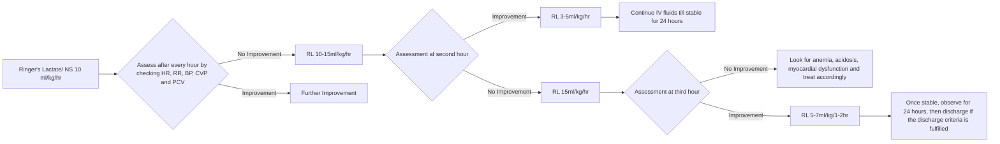

```markdown
# Standard Treatment Workflow (STW) for the Management of DENGUE FEVER
ICD-10-A90

## WHEN TO SUSPECT?
*   Fever and two of the following criteria -
    1.  Nausea
    2.  Vomiting
    3.  Rash
    4.  Myalgia
    5.  Headache
    6.  Retro orbital pain
    7.  Arthralgia
    8.  Hemorrhagic manifestations

## ASSESSMENT
*   Dengue without warning signs
*   Dengue with warning signs
*   Severe dengue

## TREATMENT OF PROBABLE DENGUE WITHOUT WARNING SIGNS
*   Symptomatic ambulatory treatment
*   Paracetamol for fever: avoid **NSAIDS**
*   Daily monitoring: clinical, PCV, platelets

## SEVERE DENGUE
*   Fluid accumulation with respiratory distress
*   Severe bleeding
*   Impaired consciousness

## REASONS FOR REFERRAL
*   Cold extremities, restlessness
*   Acute abdominal pain
*   Decreased urine output
*   Bleeding and hemoconcentration
*   Rising PCV & thrombocytopenia without clinical symptopms

## INVESTIGATIONS
### ESSENTIAL
*   Hb, TLC, DLC, Platelets, PCV
*   Positive tourniquet test
*   NS1 antigen (ELISA method)

### DESIRABLE
*   Chest X-ray
*   LFT, RFT, CPK, albumin
*   USG abdomen
*   Dengue IgM

### OPTIONAL
*   Echocardiography
*   PCR - dengue
*   CVP monitoring
*   USG guided measurement of collapsibility of IVC for monitoring hypovolemia

## SHOCK
Assess airway, breathing, circulation & start oxygen inhalation

### COMPENSATED SHOCK
(tachypnea, tachycardia, normotensive)



### HYPOTENSIVE SHOCK
(tachypnea, tachycardia, hypotension, peripheral pulses not palpable)

```mermaid
graph LR
    A[20 ml/kg crystalloid or colloid in 15 minutes] --> B{Assessment of Shock (monitor HR, RR, BP, PCV and CVP)}
    B -- No Improvement --> C[Colloids 10-20ml/kg Blood Transfusion]
    B -- PCV Increased --> D[Colloids 10-20ml/kg Blood Transfusion]
    B -- PCV Decreased --> E[Assessment]
    E -- No Improvement --> F[Look for blood loss, acidosis cardiac dysfunction and treat accordingly]
    E -- Improvement --> G[Gradually decrease infusion rate 10ml/kg/hr 1-2 hr 7ml/kg for 2-3 hrs 5ml/kg for 2-4 hrs 3ml/kg for 2-4 hrs Stop at 48 hours]
```
In case of shock, start bolus and arrange for urgent referral with continuous monitoring by a health professional to facilities with a PICU.

## INDICATION FOR PLATELET TRANSFUSION & PACKED RED CELLS

### PACKED RED CELLS
*   Loss of blood (overt blood) 10% or more of total blood volume.
*   Refractory shock
*   Fluid overload

### PLATELETS
*   Prolonged shock
*   Prophylactic platelet transfusion (PLT <10.000/cumm)
*   Systemic massive bleeding

### FRESH FROZEN PLASMA/ CRYOPRECIPITATE
*   Coagulopathy with bleeding

## DISCHARGE CRITERIA (ALL OF THE FOLLOWING CONDITIONS MUST BE PRESENT)

### CLINICAL
*   No fever for 48 hours
*   Improvement in clinical status (check for general well-being, appetite, haemodynamic status, urine output, respiratory distress)

### LABORATORY
*   Increasing trend of platelet count
*   Stable haematocrit without intravenous fluids

KEEP A HIGH THRESHOLD FOR INVASIVE PROCEDURES

*This STW has been prepared by national experts of India with feasibility considerations for various levels of healthcare system in the country. These broad guidelines are advisory, and are based on expert opinions and available scientific evidence. There may be variations in the management of an individual patient based on his/her specific condition, as decided by the treating physician. There will be no indemnity for direct or indirect consequences. Kindly visit our web portal (stw.icmr.org.in) for more information.*
*Indian Council of Medical Research and Department of Health Research, Ministry of Health & Family Welfare, Government of India.*
```