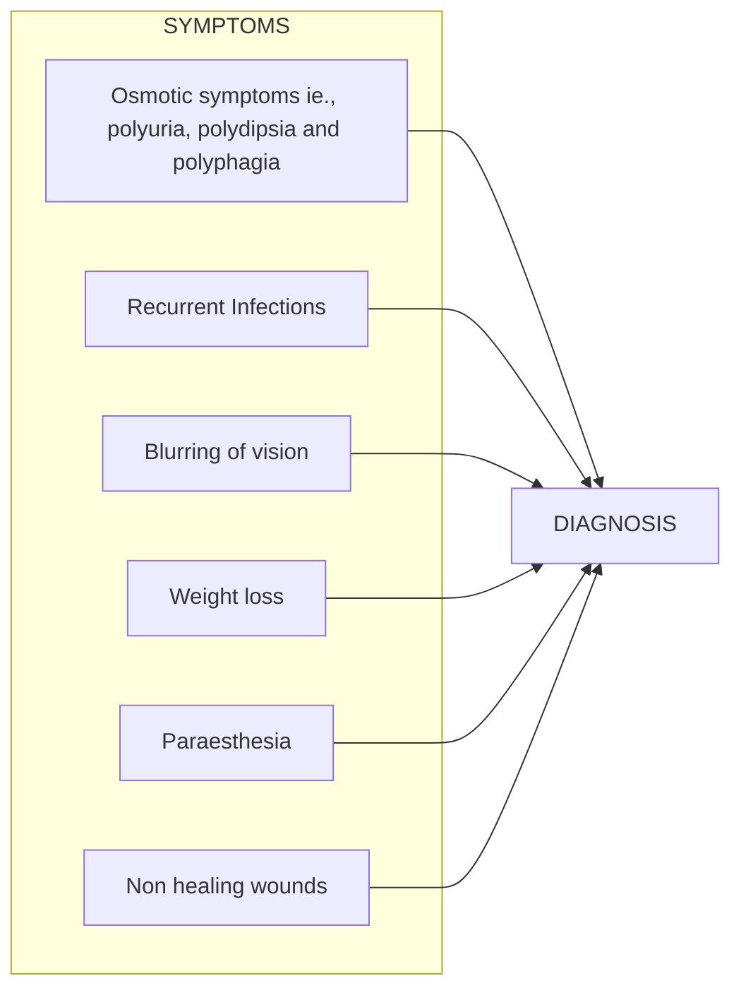

```markdown
# Standard Treatment Workflow (STW)
DIABETES MELLITUS TYPE 2
ICD-10-E11

May be asymptomatic



## DIAGNOSIS
*   FPG ≥126 mg/dl (after 8hr fasting)
    OR
*   2-h plasma glucose ≥200 mg/dl during OGTT
    OR
*   HbA1C ≥ 6.5%
    OR
*   Diabetes symptoms + random plasma glucose ≥ 200 mg/dl

## PREDIABETES:
Impaired fasting glucose: FPG 100-125 mg/dL; Impaired glucose tolerance: 140-199 mg/dL; HbA1c 5.7-6.4%

## ASSESS

*   CO-MORBIDITIES: **Hypertension**, **Dyslipidaemia**, **CAD**, **CKD**
*   EXAMINATION: **BMI waist circumference**, **BP Peripheral pulses**, **Pin-prick sensation, monofilament test, vibration, DTR**, **Skin, oral cavity, foot examination**, **Fundus (dilated) examination**

## INVESTIGATION
*   HbA1c
*   Creatinine
*   K+
*   Fasting lipid profile
*   Urine routine examination and spot albumin: creatinine ratio#
*   LFT/ALT, AST
*   ECG
*   Others like Echo, USG abdomen as indicated
*   #These may best be carried out after initial glycaemic control

## TREATMENT
*   Dietary modification
*   Avoidance of tobacco and restriction/ avoidance of alcohol
*   Physical activity
*   Pharmacotherapy:
    *   HbA1c < 8.5%: Monotherapy- Metformin
    *   HbA1c 8.5-10%: Dual therapy- Metformin + SU's/TZD/DPPIVI/SGLT2i/AGI/GLP-1RA
    *   HbA1c > 10%: Basal Insulin+ Metformin + another OAD / triple OAD combination

## MONITORING
*   Blood glucose; FPG and 2 hours PPG once monthly more frequent as required including SMBG or CGM
*   HbAlc every 6-12 months (3 monthly if uncontrolled)
*   Annual monitoring : ECG, urine ACR (albumin creatinine ratio), dilated fundoscopy,foot examination

## METABOLIC TARGETS
*   HbA1c </= 7.0% (except elderly and those with significant comorbid conditions) where higher target may be acceptable
*   Pre-prandial capillary plasma glucose: 80-130 mg/dl
*   Post-prandial capillary plasma glucose: <180 mg/dl
*   BP=140/90 (130/80 in CKD) LDL: < 100 mg/dl (< 70mg/dl in CAD)

## REFERRALS
*   Endocrinology: for uncontrolled hyperglycemia
*   Ophthalmology: at initial evaluation and every year
*   Nephrology: for deranged renal function
*   Cardiology: for CAD/HF/arrhythmia

## SCREENING FOR DIABETES MELLITUS

### IN AN APPARENTLY NORMAL ADULT
*   In obese or overweight (BMI ≥ 27.5 or ≥ 23 kg/m²) with any of the following risk factors
    *   First degree relative with diabetes
    *   History of cardiovascular disease
    *   BP (≥ 140/90 mmHg)
    *   Dyslipidemia (TG > 250 mg/dL, HDL <40 mg/dl in male, <50 mg/dl in female
    *   Physical inactivity
    *   Polycystic ovary syndrome (PCOS)
    *   Insulin resistance (acanthosis nigricans)
    *   Adults > 30 years of age
    *   Previous history of GDM

### IN AN ADULT WITH ILLNESS
*   In any adult/adolescent who presents with one of the following illness/complaints
    *   Osmotic symptoms (polyuria, polydipsia, polyphagia, nocturia)
    *   Unexplained weight loss
    *   Unexplained depression or dementia
    *   Acute coronary syndrome
    *   Deep seated infections (liver abscess, lower lobe pneumonia, tuberculosis, pyelonephritis, abscesses, septic arthritis, osteomyelitis)
    *   Recurrent infections (tinea, oral thrush, onychomycosis, cystitis-urinary tract infection, sinusitis, STI, cellulitis, carbuncle)
    *   Non-healing ulcers (foot ulcers-infected/neuropathic)
    *   Exogenous/iatrogenic Cushing's syndrome

### IN PREGNANCY
*   H/O GDM/Pre-existing diabetes
*   All pregnant women to be screened in 1st trimester with FPG
*   FPG ≥ 126 and/or HbAlc ≥ 6.5% to be considered pre-existing diabetes
*   FPG between 92-125 to be considered as GDM
*   All those women with normal screening in 1st trimester to get a 75 g-oral glucose tolerance test done at 24-28 weeks
*   All GDM women to be tested 6 weeks post-partum and once every 3 years
*   PREDIABETES: should be tested yearly

## ABBREVIATIONS
ALT: Alanine transaminase
AST: Aspartate aminotransferase
BMI: Body mass index
BP: Blood pressure
CAD: Coronary artery disease
CGM: Continuous glucose monitor
CKD: Chronic kidney disease
DTR: Deep tendon reflex
ECG: Electrocardiogram
FPG: Fasting plasma glucose
GDM: Gestational diabetes mellitus
HDL: High-density lipoprotein
LDL: Low-density lipoprotein
LFT: Liver function test
OAD: Oral antidiabetic drug
OGTT: Oral glucose tolerance test
SMBG: Self-monitoring of blood
glucose
TG: Triglyceride

KEEP LOW THRESHOLD FOR DIAGNOSIS. MAKE SURE TO FOLLOW UP TO MEET TARGETS
This STW has been prepared by national experts of India with feasibility considerations for various levels of healthcare system in the country. These broad guidelines are advisory, and
are based on expert opinions and available scientific evidence. There may be variations in the management of an individual patient based on his/her specific condition, as decided by
the treating physician. There will be no indemnity for direct or indirect consequences. Kindly visit the website of DHR for more information: (stw.icmr.org.in) for more information.
Department of Health Research, Ministry of Health & Family Welfare, Government of India.
```