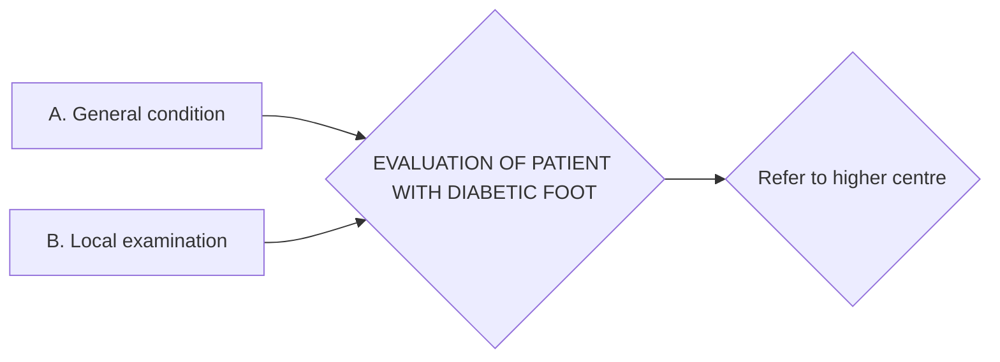
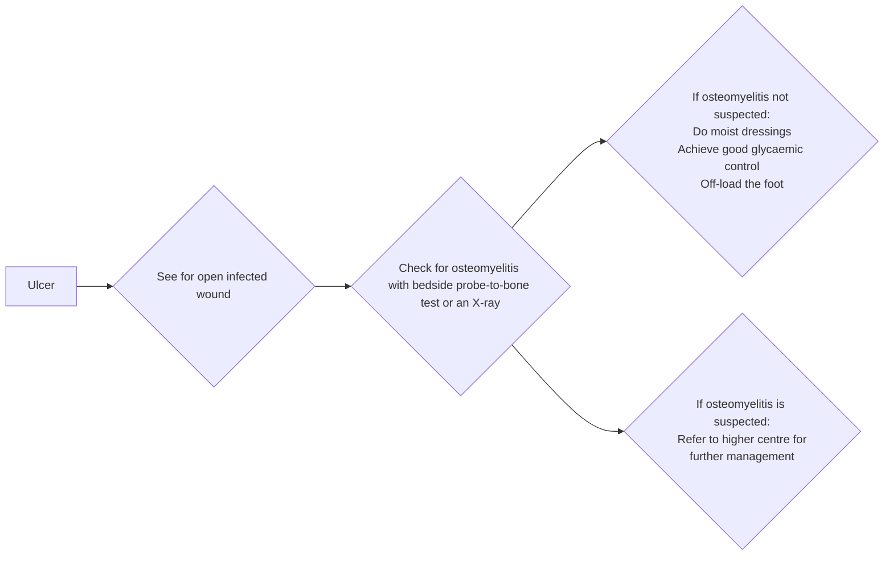
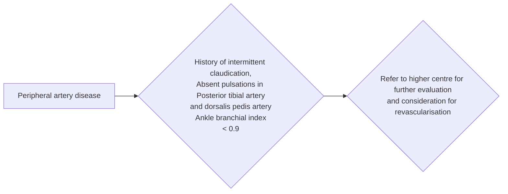
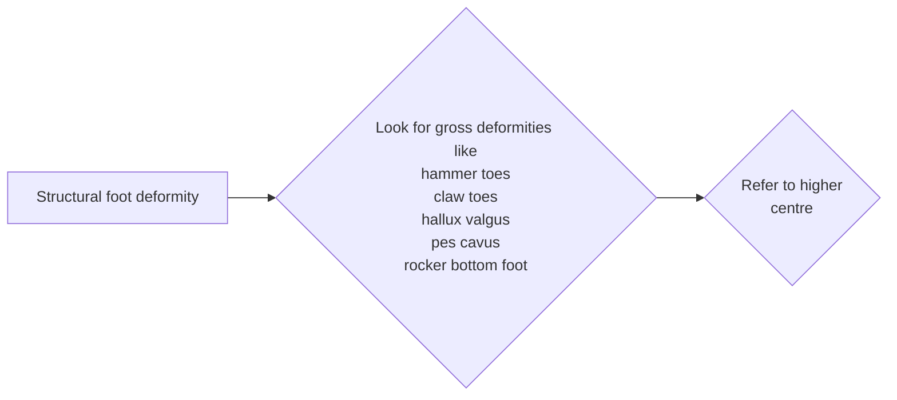

```markdown
# Standard Treatment Workflow (STW)
## DIABETIC FOOT
ICD-10-Z86.31

**RED FLAG SIGNS:** SYSTEMIC: Sick look, drowsy, abnormal breathing, abnormal pulse, fever; LOCAL: Claudication/ rest pain, gangrene, osteomyelitis, acute charcot's foot

## EVALUATION OF PATIENT WITH DIABETIC FOOT



### A. General condition
1. Vitals
2. Glycaemic control - FBS/ PPBS regularly, HbA1c once in 6 months

### B. Local examination
Check both feet for the below mentioned conditions

1. ULCER

Also refer to higher centre with facilities for:
*   Surgical debridement of wounds with necrotic tissue
*   Cellulitis needing fasciotomy
*   Wet gangrene needing amputation
*   Cases needing negative pressure wound therapy

2. PERIPHERAL ARTERY DISEASE (PAD)



3. LOSS OF PROTECTIVE SENSATIONS (LOPS)

```mermaid
graph LR
    A[Neuropathy/loss of protective sensations
(LOPS)] --> B{History of tingling,
numbness,
"feels like walking on
mattress"};
    B --> C{Check for foot sensation
using 10gm monofilament};
    C --> D{If sensations are absent
and patient is
asymptomatic, then
educate the patient,
advise protective footwear,
and call for regular follow
up as per risk category};
```
4. DEFORMITIES


## PREDISPOSING FACTORS FOR DIABETIC FOOT ULCER

### General conditions
*   Older age
*   Uncontrolled hyperglycemia
*   Duration of diabetes mellitus
*   Peripheral artery disease
*   Visual impairment
*   Chronic kidney disease

### Local conditions
*   Loss of peripheral sensations
*   Structural foot deformity
*   Limited joint mobility
*   Improperly fitting footwear
*   Callus
*   History of ulcer/amputation

## RISK ASSESSMENT & FREQUENCY OF FOLLOW UP

| Risk category | Parameters                      | Follow up       |
| ------------- | ------------------------------- | ------------- |
| Low           | Callus alone, No LOPS, NO PAD    | Once a year  |
| Medium        | Deformity with LOPS or PAD      | Once in 6 months |
| High          | Previous amputation or ulceration & any two of - Deformity/LOPS/PAD | Once in 3 months  |

## WOUND CARE

| DO:                       | DON'T USE:                                    |
| -------------------------- | -------------------------------------------- |
| Moist dressings             | Hydrogen peroxide, EUSOL, povidone iodine, chlorhexidine etc |
| Change dressings daily for dirty wounds and on alternate days for clean wounds | Hyperbaric oxygen, antimicrobial dressings and stem cell therapy has insufficient evidence to be recommended |

*Note: - Antibiotics are insufficient unless combined with appropriate wound care*

## INFECTION AND ANTIBIOTICS GUIDANCE

| NON INFECTED WOUND | MILD INFECTION                               | MODERATE INFECTION                                    | SEVERE INFECTION                                                                                                                                                                                                                                                                                 |
| ------------------ | -------------------------------------------- | ---------------------------------------------------- | --------------------------------------------------------------------------------------------------------------------------------------------------------------------------------------------------------------------------------------------------------------------------------------------------------- |
| No antibiotics      | At least two of:                              | * Redness                                          | Local findings + systemic findings of SIRS (at least two of)                                                                                                                                                                                                                                               |
|                   | Swelling/induration                          | * Deep tissues affected (abscess, osteomyelitis,  | Temperature >38°C or <36°C,                                                                                                                                                                                                                                                                               |
|                   | Pain/tenderness                              | fasciitis, septic arthritis)                      | Heart rate > 90/min,                                                                                                                                                                                                                                                                                        |
|                   | Warmth, redness (0.5-2cm)                    | * No systemic signs                               | Respiratory rate > 20/min or PaCO2 <32 mm Hg,                                                                                                                                                                                                                                                           |
|                   | Purulent discharge                           |                                                     | WBC >12000 or < 4000 or immature bands >10%                                                                                                                                                                                                                                                                |
|                   | Give oral antibiotics for 1-2 weeks           |                                                     |                                                                                                                                                                                                                                                                                                        |
|                   | (Target only aerobic gram-positive cocci)     |                                                     |                                                                                                                                                                                                                                                                                                        |
|                   |                                              |                                                     | Refer to higher centre                                                                                                                                                                                                                                                                                    |

## MANAGEMENT OF OTHER RELATED FOOT CONDITIONS / COMPLICATIONS

| Corns/callosity      | Web space fungal infection           | In-growing toe nails | Charcot's foot |
| -------------------- | ------------------------------------- | -------------------- | -------------- |
| Scaling in OPD       | Topical antifungals                     | Regular nail trimming | Refer to higher centre |
| Footwear modification | Maintain local hygiene                |                      |                |

## PATIENT EDUCATION

| DO:                                                 | DON'T:                                         |
| --------------------------------------------------- | ---------------------------------------------- |
| Daily self inspection of foot                      | Walk barefoot, even at home                   |
| Wear comfortable proper fitting footwear            | Remove calluses/corns at home                 |
| Cut toe nails straight                             | Smoking: delays healing                        |
| Keep blood sugars controlled                         |                                                |
| Regular foot check up with your doctor              |                                                |

## ABBREVIATIONS

*   EUSOL: Edinburgh university solution of lime
*   FBS: Fasting blood sugar
*   LOPS: Diabetic peripheral neuropathy with loss of protective sensation
*   PAD: Peripheral arterial disease
*   PPBS: Post prandial blood sugar
*   SIRS: Systemic inflammatory response syndrome

ALWAYS KEEP A LOW THRESHOLD FOR REFERRAL TO HIGHER CENTRE

This STW has been prepared by national experts of India with feasibility considerations for various levels of healthcare system in the country. These broad guidelines are advisory, and are based on expert opinions and available scientific evidence. There may be variations in the management of an individual patient based on his/her specific condition, as decided by the treating physician. There will be no indemnity for direct or indirect consequences. Kindly visit the website of DHR for more information: (stw.icmr.org.in) for more information. Department of Health Research, Ministry of Health & Family Welfare, Government of India.
```