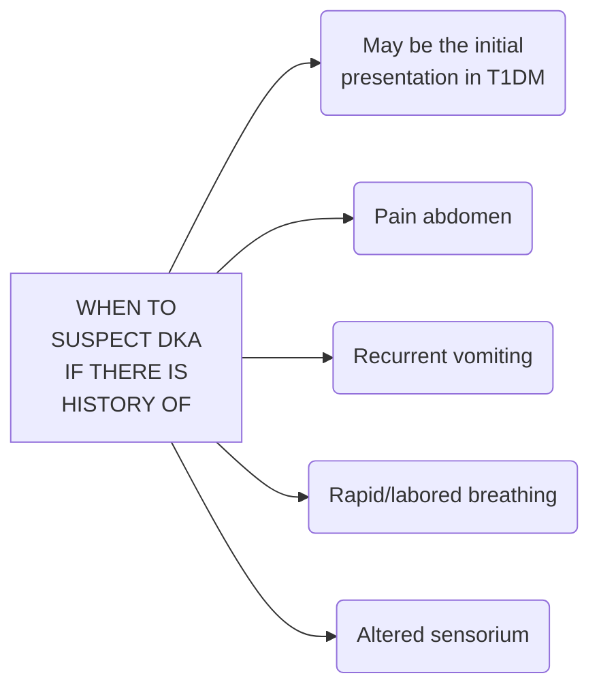

```markdown
July/2022

सत्यमेव जयते
Department of Health Research
Ministry of Health and Family Welfare, Government of India

OUNCIL OF MEDIC
DICAL
icma
INDIAN COUNCIL OF
MEDICAL RESEARCH
Serving the nation since 1911
NEW DELHI

# Standard Treatment Workflow (STW)
## DIABETIC KETOACIDOSIS
ICD-10-E11.10



### ASSESS
*   Sensorium (GCS), pulse rate, blood pressure, respiratory rate, temperature
*   Signs of dehydration (dry tongue, sunken eyes, skin turgor, urine output)

### ASSESS SEVERITY OF DKA
|       | Mild      | Moderate  | Severe  |
| :---- | :-------- | :-------- | :-------- |
| PH    | 7.25-7.3  | 7.0-7.25  | <7.0    |
| HCO3  | 15-18     | 10-15     | <10     |
| Level of Sensorium | Alert     | Mild Drowsiness | Stupor/ Coma |

Sever case: ICU Admission

### LOOK & ADDRESS FOR PRECIPITATING FACTORS
*   Skipping/missing insulin doses
*   Fever/cough/loose stools/burning micturition

### INVESTIGATIONS
*   Spot capillary blood glucose (venous blood preferable in case of shock)
*   Serum ketone/urine ketone by dipstick)
*   VBG (for pH, bicarbonate, anion gap)
*   Na+/K+/BUN/Creatinine/ECG

## MANAGEMENT

### MONITORING
*   Strict input/output charting: every 1 hour
*   Report if urine output is <30ml/hour for 2 consecutive hours
*   One hour after starting the treatment: Till resolution of DKA
*   BP and vital signs: every 1 hour
*   Blood glucose every 1 hour
*   Venous pH, Na, K, HCO₃ : 2-4 hourly
*   Blood ketones (if available)/Urine for ketones: 12 hourly
*   After resolution of DKA: Blood glucose monitoring every 4 hours

### TREATMENT
*   Replace fluids - 1 L of 0.9% saline over first hour followed by 250-500 ml/hour (10-20ml/kg/hour initially for children)
*   Administer regular insulin – 0.1 IU/kg IV then 0.1 IU/kg/hour IV infusion
*   Double infusion rate if less than 10% fall in blood glucose after 1 hour
*   When blood glucose < 250 mg/dl, add 5% dextrose @50 ml/hour
*   Supplement potassium before insulin if serum K+ < 3.3 mEq/L (or ECG changes)
*   Replace potassium @ 10-20 mEq/hour with insulin infusion if serum K+ < 5.5 mEq/L
*   If pH < 7.0, add sodium bicarbonate; 50 mmol in 200 ml sterile water over 2 hour
*   Bicarbonate should be given only: if pH is less than 6.9 or if pH is less than 7.1 along with hypotension or if hyperkalemia is present

### WHEN TO STOP INSULIN INFUSION?
*   Patient accepting orally, blood glucose consistently < 250 mg/dl, normalization of anion gap and correction of metabolic acidosis
*   Administer SC dose of long/intermediate-acting & short acting insulin at least 30 mins before stopping insulin infusion. Shift to basal-bolus/pre-mixed insulin regimen

### COMMON ERRORS/PITFALLS IN DKA DIAGNOSIS AND MANAGEMENT
*   Initiating Insulin therapy before I/V fluid therapy
*   Failure to review fluid replacement therapy particularly in elderly patients
*   Failure to identify underlying cause
*   Search for another cause of obtundation: If the osmolality is <than 320 mOsm/kg H₂O
*   Potassium: may be normal despite depletion of body stores due to metabolic acidosis
*   Elevated total leucocyte count does not suggest presence of infection until more than >15 X 109/1
*   Monitor for cerebral edema especially in childern
*   Body temperature cannot be used as a guide to presence of infection
*   Hyperamylasemia: Cannot be used as a marker for diagnosis of pancreatitis
*   Hypertriglycredemia: can cause pseudohyponatremia and when marked precipitates pancreatitis
*   Ketosis may worsen paradoxically with successful treatment initially
*   Stopping I/V insulin before S/C insulin given

### ABBREVIATIONS
*   BUN: Blood urea nitrogen
*   DKA: Diabetic ketoacidosis
*   ECG: Electrocardiogram
*   GCS: Glasgow coma scale
*   I/V: Intravenous
*   ICU: Intensive care unit
*   SC: Subcutaneous
*   VBG: Venous blood gas

KEEP A LOW THRESHOLD FOR TIMELY DIAGNOSIS AND MANAGEMENT OF DKA

This STW has been prepared by national experts of India with feasibility considerations for various levels of healthcare system in the country. These broad guidelines are advisory, and are based on expert opinions and available scientific evidence. There may be variations in the management of an individual patient based on his/her specific condition, as decided by the treating physician. There will be no indemnity for direct or indirect consequences. Kindly visit the website of DHR for more information: (stw.icmr.org.in) for more information.
Department of Health Research, Ministry of Health & Family Welfare, Government of India.
```