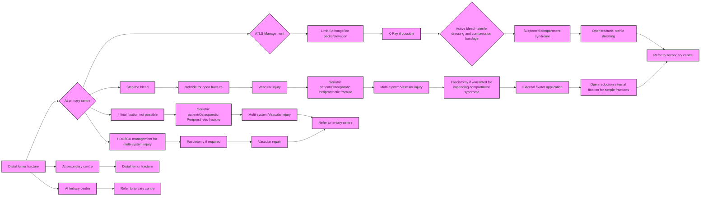

```markdown
# Standard Treatment Workflow (STW)
DISTAL FEMUR FRACTURES

**ICD-10-S72.402A**

## DEFINITION
A break in the **metaphyseal-diaphyseal** junction of the femur and/or involving articular surface of the knee

## MECHANISM OF INJURY
*   High-energy trauma in young patients (**RTA**)
*   Low-energy **fragility fracture** in elderly

## INVESTIGATIONS

### RADIOGRAPHS
*   AP View
*   Lateral View - Look for **coronal plane fractures** (**Hoffa's fracture**)

### CT SCANS
Detailed assessment of fracture pathoanatomy - **intra-articular and Hoffa component especially** (Type B & C).Desirable -3D Reconstruction. Preoperative planning for operative approaches and fixation techniques

## GOALS OF TREATMENT
1.  Restore articular congruity in intra-articular fractures
2.  Reconstruction of extra-articular component
3.  Length, alignment and rotation should be clinically and flouroscopically confirmed before final fixation

## Management of patient as per ATLS protocols

### Presentation:
Pain, swelling, deformity above the knee joint

### Physical Exam
*   Inspect
    *   Look circumferentially to rule-out an **open fracture**
*   Palpate
    *   Tenderness at the distal thigh
    *   Rule out **compartment syndrome** when pain on passive stretching of toes
*   Assess
    *   Any differences in pulse between extremities - **vascular injury**
    *   Look for associated injuries (especially **floating knee**)

## CLASSIFICATION
A. Airway and cervical spine
B. Breathing and ventilation
C. Circulation and Hemmorhage control
D. Disability and Neurological status
E. Exposure and Environment control

*   **Open fracture STW**
*   **Fasciotomy and external fixator** application

AO/OTA Classification of Distal Femur Fractures

Type A: extra-articular fracture
*   A1: Simple
*   A2: Metaphyseal wedge and/or fragmented wedge
*   A3: Metaphyseal complex

Type B: partial articular fracture
*   B1: Lateral condyle, sagittal
*   B2: Medial condyle, sagittal
*   B3: Frontal

Type C: complete articular fracture
*   C1: Articular simple, metaphyseal simple
*   C2: Articular simple, metaphyseal multi-fragmentary
*   C3: Articular multi-fragmentary

## MANAGEMENT
### Distal femur fracture


Final fixation once swelling subsides/blisters resolve/patient physiologically fit

### Distal femur fracture
```mermaid
graph LR
    A[Distal femur fracture] --> B{X-Ray};
    B --> C{Type A};
    B --> D{Type B};
    B --> E{Type C};
    C --> F[Assess need for external fixator - Skin condition/swelling/blisters/compartment syndrome];
    D --> F;
    E --> F;
    F --> G{Al and >7cm from joint};
    F --> H{Type A within 4cm from joint};
    F --> I{Bl and B2 fractures};
    F --> J{B3 fractures};
    F --> K{Rigid anatomic fixation of intra-articular fractures};
    G --> L[Antegrade nailing];
    H --> M[Retrograde nailing/ ORIF with Locking plate, Blade plate and Sliding barrel condylar plate];
    M --> N[Anterolateral approach];
    I --> O[ORIF with locked plate/Condylar Buttress Plating];
    O --> P[Anterolateral/ Medial approach];
    J --> Q[ORIF with buttress Plate +/- Screws (Anterior to posterior/ Posterior to anterior)];
    K --> R[Single approach-anterolateral, medial/lateral parapatellar, Swashbuckler, Gerdy's tubercle osteotomy approach];
    K --> S[Placement of void filler bone graft substitute];
    P --> T[Geriatric patients/ Osteoporotic bone];
    M --> T;
    I --> T;
    J --> T;
    K --> T;
    K --> U[Nail Plate or Dual plate constructs needed];
    style A fill:#f9f,stroke:#333,stroke-width:2px
    style B fill:#f9f,stroke:#333,stroke-width:2px
    style C fill:#f9f,stroke:#333,stroke-width:2px
    style D fill:#f9f,stroke:#333,stroke-width:2px
    style E fill:#f9f,stroke:#333,stroke-width:2px
    style F fill:#f9f,stroke:#333,stroke-width:2px
    style G fill:#f9f,stroke:#333,stroke-width:2px
    style H fill:#f9f,stroke:#333,stroke-width:2px
    style I fill:#f9f,stroke:#333,stroke-width:2px
    style J fill:#f9f,stroke:#333,stroke-width:2px
    style K fill:#f9f,stroke:#333,stroke-width:2px
    style L fill:#f9f,stroke:#333,stroke-width:2px
    style M fill:#f9f,stroke:#333,stroke-width:2px
    style N fill:#f9f,stroke:#333,stroke-width:2px
    style O fill:#f9f,stroke:#333,stroke-width:2px
    style P fill:#f9f,stroke:#333,stroke-width:2px
    style Q fill:#f9f,stroke:#333,stroke-width:2px
    style R fill:#f9f,stroke:#333,stroke-width:2px
    style S fill:#f9f,stroke:#333,stroke-width:2px
    style T fill:#f9f,stroke:#333,stroke-width:2px
    style U fill:#f9f,stroke:#333,stroke-width:2px
```

## ABBREVIATIONS
*   **AP**: Antero-posterior
*   **ATLS**: Advanced Trauma Life Support
*   **HDU**: High Dependency Unit
*   **ICU**: Intensive Care Unit
*   **ORIF**: Open Reduction and Internal Fixation
*   **OTA**: Orthopaedic Trauma Association
*   **RTA**: Road Traffic Accident

## REFERENCES
1.  Coon MS, Best BJ. Distal Femur Fractures. 2023 Jul 31. In: StatPearls [Internet]. Treasure Island (FL): StatPearls Publishing; 2024 Jan-. PMID: 31869139.
2.  Pennock AT, Ellis HB, Willimon SC, Wyatt C, Broida SE, Dennis MM, Bastrom T. Intra-articular Physeal Fractures of the Distal Femur: A Frequently Missed Diagnosis in Adolescent Athletes. Orthop J Sports Med. 2017 Oct 10;5(10):2325967117731567. doi: 10.1177/2325967117731567. PMID: 29051906; PMCID: PMC5639969.
3.  Nork SE, Segina DN, Aflatoon K, Barei DP, Henley MB, Holt S, Benirschke SK. The association between supracondylar-intercondylar distal femoral fractures and coronal plane fractures. J Bone Joint Surg Am. 2005 Mar;87(3):564-9. doi: 10.2106/JBJS.D.01751. PMID: 15741623.
4.  Kolb K, Grützner P, Koller H, Windisch C, Marx F, Kolb W. The condylar plate for treatment of distal femoral fractures: a long-term follow-up study. Injury. 2009 Apr;40(4):440-8. doi: 10.1016/j.injury.2008.08.046. Epub 2009 Mar 13. PMID: 19285670.
5.  Huang HT, Huang PJ, Su JY, Lin SY. Indirect reduction and bridge plating of supracondylar fractures of the femur. Injury. 2003 Feb;34(2):135-40. doi: 10.1016/s0020-1383(02)00213-9. PMID: 12565021.
6.  Canadian Orthopaedic Trauma Society. Are Locking Constructs in Distal Femoral Fractures Always Best? A Prospective Multicenter Randomized Controlled Trial Comparing the Less Invasive Stabilization System With the Minimally Invasive Dynamic Condylar Screw System. J Orthop Trauma. 2016 Jan;30(1):e1-6. doi: 10.1097/BOT.0000000000000450. PMID: 26429408.
7.  Higgins TF, Pittman G, Hines J, Bachus KN. Biomechanical analysis of distal femur fracture fixation: fixed-angle screw-plate construct versus condylar blade plate. J Orthop Trauma. 2007 Jan; 21(1):43-6. doi: 10.1097/BOT.0b013e31802bb372. PMID: 17211268.
8.  McDonald TC, Lambert JJ, Hulick RM, Graves ML, Russell GV, Spitler CA, Bergin PF. Treatment of Distal Femur Fractures With the DePuy-Synthes Variable Angle Locking Compression Plate. J Orthop Trauma. 2019 Sep;33(9):432-437. doi: 10.1097/BOT.0000000000001510. PMID: 31259799.
9.  Sanders R, Swiontkowski M, Rosen H, Helfet D. Double-plating of comminuted, unstable fractures of the distal part of the femur. J Bone Joint Surg Am. 1991 Mar;73(3):341-6. PMID: 2002071.

## TIMELY INTERVENTION AS PER RESOURCE SETTING
This STW has been prepared by national experts of India with feasibility considerations for various levels of healthcare system in the country. These broad guidelines are advisory, and are based on expert opinions and available scientific evidence. There may be variations in the management of an individual patient based on his/her specific condition, as decided by the treating physician. There will be no indemnity for direct or indirect consequences. Kindly visit the website of ICMR for more information: (icmr.gov.in) for more information. Indian Council of Medical Research, Ministry of Health & Family Welfare, Government of India.
```