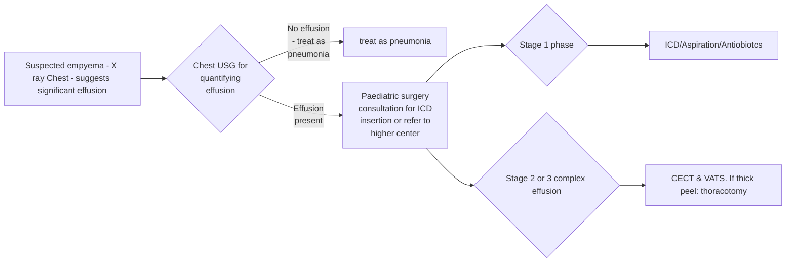

```markdown
# Standard Treatment Workflow (STW)
EMPYEMA THORACIS IN CHILDREN
ICD-10-J86

## CLINICAL FEATURES

### SYMPTOMS
*   Fever
*   Chest pain
*   Cough
*   Respiratory distress
*   Abdominal pain and vomiting

### SIGNS
*   Auscultation -
    decreased breath
    sounds & crackles
*   Dullness to percussion

## DEFINITION
Presence of pus or
microorganism in the
pleural fluid, observed on
smear examination or on
culture.
*   Criteria for diagnosis in the
absence of microorganism:
    *   (a) **Pleural fluid pH< 7.0**
    *   (b) **Lactic
        dehydrogenase (LDH)
        > 1000 IU/L**
    *   (c) **Glucose <40 mg/dL**
        or
    *   (d) **Lactate > 5 mol/L or
        45 mg/dL**

## CAUSE OF EMPYEMA
*   **Bacterial pneumonia** (develop in 50-70% cases
    of complicated pneumonia)
*   **Tubercular empyema**
*   **Chest wall trauma**
*   **Lung Abscess/Aspiration**
*   Common organisms: **S pneumoniae, S aureus**,
    and **group A streptococci**

## PHASES OF EMPYEMA
The treatment depends on the stage of
empyema
*   Exudative phase (1-3days)
*   Fibrino-purulent phase (4-14days)
*   Organising phase (>14days)
*   Any child with diagnosed pneumonia with no
    improvement and spiking fever after 48 hours
    of antibiotic treatment may signal empyema

## INVESTIGATIONS:
*   **Blood**: Blood counts, Blood Culture, ASO Titre, CRP
*   **Sputum**: Sputum AFB, Gram Staining and Culture
*   **Radiological:**
    *   **Chest X-ray**: PA. Obliteration of Costophrenic angle or
        Meniscus sign are early signs of pleural effusion.
    *   **USG Chest**: Amount of fluid & echogenicity of fluid,
        loculation and pleural thickening. It can be a guide for
        thoracocentesis or ICD placement.
    *   **CT Chest**: Role only in complicated cases and to detect
        underlying lung problems. HRCT is ideal before surgery
*   **Pleural fluid Analysis**:
    *   Microbiology - Gram stain, Culture (aerobic & anaerobic)
    *   Cytology to see for type of cells
    *   Biochemistry- LDH, PH, Glucose

## TREATMENT
*   Child not sick; investigation
    reveals a small effusion- **IV fluids**,
    **Oxygen**, **IV Antibiotics**, **Analgesics**
*   Child looks sick; investigation
    reveals larger effusions &
    respiratory compromise -
    **IV Antibiotics** and **Intercostal
    Chest tube Drainage**
*   **Antibiotics** : **3rd Gen
    Cephalosporins/Extended
    Penicillins like Co-Amoxiclav**, for
    1-4 weeks
    Change based on cultures,
    Continue until afebrile/ICD
    removed

## ICD INSERTION
*   Adequate sized tubes under **USG**
    guidance preferably in the mid
    axillary line through the safe
    triangle under **IV** sedation for
    children with adequate
    monitoring
*   If **USG** is not available: needle
    aspiration, confirmation of pus
    and insertion of tube maybe
    done
*   Maximum fluid to be drained:
    *   10ml/kg in small children
    *   1.5 litres in older children
*   Tube to be removed at complete
    clinical resolution or changed
    when blocked

## ROLE OF SURGERY
*   Thoracoscopy if facilities available
*   If not, thoracotomy
*   Indications for surgery:
    1.  **Failure of ICD, Antibiotics**
    2.  **Persisting sepsis beyond 7 days of
        antibiotics, pleural collection despite
        chest tube drainage or complex or
        delayed empyema (with loculation)**

## THORACOSCOPY VS THORACOTOMY

### THORACOSCOPY
*   Preferred in early
    empyema
*   Breakdown of loculi
*   Complete pus drainage
*   Debridement under vision
*   Full lung expansion
*   If peel is very thick and not
    amenable for removal,
    should be converted to
    thoracotomy

### THORACOTOMY
*   Formal Thoracotomy and
    Decortication indicated in **Stage 3**
    and delayed cases where there is
    *   Thick peel
    *   Thick pyogenic material
    *   Inability to develop a pleural
        window
    *   Complex and chronic
        empyema
    *   Underlying diseased lung

## FIBRINOLYTICS IN STAGE II EMPYEMA
*   Safe and cost effective treatment
    modality that avoids surgery
*   **Indications**
    *   Within 2 weeks duration
    *   Preferably no ICD has been placed
    *   Imaging shows echogenic collection
        with septation
    *   Fluid analysis shows frank
        pus/exudative effusion
*   **CONTRAINDICATIONS**
    *   Bleeding diathesis
    *   Suspected TB
    *   Hypersensitivity to fibrinolytic
    *   Complicated pneumonia/ lung abscess
    *   Air leak on insertion of ICD

## PROCEDURE
*   16/18 size ICD tube inserted under sedation with local
    anesthesia, towards marked point of maximal collection
    and connected to underwater seal without any suction
*   Assessed after 24 hours, no further intervention if
    afebrile, without distress and effusion cleared on Xray

## ALGORITHM OF MANAGEMENT OF CHILDHOOD EMPYEMA



## REFERENCES
1.  Meenu Singh, Saroj Kumar Singh, Sujit Kumar Chowdhary.Management of Empyema Thoracic in Children -Indian Pediatrics 2002; 39:145-157.
2.  IAPS guidelines for treatment of Empyema in Children. 2018. www.iapsonline.org
3.  Balfour-Lynn I. BTS guidelines for the management of pleural infection in children. Thorax. 2005;60(suppl_1): i1-i21.
4.  Prospective randomized controlled study conducted at Indira Gandhi Institute of Child Health, Bengaluru, under review for publication (Clinical Trials Registry of India, vide CTRI/2018/03/012403)

## DRUG AND METHODS
*   **Urokinase:**
*   Dose: Twice daily for a maximum of three days (6
    instillations)
    *   Age <1 year 10000 IU diluted in 10 mL NS
    *   Age >1 year 40000IU diluted in 40 mL NS
*   Instilled through the ICD and kept blocked for 30
    minutes (ICD reconnected after 30 minutes)
*   Children are encouraged to change their positions

## MONITORING
*   Resolution of clinical symptoms: fever, tachypnoea
*   Drain output: Daily USG & X-ray

## ICD
*   ICD is removed: drain output is <10mL/kg/day, chest
    X-ray shows good expansion
*   Discharged with standard antibiotic cover of 1-2 weeks

## Failure/ Indication for Surgery
*   Persistence of collection on x-ray/ ultrasound after 3
    days
*   Clinical/Radiological worsening during therapy

## KEEP A HIGH THRESHOLD FOR INVASIVE PROCEDURES
This STW has been prepared by national experts of India with feasibility considerations for various levels of healthcare system in the country. These broad guidelines are advisory, and
are based on expert opinions and available scientific evidence. There may be variations in the management of an individual patient based on his/her specific condition, as decided by
the treating physician. There will be no indemnity for direct or indirect consequences. Kindly visit the website of DHR for more information: (stw.icmr.org.in) for more information.
Department of Health Research, Ministry of Health & Family Welfare, Government of India.
```