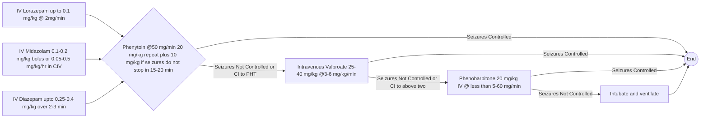

```markdown
October/2019

# Standard Treatment Workflow (STW) for the Management of **EPILEPSY**
ICD 10 - G40

| CLINICAL FEATURES |  |  |  |  |
|---|---|---|---|---|
| Episodic, few secs-mins | Abnormal jerky movements | Loss of consciousness/ awareness | Blank staring | Episodes could be single with high risk of recurrence. Prolonged motor convulsion of > 5 mins with loss of consciousness - **STATUS EPILEPTICUS (SE)** - MEDICAL EMERGENCY |
| Sudden drops/falls, brief jerks | With or without urine/ stool incontinence, tongue bite, drooling | Bizzare activity out of context | Any other episode lasting for few mins (usually<5 mins) |  |

## PRIMARY HEALTH CENTRE (MEDICAL OFFICER)
*   Clinical diagnosis of epilepsy: detailed history from an eyewitness
*   Differentiate between provoked seizures and epilepsy (provoked due to fever, acute CNS insult, antibiotics, and metabolic causes)
*   Laboratory investigations: CBC, liver function tests, routine biochemistry, hemogram, lipd profile, vit D levels, TFT (whichever feasible)
*   Initiation of treatment:
    *   Treat the patient if patient has epilepsy (2 or more episodes of unprovoked seizures)
    *   Treat a single seizure if risk of recurrence is high as in patients with focal seizures, mentally retarded, neurological deficits having family history of seizures abnormal EEG, neuroimaging
*   Anti Epileptic Drug (AED broad spectrum, low dose, start low go slow, except status epilepticus)
*   Emergency medical care of status epilepticus
*   Treatment counselling: side effects/toxicities of drugs, red flags, importance of adherence, maintaining treatment diary
*   Advice on prevention of seizures: regular medication, sleep 7-8 hrs, avoid excess TV/mobile/photic stimulation, regular diet, lifestyle choices(avoid alcohol)
*   Evaluate any possibility of superimposed non-epileptic seizure
*   Training of MLP/ANM/ASHA on epilepsy
*   For excessive alcohol use, refer to ANM/MLP where psychosocial interventions are carried out for substance use disorders
*   Follow up visits for treatment monitoring & difficult patients under neurologist at STC centre
*   Basic management of co-morbidities (behaviour, cognition, reproductive health, bone health)
*   Alert to signs of abuse and neglect
*   Maintain upward referrals with paediatrician/physician at DH

## REASONS FOR REFERRAL
(centres with specialists like paediatrician, neurologist)

*   Redflag Signs
*   Progressive problems, rapid appearance of new symptoms
*   Recent injury
*   Symptoms appearing after alcohol binge
*   Status epilepticus after stabilization
*   Non response to adequate dose and duration of medication
*   Serious side effects
*   Neuroimaging

## DISTRICT HOSPITALS
*   Careful evaluation of all referral patients, provide specialized management for patients and refer back to PHC for follow up of management
*   Maintain communication, ongoing clinical support and supervision of MOs at PHC
*   Laboratory investigation CBC, liver function tests, antiepileptic drug levels, routine biochemistry, hemogram, lipid profile, vit D levels, TFT, CT brain (when necesary)
*   Monitor side effects of AED
*   Clinical Psychologist: counselling health services for persons with epilepsy or upon referral from PHC/UPHC

## RED FLAG SIGNS
*   Fever
*   Headache
*   Vomiting
*   Altered Sensorium
*   Severe Giddiness
*   Loss of function of body

## AED- BROAD SPECTRUM (GENERALIZED SEIZURES)

|   |   |   |
|---|---|---|
| **Sodium Valproate** (avoid in women of child bearing age unless non responsive to other drugs) | Starting Dose: 200mg TDS   Maintenance Dose: 600-2400 | Anorexia, wt gain, nausea, vomiting, tremors, hair loss, PCOS, thrombocytopenia |
| **Lamotrigine** | Starting dose: 25mg OD (lower dose with VPA) Maintenance Dose: 100-300 | Sedation, ataxia, dizziness, skin rash, SJS (lower risk with slow titration) |
| **Levetiracetam** | Starting Dose: 250mg BD Maintenance Dose: 1000-3000 | Somnolence, dizziness, cognitive slowing, psychosis |
| **Topiramate** | Starting dose: 25mg OD Maintenance Dose: 100-400 | Sedation, somnolence, cognitive problems, weight loss, word finding difficulty, renal stones, seizure worsening |
| **AED (focal seizures)** |  |  |
| **Carbamazepine** | Starting dose: 100mg BD Maintenance dose: 400-1200 | Sedation, dizziness, ataxia, skin rash, SJS, hyponatremia, seizure worsening in some situations |
| **Oxcarbazepine** | Starting dose: 150mg BD Maintenance dose: 600 to 1800 | Sedation, dizziness, ataxia, headache, hyponateremia, skin rash |
| **Phenobarbitone** | Starting dose: 30mg HS Maintenance dose: 60-180 | Sedation, ataxia, depression, memory problems, hyperactivity in children, skin rash |
| **Can** | Starting dose: 200mg HS Maintenance dose:200-400 | Ataxia, sedation, gum hyperplasia, coarsening of facial features, hirsutism, memory problems, osteomalacia & bone loss, skin rash |

**Folic Acid 5 mg/day to be added along with AEDs in all women of child bearing age. Polytherapy and valproate to be avoided in women with epilepsy**

|   |   |   |
|---|---|---|
| IMPENDING SE | ESTABLISHED SE | REFRACTORY SE |
| **5 MIN** | **30 MIN** | **60 MIN 2 IV drugs fail (Benzo + IV AED)** |

FIRST ABCS TO BE DONE FROM WHEN YOU SEE PATIENT SIMULTANEOUSLY WITH MEDICATION

Out of Hospital/home: Buccal/Intranasal IMDZ with acute repititive seizures/status (0.3-0.5 mg/kg)

**EMERGENCY ROOM**

*   IV Lorazepam up to 0.1 mg/kg @ 2mg/min

    OR
*   IV Midazolam 0.1-0.2 mg/kg bolus or 0.05-0.5 mg/kg/hr in CIV

    OR
*   IV Diazepam upto 0.25-0.4 mg/kg over 2-3 min
*   Phenytoin @50 mg/min 20 mg/kg repeat

    plus 10 mg/kg if seizures do not stop in 15-20 min
*   If seizures not controlled or contra indiction (CI) to PHT

    Intravenous Valproate 25-40 mg/kg @3-6 mg/kg/min
*   If Cl to above two; Phenobarbitone 20 mg/kg IV @ less than 5-60 mg/min but be prepared to Intubate and ventilate



*   Levetiracetam 20-30 mg/kg IV at 5 mg/kg/min (max 3g) or

    Levetiracetam 1500-3000 mg via NGT or
*   Lacosamide 200-400 mg IV at 40-80 mg/min
*   Topiramate 150-800 mg bid via NGT
*   ICU
*   IV Midazolam loading 0.2 mg/kg

    OR CIV 0.05-0.5 mg/kg/hr
*   (can go up to 2 mg/kg/hr)

    Taper gradually after seizure stops
*   (preferably as evidenced by EEG)
*   Thiopental 5-7 mg/kg IV bolus

    further 50 mg until seizures controlled
*   3-5 mg/kg/hr for only 48 hours

    OR Propofol IV loading 2-5 mg/kg
*   CIV 1-15 MG/KG/HR

    OR Pentobarbital IV upto 10 mg/kg
*   @<0.2-0.4 mg/kg/min CIV 0.5-2 mg/kg/h

    OR Ketamine bolus 1.5 mg/kg
*   CIV 0.01-0.05 mg/kg/h max 10mg/kg/hr * to be EEG Monitoring
*   Super refractory
    \> 24hr no control

Airway, blood pressure, temperature, intravenous access, electrocardiography, CBC, glucose, electrolytes, AED levels, ABG, oximetry, tox screen, central line
If alcoholic- thiamine & glucose, if diabetic GLUCOTEST/blood sugar & glucose IV. MUST INFORM CONSULTANT ON CALL

KEEP A HIGH THRESHOLD FOR INVASIVE PROCEDURES

This STW has been prepared by national experts of India with feasibility considerations for various levels of healthcare system in the country. These broad guidelines are advisory, and are based on expert opinions and available scientific evidence. There may be variations in the management of an individual patient based on his/her specific condition, as decided by the treating physician. There will be no indemnity for direct or indirect consequences. Kindly visit our web portal (stw.icmr.org.in) for more information.
Indian Council of Medical Research and Department of Health Research, Ministry of Health & Family Welfare, Government of India.
```