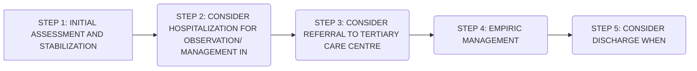

```markdown
# Standard Treatment Workflow (STW) for the Management of FEVER IN CHILDREN
ICD-10-R50

FEVER IS Core (rectal) temperature ≥ 38.0°C (100.4°F) or axillary temperature > 37.5°C (100.4°F).

## What to Ask?
*   Fever duration
*   Localizing symptoms of: RTI, UTI, GI tract infection, CNS infection
*   Rash, joint symptoms, skin/soft tissue swelling or redness
*   Vaccination within 24 hours, drug/toxin exposure
*   Family/neighbourhood history of similar illness

## Examination
*   Vital signs: Temp, HR, RR, BP, CFT
*   Appearance: Sick, toxic, lethargic, irritable, inconsolable, dehydrated

### General Examination
*   Ear, nose, throat
*   Rash (petechiae, macules, papules, vesicles, nodules, polymorphic)
*   Lymphadenopathy
*   Skin (pustules, pyoderma, impetigo, cellulitis)
*   Joints
*   Genitalia (for erythema, tenderness, edema)
*   Bones

### Systemic Examination
*   Chest auscultation, abdominal palpation, CNS, CVS

## Clues to a Specific Diagnosis
*   **Fever + respiratory symptoms:**
    *   Cough, runny nose: URTI
    *   Membrane over tonsils/pharynx: Diphtheria
    *   Paroxysmal cough: Pertussis like illness
    *   Barking cough: Laryngotracheobronchitis/ croup
*   **Fever + rash**
    *   Red maculopapular rash: Measles, Rubella, Dengue.
    *   Fine generalized maculopapular rash with systemic dysfunction/shock: Meningococcemia.
    *   Itchy erythematous macules evolving to clear vesicles: Varicella
*   **Fever + other symptoms:**
    *   Parotid gland swelling: Mumps
    *   Arthritis: Consider Chikungunya, acute rheumatic fever, JIA
    *   Strawberry red tongue, skin peeling, lymphadenopathy, conjunctival injection: Kawasaki disease

## Investigation of the Febrile Child
(Consider if one or more of the following are warranted. Perform investigations only where result impacts management)

### <7 Days Fever Alone
*   **ESSENTIAL:**
    *   If fever <72 hours and child not looking sick: No investigations
    *   If fever >72 hours, consider: TLC, DLC, P.S for leukocyte morphology, malarial parasite & platelet count
*   **DESIRABLE:** Rapid antigen test for malaria, NS1 antigen and dengue IgM antibody, blood culture
*   **OPTIONAL:** C reactive protein, procalcitonin

### <7 Days and Localizing Symptoms Present
*   **ESSENTIAL:** As given in the first box
*   **DESIRABLE:** As given in the first box + consider: (Clean-catch) urine microscopy & culture, chest Xray, CSF analysis
*   **OPTIONAL:** As given in the first box + consider: ultrasonography, throat/ pharyngeal swab, pus aspiration.

### <7 Days and Non Specific Symptoms
*   **ESSENTIAL:** As given before
*   **DESIRABLE:** As given before. Additionally consider: serology for specific viral infection, rapid antigen test for malaria, NS1 antigen and dengue IgM antibody, blood culture, serology for scrub typhus
*   **OPTIONAL:** As given before

### >7 Days and Fever Alone or Without Localizing Symptoms
*   **ESSENTIAL:** All mentioned in Essential & Desirable list in the prior boxes. Additionally consider Widal test.
*   **DESIRABLE:** Consider Mantoux test, ultrasonography
*   **OPTIONAL:** As given before. Additionally consider: Ultrasonography of abdomen, chest, pericardium, joint(s), abscess, lymph node clusters, parotid gland etc, for microscopy, Xpert MTB RIF assay, Mycobacterial culture. Consider: bone marrow, ANA-profile, HIV serology, echocardiography, CT PET scan.

### >7 Days and Localizing Symptoms Present
*   **ESSENTIAL:** All investigations mentioned in the prior boxes
*   **DESIRABLE:**All investigations mentioned in the prior boxes. Additionally consider: serology for Brucella, CMV, Herpes, Japanese encephalitis. CT scan in deep seated abscess or lung abscess, Bone marrow examination, ANA profile, HIV serology, PET scan.
*   **OPTIONAL:** All investigations mentioned in the prior boxes

## Management


### STEP 1
*   **INITIAL ASSESSMENT AND STABILIZATION**
    *   Manage urgent issues
    *   Decrease body temperature with Paracetamol (15mg/kg by any route) and/or hydrotherapy.
    *   Manage any life-threatening issue.
    *   Consider first dose antibiotic in suspected meningitis, severe pneumonia, or severe malnutrition.
    *   Consider anti-malarial in suspected malaria

### STEP 2
*   **CONSIDER HOSPITALIZATION FOR OBSERVATION/ MANAGEMENT IN**
    *   All neonates
    *   Young infants with toxic appearance.
    *   Severe malnutrition, toxic appearance, inability to feed, lethargy, irritability, dehydration, etc.
    *   >14 days illness without diagnosis.
    *   Any reason deemed by the treating physician.

### STEP 3
*   **CONSIDER REFERRAL TO TERTIARY CARE CENTRE**
    *   (after appropriate stabilization and/or initial management):
        *   Need for intensive care
        *   Complex multi-system disease.
        *   Confirmed complications of the primary illness

### STEP 4
*   **EMPIRIC MANAGEMENT**
    *   Consider based on likely diagnosis, sickness status, and availability of investigation facilities.
    *   Empiric treatment should be tailored based on subsequently available investigation reports & local antimicrobial sensitivity.
    *   Anti tuberculosis treatment (ATT) should not be started on empiric basis except in suspected TBM

### STEP 5
*   **CONSIDER DISCHARGE WHEN**
    *   Afebrile > 48 hours or fever is showing defervescence
    *   Feeding well
    *   Presenting symptoms (in addition to fever) resolved/resolving
    *   Physician is satisfied that further care can be continued on ambulatory basis
    *   Duration of i.v antibiotic therapy is completed

## Abbreviations
*   ANA: Anti-nuclear antibody
*   BP: Blood pressure
*   CFT: Capillary filling time
*   CMV: Cytomegalovirus
*   CNS: Central nervous system
*   CSF: Cerebro-spinal fluid
*   CT: Computed tomography
*   DLC: Differential leukocyte count
*   CVS: Cardiovascular system
*   GI: Gastro-intestinal
*   HR: Heart rate
*   JIA: Juveline idiopathic arthritis
*   PET: Positron emisison tomography
*   PS: Peripheral smear
*   RR: Respiratory rate
*   RTI: Respiratory tract infection
*   TLC: Total leukocyte count
*   URTI: Upper respiratory tract infection
*   UTI: Urinary tract infection

**KEEP A HIGH THRESHOLD FOR INVASIVE PROCEDURES**

## References
1.  World Health Organization. Integrated Management of Childhood Illness: distance learning course.
http://apps.who.int/iris/bitstream/handle/10665/104772/9789241506823_Module-5_eng.pdf;jsessionid=942F89F89671BA396EC7F46C9B5C1158?sequence=7
2.  Mahajan P, et al. Consensus Guidelines on Evaluation and Management of the Febrile Child Presenting to the Emergency Department in India. Indian Pediatr 2017; 54: 652-60.
3.  World Health Organization 2015. Government of India National Guidelines for Clinical Management of Dengue Fever.
4.  Kliegman RM (ed). Nelson Textbook of Pediatrics 20th edition, 2016.

This STW has been prepared by national experts of India with feasibility considerations for various levels of healthcare system in the country. These broad guidelines are advisory, and are based on expert opinions and available scientific evidence. There may be variations in the management of an individual patient based on his/her specific condition, as decided by the treating physician. There will be no indemnity for direct or indirect consequences. Kindly visit our web portal (stw.icmr.org.in) for more information.

Indian Council of Medical Research and Department of Health Research, Ministry of Health & Family Welfare, Government of India.
```