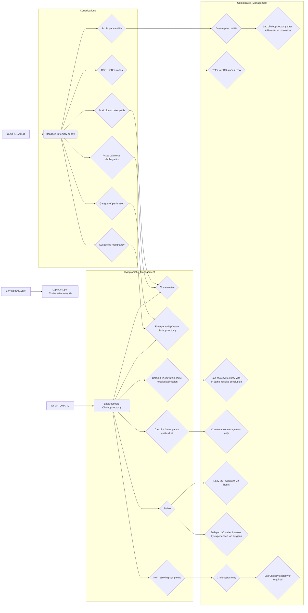

```markdown
# Standard Treatment Workflow (STW)
## GALL STONE DISEASE
ICD-10-K80.20

### SYMPTOMS
1) Pain
A) Biliary colic- slowly
progressive, constant
pain in right upper
quadrant or mid -
epigastrium,
crescendo-decrescendo pattern
B) Acute cholecystitis - prolonged
pain more than biliary colic,
(> 24 hrs) associated with fever
2) Nausea or vomiting
3) Dyspepsia
4) Flatulence
5) Food intolerance
6) Jaundice - GB stone impacted
at the neck or hartmann's
pouch that compresses CBD
7) Acute cholangitis - pain,
fever, jaundice

## PRESENTATION OF A PATIENT WITH GSD

### SYMPTOMATIC
1. **Acute cholecystitis**
2. **Empyema**
3. **Mucocoele**
### ASYMPTOMATIC
### COMPLICATED
4. **Acalculous cholecystitis** (critically ill patients - unexplained fever, lack of
right upper quadrant tenderness, leukocytosis)
5. **Gangrene/ perforation**
6. **Biliary obstruction**
7. **Acute pancreatitis**

## INVESTIGATIONS
* Haemogram, RFT,
electrolytes, CXR,
RBS, ECG (to distinguish
from cardiac pain)
* LFT-Serum bilirubin,
SGOT/PT, Alkaline
Phosphatase
* Amylase, lipase
* USG abdomen-investigation of choice (sensitivity-95%)
 1. To look for status of gall bladder and characteristic distal acoustic shadow
 2. Status of liver/CBD/ Intra hepatic biliary radicle dilatation (IHBRD)
 3. Other intra abdominal pathology like renal stones, ovarian pathology etc
* MRCP
Indications- jaundice, high ALP, dilated CBD (on USG),
suspected CBD stones or mirizzi's syndrome (CBD
obstruction caused by extrinsic compression from an
impacted stone in cystic duct or Hartmann's pouch)

## EVALUATION OF COMORBIDITIES
* DM - fasting & post prandial blood sugar, HbAlc, sugar charting
* Cardiac evaluation - ECHO and other as required
* COPD patient - PFT
* Coagulation profile - PT/ INR
* Thyroid function test

## MANAGEMENT



### ASYMPTOMATIC
Laparoscopic
Cholecystectomy +/-
#### Absolute indications:
* GB polyp > 1cm
* Porcelain GB
* Chronic hemolytic
anemia
* Transplant patient
especially (cardiac
transplant)
* Calculi > 3cm
* Multiple small
stones
* Paediatric gall
stones
#### Relative Indications:
* Calculi > 2 cm
* Calculi < 3mm,
patent cystic duct
* Diabetes mellitus
* Non functioning GB

### SYMPTOMATIC
Laparoscopic
Cholecystectomy
#### Acute calculous
cholecystitis
Conservative
#### Suspected
malignancy
Emergency lap/
open
cholecystectomy
#### Gangrene/
perforation
Emergency lap/
open
cholecystectomy
#### Acute
pancreatitis
Conservative
management
#### Acalculous
cholecystitis
Conservative
management
#### GSD+ CBD stones
Refer to CBD
stones STW

Unstable
Lap
cholecystectomy
within same
hospital admission

Stable
Conservative
management only

Non resolving
symptoms
Cholecystostomy

### COMPLICATED
(If possible patient should
be managed in a tertiary
centre after initial
resuscitation)

Mild/moderate
pancreatitis
Lap cholecystectomy
with in same
hospital conclusion

Severe
pancreatitis
Lap cholecystectomy
after 4-6 weeks of
resolution of
pancreatitis
Lap cholecystectomy
if symptoms persists
after resolution of
acute phase

NON RESOLVING
Cholecystostomy followed by laparoscopic
cholecystectomy by experienced
laparoscopic surgeon after 6 weeks

STABLE
Early LC - within 24-72 hours (if expertise available)
OR
Delayed LC - after 6 weeks by experienced lap surgeon

## MANAGEMENT OF ACUTE CHOLECYSTITIS (CONSERVATIVE)
At PHC level: initial resuscitation, IV antibiotics (3rd
generation cephalosporin, metrogyl +
aminoglycosides), analgesics, bowel rest, USG
abdomen (if available) and refer to higher centre

At district hospital level: IV hydration,
antibiotics (3rd generation cephalosporin,
metrogyl + aminoglycosides), analgesics, bowel
rest, USG abdomen, surgical consultation

Tertiary level- Early (if presents
within 72 hrs)/ interval laparoscopic
cholecystectomy depending on
expertise in laparoscopy

## POST LAP CHOLECYSTECTOMY COMPLICATIONS
* Patient not looking well, non ambulatory, not tolerating orally
* Pain out of proportion / not explained / not responding to analgesics
* Tachycardia, Fall in BP
* Abdominal distention, bile/ blood in drain

FOLLOW UP
* Suture removal after 1 week, HPE report
* Continue antibiotics - if mucocele, empyema,
diabetic

## CONVERT EARLY IN CASE OF DOUBT IN LAP CHOLECYSTECTOMY
## REFER PATIENT EARLY IN CASE OF ANY DOUBT IN POST OP

### ABBREVIATIONS
CBD: Common bile ducts
GSD: Gall stone disease

HPE: Histopathological examination
LC: Laparoscopic cholecystectomy

MRCP: Magnetic resonance
cholangiopancreatography

### KEEP A HIGH THRESHOLD FOR INVASIVE PROCEDURES
This STW has been prepared by national experts of India with feasibility considerations for various levels of healthcare system in the country. These broad guidelines are advisory, and
are based on expert opinions and available scientific evidence. There may be variations in the management of an individual patient based on his/her specific condition, as decided by
the treating physician. There will be no indemnity for direct or indirect consequences. Kindly visit the website of DHR for more information: (stw.icmr.org.in) for more information.
Department of Health Research, Ministry of Health & Family Welfare, Government of India.
