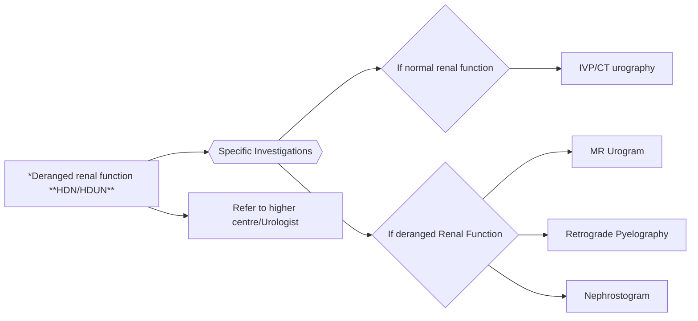

```markdown
March
ch/2022
सत्यमेव जयते
Department of Health Research
Ministry of Health and Family Welfare, Government of India
भारतीय
EDICAL
icma
INDIAN COUNCIL OF
MEDICAL RESEARCH
Serving
1911
NEW DELHI
नई दिल्ली
# Standard Treatment Workflow (STW) for the Management of
**GENITOURINARY TUBERCULOSIS**
ICD-A18.10

## WHEN TO SUSPECT?
- Fever
- Weight loss
- Night sweats

## PRESENTING SYMPTOMS

### Urinary Tuberculosis
- **LUTS** (frequency, urgency and nocturia) with dysuria and/or haematuria for at least 2 weeks
- Not responding to a 3-7 day course of antibiotics

### Male Genital Tuberculosis (MGTB)
- Scrotal pain or swelling for 2 weeks or more
- Not responding to a 7-14 day course of antibiotics, or
- Discharging sinuses in the scrotum
- Rarely infertility

## INVESTIGATION

### Essential
- CBC
- KFT*
- LFT
- ESR
- Chest X ray
- Urine R/M and Culture
- Urine for AFB x 3-5 days (early morning, first void)
- Urine Culture for MTB x 3-5 days (early morning, first void)
- NAAT assay (GeneXpert MTB/RIF)
- USG KUB**
- USG Scrotum (for MGTB only)

### *Deranged renal function **HDN/HDUN**

### Specific Investigations
- If normal renal function
    - IVP/CT urography
- If deranged Renal Function
    - MR Urogram
    - Retrograde Pyelography
    - Nephrostogram

### Optional (If other tests are inconclusive with high suspicion of GUTB)
- FNAC/Biopsy- from accessible mass lesions or fluid collections
- Cystoscopic biopsy of Genitourinary tract



## TREATMENT

| TYPE OF TB | TYPE OF REGIMEN | DRUGS | EXTENSION CRITERIA |
|---|---|---|---|
| DRUG SUSCEPTIBLE TB | DS-TB REGIMEN | 2 MONTHS H,R,E,Z <br> 4 MONTHS H,R,E | Extension packets of infection, concurrent smear positive cavitary pulmonary disease, CNS involvement, Delay in positive cultures converting to negative <br> Duration can be increased up to 9 to 12 months |
| MDR/RR OR XDR-TB | TREATMENT AS PER NTEP GUIDELINES |

## FOLLOW UP

- **At 8 weeks**: Resolution of systemic symptoms, improved urinary symptoms, repeat culture if baseline culture positive
- **After completion of ATT**: Repeat culture if baseline culture positive
- **Repeat imaging**: If partial or impending ureteric stricture
- **Watch for the following complications at each Follow-up visit**:
    - Severe **LUTS** suggestive of small capacity bladder
    - Deteriorating renal function

## ABBREVIATIONS
- **ATT**: Anti-tubercular treatment
- **CBC**: Complete Blood Count
- **CT**: Computed Tomography
- **CXR**: Chest X- Ray
- **DJS**: Double J Stent
- **DS-TB**: Drug Susceptible Tuberculosis
- **E**: Ethambutol
- **ESR**: Erythrocyte Sedimentation Rate
- **HDN**: Hydronephrosis
- **HDUN**: Hydroureteronephrosis
- **IVP**: Intravenous Pyelogram
- **KFT**: Renal Function Test
- **LFT**: Liver Function Test
- **LUTS**: Lower Urinary Tract Symptoms
- **MDR**: Multi Drug Resistant
- **MR**: Magnetic Resonance
- **MTB**: Mycobaterium Tuberculosis
- **NAAT**: Nucleic Acid Amplification Test
- **NTEP**: National Tuberculosis Elimination Programme
- **R**: Rifampicin
- **RR**: Rifampicin Resistant
- **USG KUB**: Ultrasonography Kidney, Ureter and Bladder
- **URINE AFB**: Urine for Acid-fast Bacillus
- **XDR**: Extensively Drug Resistant
- **Z**: Pyrazinamide

## References
1. National TB Elimination Programme, Central TB Division. Training modules for Programme Managers & Medical Officers. Ministry of Health & Family Welfare, Government of India
https://tbcindia.gov.in/index1.php?lang=1&level=1&sublinkid=5465&lid=3540 Last access on 11 March, 2022.
2. Guidelines for programmatic management of drug resistant tuberculosis in India March 2021. National TB Elimination Programme, Central TB Division, Ministry of Health & Family Welfare,
Government of India. https://tbcindia.gov.in/showfile.php?lid=3590 Last access on 11 March, 2022.
3. Partin, A. W. et al. Edited (2020). Campbell Walsh Wein Urology (12th ed.). Elsevier.

*Disclaimer: This STW has been prepared by national experts of India with feasibility considerations for various levels of healthcare system in the country. These broad guidelines are advisory, and are based on expert opinions and available scientific evidence. There may be variations in the management of an individual patient based on his/her specific condition, as decided by the treating physician. There will be no indemnity for direct or indirect consequences. Kindly visit our web portal (stw.icmr.org.in) for more information. Indian Council of Medical Research and Department of Health Research, Ministry of Health & Family Welfare, Government of India.*
```