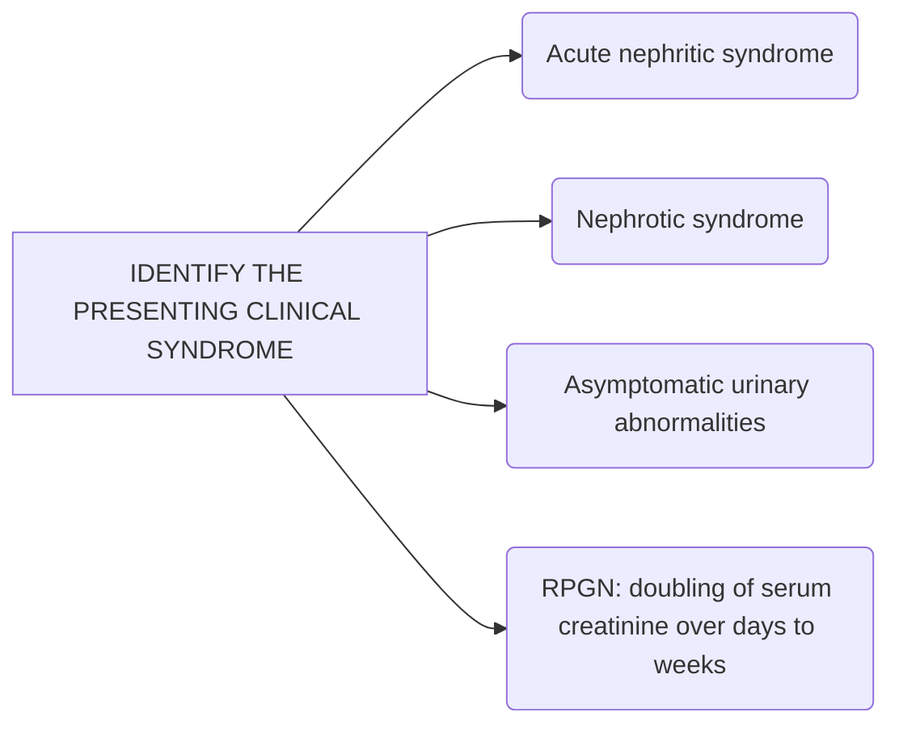
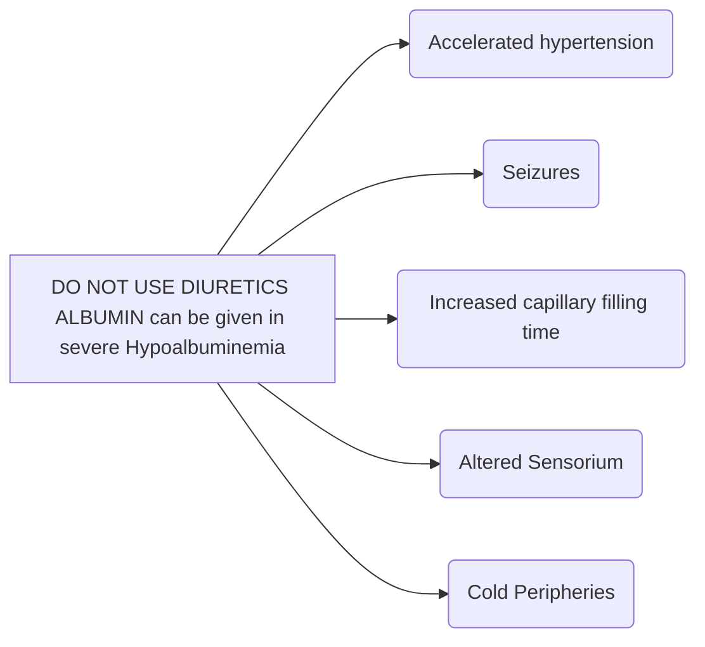

```markdown
October/2019

# Standard Treatment Workflow (STW) for the Management of GLOMERULONEPHRITIS

## WHAT IS GN?

Glomerulonephritis
refers to an
inflammation of the
glomerulus hence it is
not strictly a single
disease, its
presentation depends
on the specific
disease entity. It may
present as
symptomatic urinary
abnormalities/
nephrotic syndrome/
nephritic syndrome/
AKI/CKD

ICD-10-N05.9



## EVALUATION OF A PATIENT WITH GN
*   Full history and clinical examination
*   Urinalysis: urine routine exam, microscopy
*   proteinuria quantitation: 24 h UP; ACR/PCR for follow up
*   Assess eGFR using age-appropriate formula
*   Renal imaging
*   Serologic testing
*   Kidney biopsy

## KIDNEY BIOPSY
*   Age <1 y or >12 y
*   Steroid resistant state
*   Family history of kidney disease
*   Features suggestive of systemic disease
*   Diagnosis unclear, therapeutic uncertainty
*   Doubling of serum creatinine over days-weeks

## SEROLOGY
*   ASO
*   HIV (high risk)
*   ANA
*   Anti-GBM antibody
*   Anti-PLA2R
*   HBsAg, anti-HCV
*   C3
*   ANCA
*   SPEP (>50 y)

## IN CHILDREN <12 Y WITH NEPHROTIC SYNDROME DO NOT
*   Give any vaccine while on steroids or within 3 months of stopping
*   Prescribe bed rest unless indicated
*   Restrict salt in children with nephrotic syndrome
*   Restrict fluids
*   Use ACE inhibition in children with renal dysfunction, or in steroid sensitive nephrotic syndrome

## BEFORE STARTING STEROIDS IN CHILDREN, REMEMBER TO
*   Look for latent TB (Mantoux test, Chest X-ray)
*   Start 6 months INH therapy (5mg/kg day) if asymptomatic Mantoux +ve
*   Be on the lookout for common infections (e.g. peritonitis, pneumonia and skin infections)

## CAUTION
*   Non-nephrotic proteinuria: rule out orthostatic cases
*   Isolated hematuria: rule out urological causes

## LOOK FOR COMPLICATIONS
*   Malnutrition
*   Hypovolemia
*   AKI
*   Thromboembolism
*   Infections

```mermaid
graph LR
    A[TREATMENT] --> B(Lifestyle modifications);
    A --> C(Sodium restriction (not in children));
    A --> D(Diuretics - loop needed, reverse edema slowly);
    A --> E(Avoid nephrotoxic agents);
    A --> F(BP control (<130/80 mm Hg in adults, <95th centile for age in children));
    A --> G(ACE inhibition (see exceptions under DO NOT));
```

## RECOMMENDED PHARMACOLOGICAL TREATMENT

### CHILDREN
*   Prednisolone 2 mg/kg x 6 w followed by 1.5 mg/kg A/D x 6w
*   In case of relapse- Prednisolone 2 mg/kg x 2w followed by 1.5 mg/kg A/D x 4w

### ADULTS
*   Treatment Depends on diagnosis (biopsy, serology)
*   Therapeutic choices include
    *   Corticosteroid (Prednisolone, IV methylprednisolone)
    *   CNIs (cyclosporine/tacrolimus)
    *   Cyclophosphamide
    *   Azathioprine
    *   Mycophenolate mofetil
    *   Levamisole
    *   Rituximab

## THROMBOSIS PROPHYLAXIS
*   Evaluate bleeding risk: Do not use if risk high
*   S alb <2 + non-ambulatory: start aspirin, OAC if high risk

## MANAGEMENT

### PHC/CHC
*   Detailed history and clinical examination
*   Urine dipstick test
*   Serum creatinine, electrolytes
*   Stabilize
*   Start antihypertensives and diuretics if needed

### INDICATIONS FOR REFERRAL
*   All cases >12 years old and less than 1 year old
*   In children:
    *   Frequent relapses (=>3 per year)
    *   Steroid dependent or resistant state
    *   Recent rise in serum creatinine
    *   Appearance of complications related to disease or treatment
    *   Pregnancy
    *   Persistent asymptomatic urinary abnormalities (>6 months)

### DISTRICT HOSPITALS
*   Detailed history and clinical examination
*   24-hr urinary protein estimation
*   Serum creatinine, electrolytes, serum albumin, lipid profile
*   Imaging of kidneys
*   Evaluate for secondary causes
*   Look for and treat complications
*   Start general treatment
*   Can treat
    *   Uncomplicated NS in 1-12 y old
    *   Infrequent relapses
*   Prepare treatment plan and refer back to primary care

### ADMISSION CRITERIA:
Initial evaluation, kidney biopsy, or management of complications

### TERTIARY CARE HOSPITALS
*   Detailed history and clinical examination
*   24-hr urinary protein estimation
*   Serum creatinine, electrolytes, serum albumin, lipid profile
*   Imaging of kidneys
*   Evaluate for secondary causes
*   Look for and treat complications
*   Start antihypertensives and diuretics
*   Kidney biopsy
*   Prepare treatment plan and refer back to primary care

## RED FLAG SIGNS



## KEEP A HIGH THRESHOLD FOR INVASIVE PROCEDURES

This STW has been prepared by national experts of India with feasibility considerations for various levels of healthcare system in the country. These broad guidelines are advisory, and are based on expert opinions and available scientific evidence. There may be variations in the management of an individual patient based on his/her specific condition, as decided by the treating physician. There will be no indemnity for direct or indirect consequences. Kindly visit our web portal (stw.icmr.org.in) for more information.

Indian Council of Medical Research and Department of Health Research, Ministry of Health & Family Welfare, Government of India.
```