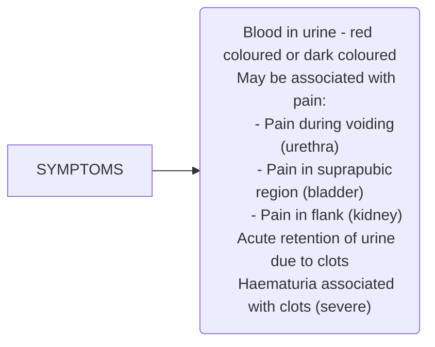

```markdown
October/2019

सत्यमेव जयते
Department of Health Research
Ministry of Health and Family Welfare, Government of India

अनुसंधान
MEDICAL RESEARCH
NEW DELHI
INDIAN COUNCIL OF
MEDICAL RESEARCH
Serving the nation since 1911

# Standard Treatment Workflow (STW) for the Management of
**GROSS HAEMATURIA**
ICD-10-R31.0

**PERFORM THOROUGH CLINICAL EVALUATION**



**EXAMINATION**
* Pulse, blood pressure
* Check for pallor
* Check for anasarca
* Per abdomen
  examination: Palpable
  bladder, flank mass
* Digital rectal
  examination: Enlarged
  prostate, hard nodular/
  smooth surfaced
  prostate
* Rule out vaginal causes
  of bleeding

**RED URINE BUT NOT HAEMATURIA**
* Foods: beetroot,
  blackberry,
  rhubarb
* Medicines:
  rifampicin,
  pyridium

Even single episode of
haematuria warrants
complete evaluation

## MAKE A CLINICAL
**DIAGNOSIS: IS HAEMATURIA**

### INITIAL
* Urethra: stone, **urethritis**, **stricture**
* Prostate: inflammation, benign
  hyperplasia, **malignancy**

### TOTAL
* Kidney: stone, **malignancy** (renal parenchyma,
  pelvis/ureter, genito-urinary **tuberculosis**)
* Ureter: stone, **malignancy**, genito- urinary
  **tuberculosis**
* Bladder: infection, genitourinary **tuberculosis**,
  stone, **malignancy**)

### TERMINAL
* Bladder: stone, tumor at bladder neck
* Prostate: inflammation, benign
  hyperplasia, **malignancy**

## HOW TO INVESTIGATE

### ESSENTIAL
* Urine examination - routine, microscopy
* Hemoglobin estimation
* Kidney function tests (KFT)
* Ultrasonography of kidney urinary
  bladder and prostate region

### DESIRABLE
* Contrast enhanced computed
  tomography of kidney urinary bladder
  region/intravenous pyelography (if KFT
  normal)
* Magnetic resonance imaging of Kidney
  urinary bladder region (if KFT deranged)
* Urine cytology if > 40yrs or smoker
* Cystoscopy if > 40 years or smoker

### OPTIONAL
* Urine culture
* Urine for active
  sediments(if
  nephrotic/
  nephritic
  syndrome
  suspected)
* PT/INR (if
  bleeding disorder
  suspected)
* Serum prostate
  specific antigen
  (if required)
* Urine for acid fast
  bacilli - 3 samples
  (if tuberculosis
  suspected)

### WHEN TO REFER
**(WARNING SIGNS)**
* Deranged kidney functions
* Suspecting malignancy
* Haematuria with hypertension/
  albuminuria
* Persistent severe haematuria

## HOW TO TREAT

### GENERAL
* Start intravenous fluids
  if required (primary
  level)
* If Anaemia - may trans-
  fuse blood as required
  (primary level)
* Manage clot colic /
  flank pain with analge-
  sics (primary level)
* If Acute urinary reten-
  tion - catheterise with
  20/22Fr 3 way Foley and
  may start continuous
  irrigation with normal
  saline (Primary level)
* Cystoscopic clot evacu-
  ation may be per-
  formed if feasible (ter-
  tiary level)
* If basic evaluation and
  management facilities
  are unavailable - refer
  (tertiary level)

### SPECIFIC
* Haematuria should be considered as a symptom of genitourinary malignancy in patients >40years old until
  proven otherwise
* Suspected nephrotic/nephritic syndrome: cola coloured urine, proteinuria, anasarca, hypertension - Refer to
  nephrologist (tertiary level)
* Suspect urinary tract infection: presents with dysuria, increased frequency of voiding and other irritative lower
  urinary tract symptoms with/without fever- treat with broad spectrum oral antibiotics (primary level)

## DIFFERENTIAL DIAGNOSIS FOR CHRONIC CONDITIONS LEADING TO HAEMATURIA

|                 | Stones                                                              | Renal cell cancer                                                        | Genito-urinary tuberculosis                                             | Bladder tumor                                                                  |
| :-------------- | :------------------------------------------------------------------ | :----------------------------------------------------------------------- | :---------------------------------------------------------------------- | :----------------------------------------------------------------------------- |
| **Symptoms**    | Flank pain Ureteric colic Recurrent urinary tract infection         | Flank mass Haematuria                                                    | Flank pain Urinary retention Dysuria                                     | Dysuria Frequency Nocturia Haematuria                                          |
| **Investiga-**  | Ultrasonography Xray KUB Intravenous pyelography or Computed tomography | Ultrasonography Computed tomography                                      | Ultrasonography Computed tomography Urine analysis Urine acid fast bacilli | Ultrasonography Computed tomography Urine cytology                              |
| **Treatment**   | >5mm or symptomatic - refer to urologist                             | Mostly surgical treatment - refer to urologist                            | Oral Antitubercular treat- ment - 6months, refer to a urologist        | Mostly surgical treatment - refer to urologist, close follow up                |
| **tions**       |                                                                     |                                                                          | Gene expert (optional) Intravenous pyelography or Computed tomography |                                                                                |

## REFERENCES
1. Standard treatment guidelines in urology: Ministry of Health and Family selfare

**KEEP A HIGH THRESHOLD FOR INVASIVE PROCEDURES**

This STW has been prepared by national experts of India with feasibility considerations for various levels of healthcare system in the country. These broad guidelines are advisory, and are
based on expert opinions and available scientific evidence. There may be variations in the management of an individual patient based on his/her specific condition, as decided by the
treating physician. There will be no indemnity for direct or indirect consequences. Kindly visit our web portal (stw.icmr.org.in) for more information.
Indian Council of Medical Research and Department of Health Research, Ministry of Health & Family Welfare, Government of India.
```