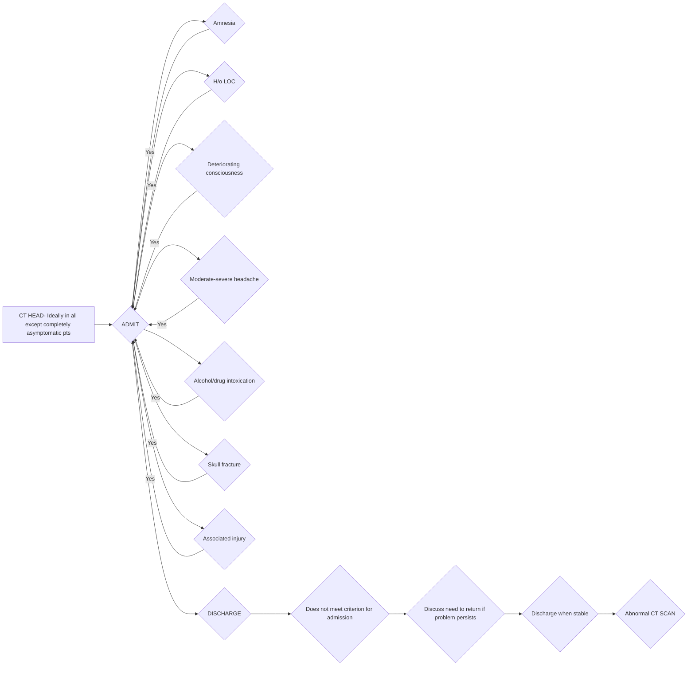
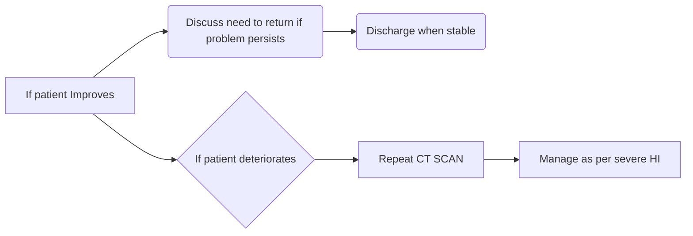

```markdown
# Standard Treatment Workflow
# HEAD INJURY
ICD-S09.90XA

## CLINICAL PRESENTATION

### SYMPTOMS
*   Headache/vomiting
*   Brief or persistent **loss of consciousness (LOC)**
*   Confusion/amnesia/ inability to remember events related to trauma
*   Seizures
*   Local signs of scalp hematoma/ laceration
*   Blood/blood stained/clear watery fluid leak from nose/ear

### RED FLAG SIGNS:
*   Unconscious
*   Irregular respiration
*   Pupil size asymmetric
**IF RED FLAG SIGNS PRESENT:**
Give 200ml (to adult patients or as per weight to children) **20% mannitol IV over 30 minutes** (only if systolic BP > 90 mmHg) and refer to higher centre immediately after stabilisation of ABC

### PREHOSPITAL CARE OF HEAD INJURY
*   Golden hour of head injury management: ABC as in trauma guidelines
*   Look for associated injuries to pelvis/long bones/chest/abdomen
*   Any external bleeding controlled with local pressure
*   All suspected head injury cases: shift to higher centre (where CT SCAN and neurosurgeon are available)
*   Transfer only when ABC are stable

## NEUROLOGICAL ASSESSMENT

### GLASGOW COMA SCORE (GCS) TO QUANTIFY SEVERITY OF HEAD INJURY

| ASSESSMENT DOMAIN        | SCORE |
| :----------------------- | :---- |
| **Eye opening (E)**        |       |
| Spontaneous            | 4     |
| To speech                | 3     |
| To pain                  | 2     |
| None                     | 1     |
| **Verbal response (V)**  |       |
| Oriented                 | 5     |
| Confused conversation    | 4     |
| Inappropriate words      | 3     |
| Incomprehensible sounds  | 2     |
| None                     | 1     |
| **Best motor response (M)** |       |
| Obeys commands           | 6     |
| Localizes pain             | 5     |
| Flexion withdrawal to pain | 4     |
| Abnormal flexion (decorticate) | 3 |
| Extension (decerebrate)    | 2     |
| None (flaccid)             | 1     |

### SCORING & INTERPRETATION OF SEVERITY
*   GCS Score = (E[4] + V[5] + M[6])
*   Score range: 3 to 15
*   Mild = GCS 13-15, Moderate = GCS 9-12, Severe = GCS 3-8

### NOTE PUPILS: SIZE/ SHAPE/REACTION/ SYMMETRY
*   LOOK FOR SYMMETRY OF MOTOR RESPONSE
NORMAL
ANISOCORIA (unequal pupils)
Abnormal pupil dilation

### ELICITING MOTOR RESPONSE TO PAINFUL STIMULI
### IRREGULAR RESPIRATION
*   Labored breathing
*   Accessory muscles of respiration active

## INVESTIGATIONS
### ESSENTIAL
*   Chest X ray
*   Ultrasound abdomen and chest to rule out abdominal free fluid/hemothorax
*   **NCCT Head with Cervical Spine** as soon as possible in all head injury patients
*   Definite indication for CT SCAN if any of the following are present
    *   GCS <15
    *   Transient loss of consciousness
    *   Suspected skull fracture
    *   Post traumatic seizure
    *   Focal neurological deficit
    *   Persistent vomiting
    *   Amnesia

### DESIRABLE:
*   X rays long bone and pelvis (if indicated)

### OPTIONAL:
*   Blood alcohol levels
*   Plain MRI brain for prognostication (not in acute cases)
*   Biomarkers like serum S100b

## MANAGEMENT AT HIGHER CENTRE WITH CT SCAN & NEUROSURGEON

### MILD HEAD INJURY (GCS: 13-15)
*   History
*   General examination
*   Neurological examination
*   Skull X-Ray
*   Cervical spine X-Ray
*   Blood alcohol levels



### MODERATE HEAD INJURY (GCS: 9-12)
*   Initial Assessment
*   **CT SCAN IN ALL CASES**
*   Admit even if CT is normal
*   Frequent neurological examinations
*   Follow up
*   CT SCAN if deteriorates/before discharge



### SEVERE HEAD INJURY (GCS: 3-8)
*   Intubate, Sedate, Resuscitate

```mermaid
graph LR
    A[CT SCAN - Not available] --> B{Refer to higher centre if < 2 hrs};
    A --> C[Diffuse lesion];
    C --> D[ICU];
    D --> E[Monitor ICP];
    E --> F[Elevate Head end];
    F --> G[Sedate];
    G --> H[Maintain PaO2 100 mmHg];
    H --> I[Maintain PaCO2 30-32 mmHg];
    I --> J[ICP still high];
    J --> K[Treat ICP];
    A --> L[Surgical Lesion (decompressive craniectomy)];
```

## MEDICAL MANAGEMENT

*   Treatment of high intracranial pressure
    *   Sedation, analgesia and mild to moderate hyperventilation (PaCO₂ 30-35 mmHg)
    *   Osmotic therapy: mannitol: **0.25 - 1.00 g/kg IV bolus** or **3ml/kg 3% hypertonic saline** 8 hourly
    *   Antiepileptic drugs
        *   **Phenytoin (20mg/kg over 30 min IV, followed by 5mg/kg in 2-3 divided doses)**
        *   **Levetiracetam (500 mg BD, continue for 1-3 months)**
        *   Prophylaxis - if seizure free for 6 months
        *   Therapeutic - if seizure free for 2 years after receiving drug therapy, consider tapering/discontinue antiepileptic
        *   Consult neurosurgeon/neurologist before stopping
    *   **Steroids NOT useful in Head Injury**

## SURGICAL MANAGEMENT IN HEAD INJURY IF
*   Extradural hematoma > 30cc in volume
*   Subdural hematoma > 10mm thick with midline shift > 5 mm and evidence of deterioration in clinical neurology/change in pupillary size
*   Most common operation done is decompressive craniotomy with hematoma evacuation and/ or removal of large bone flap (15x12cm). To be done by neurosurgeon only

## ABBREVIATIONS
*   CT: Computed Tomography
*   ICP: Intracranial Pressure
*   ICU: Intensive Care Unit
*   MRI: Magnetic Resonance Imaging

## REFERENCES
1.  Temkin NR. Risk factors for posttraumatic seizures in adults. Epilepsia. 2003;44(s10):18-20. doi: 10.1046/j.1528-1157.44.s10.6.x. PMID: 14511390.
2.  Fordington S, Manford M. A review of seizures and epilepsy following traumatic brain injury. J Neurol. 2020 Oct;267(10):3105-3111. doi: 10.1007/s00415-020-09926-w. Epub 2020 May 22. PMID: 32444981; PMCID: PMC7501105.
3.  Teasdale G, Maas A, Lecky F, Manley G, Stocchetti N, Murray G. The Glasgow Coma Scale at 40 years: standing the test of time. Lancet Neurol. 2014 Aug;13(8):844-54. doi: 10.1016/S1474-4422(14)70120-6. Erratum in: Lancet Neurol. 2014 Sep;13(9):863.
    PMID: 25030516.
4.  Carney N, Totten AM, O'Reilly C, Ullman JS, Hawryluk GW, Bell MJ, Bratton SL, Chesnut R, Harris OA, Kissoon N, Rubiano AM, Shutter L, Tasker RC, Vavilala MS, Wilberger J, Wright DW, Ghajar J. Guidelines for the Management of Severe Traumatic Brain Injury, Fourth Edition. Neurosurgery. 2017 Jan 1;80(1):6-15. doi: 10.1227/NEU.0000000000001432. PMID: 27654000.
5.  Maas AIR, Fitzgerald M, Gao G, Gupta D, Hutchinson P, Manley GT, Menon DK. Traumatic brain injury over the past 20 years: research and clinical progress. Lancet Neurol. 2022 Sep;21(9):768-770. doi: 10.1016/S1474-4422(22)00307-6. PMID: 35963251.

### REMOVAL OF LARGE BONE FLAP (15CM X12 CM) BY A NEUROSURGEON (DECOMPRESSIVE CRANIECTOMY) IS THE MOST COMMON SURGICAL PROCEDURE DONE

### COMPLICATIONS TO WATCH FOR
*   Deterioration of GCS score
*   New onset or worsening focal neurological deficit
*   Persistent headache, vomiting, or restlessness
*   Bradycardia, hypertension
*   Abnormal initial CT SCAN (repeat at 24 hours or earlier if indicated)
*   NCCT: Non-contrast Computerized Tomography

### KEEP A HIGH THRESHOLD FOR INVASIVE PROCEDURES

This STW has been prepared by national experts of India with feasibility considerations for various levels of healthcare system in the country. These broad guidelines are advisory, and are based on expert opinions and available scientific evidence. There may be variations in the management of an individual patient based on his/her specific condition, as decided by the treating physician. There will be no indemnity for direct or indirect consequences. Kindly visit the website of ICMR for more information: (icmr.gov.in) for more information. ©Indian Council of Medical Research, Ministry of Health & Family Welfare, Government of India.
