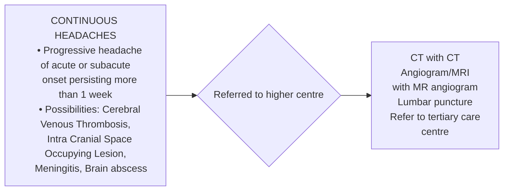
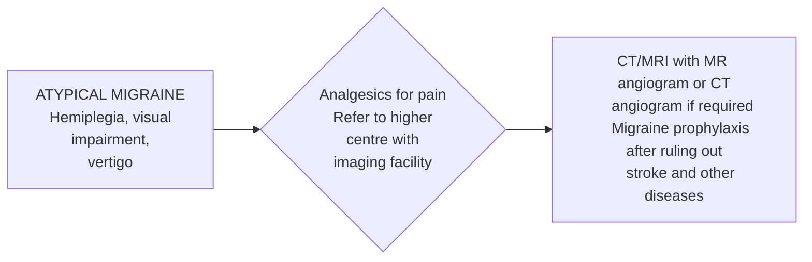

```markdown
# Standard Treatment Workflow (STW) for the Management of HEADACHE
ICD-10-G43-44



## TREATMENT FLOWCHART
LEGEND/INDEX/ KEY
*   Type of Headache
*   Management at PHC
*   Management at district hospital

```mermaid
graph LR
    A[CHRONIC TENSION HEADACHE
    Continuous bilateral headache for many years with
    significant insomnia and psychosomatic complaints.] --> B[Start Amitriptyline
    (10mg HS) and
    advice on lifestyle]
```

```mermaid
graph LR
    A[MIGRAINE
    Side
    alternating,
    associated
    visual aura,
    photo-phono
    phobia,
    nausea,
    relieved by
    sleep or
    analgesics] --> B{Frequency > 2/month -
    Start prophylaxis trial for 2 months
    • Propranolol 40 mg OD
    • Flunarizine 10 mg OD
    Acute management
    • Analgesics(Paracetamol 650 mg, or
    Indomethacin 50 mg) and
    • Antiemetics (Prochlorperazine 10mg).
    Life style changes
    • Good sleep at least 6 hrs, food habit
    modification, avoiding triggers of migraine.}
    B --> C{Brain imaging
    if atypical
    features exist}
    B --> D{Brain imaging
    if there
    are
    atypical
    symptoms}
```



```mermaid
graph LR
    A[TRIGEMINAL AUTONOMIC CEPHALGIAS
    Rapid onset peri orbital and temporal
    pain with autonomic features] --> B{Indomethacin
    (25mg TID) for
    7 days}
    B --> C{Refer to
    tertiary care
    centre}
```

```mermaid
graph LR
    A[CLUSTER HEADACHE, PAROXYSMAL HEMICRANIAS, SHORT
    LASTING UNILATERAL NEURALGIFORM PAIN WITH
    CONJUNCTIVAL INJECTION AND TEARING SYNDOME (SUNCT)] --> B{Refer to
    tertiary
    care centre}
    B --> C{Refer to
    tertiary
    care centre}
```

*   First or worst headache of the patient's life
*   Focal neurologic signs (not typical aura)
*   Severe headache awakening from sleep

**RED FLAG SIGNS**

*   Headache with fever, change in personality, mental status, level of consciousness
*   Fever, neck stiffness or meningism
*   New onset of severe headache in pregnancy or postpartum or while on hormone treatment
*   Rapid onset with strenuous exercise
*   Sudden onset (maximal intensity occurs within seconds to minutes, thunderclap headache)
*   New headache type in a patient with malignancy or immunosuppression

## TREATMENT OF MAJOR CATASTROPHIC HEADACHES AT TERTIARY CENTRE

```mermaid
graph LR
    A[Sudden Severe headache,
    First or Worst headache of life]
    B[Progressive headache]
    C[Headache with fever,
    personality change,
    altered sensorium,
    neck stifffness]
    D[Progressive
    headache with
    seizure or focal
    deficit]
    A --> E[CT with CT Angiogram/
    MRI with MR angiogram]
    B --> F[MR venogram]
    C --> G[CT scan followed
    by CSF study]
    D --> H[CT/MRI with
    contrast]
    E --> I[SUBARACHNOID
    HEMORRHAGE]
    F --> J[CEREBRAL VENOUS
    THROMBOSIS]
    G --> K[MENINGIOENCEPHALITIS]
    H --> L[BRAIN TUMORS]
    I --> M[Angiogram,
    clipping/
    coiling of
    aneurysm
    (to prevent
    rebleed)]
    E --> N[INTRACEREBRAL
    HEMORRHAGE]
    J --> O[Intravenous UFH /
    subcutaneous
    heparin/LMWH]
    K --> P[Antibiotics/
    antivirals]
    L --> Q[Surgery,
    radiation,
    chemotherapy]
    N --> R[Stroke unit
    admission and
    neurosurgery for
    cortical
    hemorrhages or
    large
    hemorrhage
    with herniation]
```

## INDICATIONS FOR ADMISSION
*   Patient with unrelenting headache
*   Immunosuppressed patients with continuous headache,
*   First ever headache with worsening intensity,
*   Progressive headache with other systemic disease
*   Severe symptomatic primary headache disorders

## CRITERIA FOR DISCHARGE
*   Primary headache disorders- symptomatically improved severe episode of headache due to primary headache disorder can be discharged
*   Secondary headache disorders- secondary headache disorders with essential work up, diagnosis and treatment as per individual case can be discharged

## FOLLOW UP OF HEADACHE PATIENTS
| CAUSES OF HEADACHE                 | TREATMENT OF HEADACHE          |
| ----------------------------------- | -------------------------------- |
| Intra cerebral hemorrhage         | Good control of blood pressure |
| Seizures                            | Antiepileptic medications        |
| Cerebral venous sinus thrombosis | Follow up of anticoagulation     |
| Migraine                            | Give prophylaxis for adequate duration of time and taper after remission |

**KEEP A HIGH THRESHOLD FOR INVASIVE PROCEDURES**

**REFERENCES**
1.  Hainer BL, Matheson EM. Approach to acute headache in adults. American family physician. 2013 May 15;87(10).
2.  https://www.uptodate.com/contents/evaluation-of-headache-in-adults

**ABBREVIATIONS**
CSF: Cerobrospinal Fluid, UFH: Unfractionated Heparin, LMWH: Low Molecular Weight Heparin

This STW has been prepared by national experts of India with feasibility considerations for various levels of healthcare system in the country. These broad guidelines are advisory, and are based on expert opinions and available scientific evidence. There may be variations in the management of an individual patient based on his/her specific condition, as decided by the treating physician. There will be no indemnity for direct or indirect consequences. Kindly visit our web portal (stw.icmr.org.in) for more information.
Indian Council of Medical Research and Department of Health Research, Ministry of Health & Family Welfare, Government of India.
