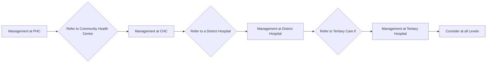

```markdown
# Standard Treatment Workflow (STW) for the Management of HEART FAILURE: A BREATHLESS PATIENT

ICD-10-150.9

## SYMPTOMS

*   1.  **Dyspnea/ orthopnea/ PND**
*   2.  Pink frothy sputum
*   3.  Dependent pedal edema
*   4.  Recent weight gain
*   5.  Easy fatiguability
*   6.  H/0 CHF/ MI

## SIGNS

*   1.  Tachypnoea
*   2.  Tachycardia or irregular pulse
*   3.  Basal crepitations
*   4.  Cardiomegaly
*   5.  Presence of murmurs
*   6.  Systemic desaturation

## MANAGEMENT AT PHC

*   Rule out respiratory cause: Breathlessness with fever, cough and expectoration or known patient of asthma or COPD
*   Likely CHF: Decongest with **furosemide**
*   REFER IF FOLLOWING:
    *   BP < 90 mmHg or > 200 mmHg
    *   Heart rate < 50/min or > 120/min
    *   Respiratory rate > 30/min or cyanosis
    *   Oliguria
    *   Altered sensorium

## MANAGEMENT AT DISTRICT HOSPITAL

*   Admit and re-assess
*   Optimise therapy with **furosemide/ enalapril/ spironolactone/ O2** and stabilize
*   Consider non-invasive ventilation if marked respiratory distress and O2 saturation < 90%
*   Echocardiography: confirm diagnosis of HFrEF: LV ejection fraction < 35%
*   Search for etiological diagnosis
*   Consider **carvedilol** after decongestion
*   Refer back to CHC/PHC after stabilization

## REFER TO TERTIARY CARE IF

*   CHF uncontrolled,
*   Unstable hemodynamics
*   Suspected ongoing ischemia
*   Abnormal electrolytes
*   Abnormal renal functions
*   Structural heart disease
*   Unclear etiology

## ADDITIONAL INFORMATION

*   Prior history of respiratory illness like asthma or COPD
*   Known patient of CHF/ similar illness in past with response to therapy
*   Prior history of RHD, CAD, pregnancy, cancer chemotherapy
*   Risk factors: HT, DM, smoking, hyperlipidemia or premature CAD in first degree relatives

## COMMON ETIOLOGY AND INDICATORS

*   1.  Ischemic cardiomyopathy: past MI
*   2.  Diabetic cardiomyopathy
*   3.  RHD: existing valvular disease
*   4.  Post-viral: acute onset breathlessness within last 3 months
*   5.  Peri-partum cardiomyopathy-onset in last trimester or after delivery
*   6.  Idiopathic cardiomyopathy
*   7.  Post-cancer chemotherapy



## MANAGEMENT AT CHC

*   Admit and stabilize
*   Send for routine investigations
*   ECG: Rule out acute ST-Elevation MI
*   X-ray chest: Rule out respiratory etiology
*   Decongest with intravenous **furosemide**
*   O2 therapy if systemic saturation < 90%
*   Start **enalapril** and **spironolactone** orally
*   Consider **carvedilol** after decongestion

## REFER TO A DISTRICT HOSPITAL

## MANAGEMENT AT TERTIARY HOSPITAL

1.  Re-assess and confirm diagnosis of HF
2.  Categorize acute (< 3 months) vs chronic (> 3 months) and HFrEF (EF 35%) vs HFpEF (EF 35-50%)
3.  Optimize therapy with **furosemide**, **enalapril**, **carvedilol**, **spironolactone** and **O2**
4.  Consider ARNI and ivabradine
5.  Pneumococcal and influenza vaccines
6.  Investigate for etiology and manage
7.  Consider non-pharmacological invasive therapy
    *   a. **ICD**: In selected patients (Ref Arrhythmia STW)
    *   b. **BiV**: Consider in NYHA class II/III Symptomatic patient, EF <35%, QRS >150msec in sinus rhythm with LBBB morphology and optimal medical therapy of >3 months
8.  Etiology based Interventions
    *   a. **PCI**
    *   b. Valve replacement
    *   c. **CABG**

## CONSIDER AT ALL LEVELS

*   Smoking Cessation
*   Salt restriction
*   Physical activity
*   Weight Reduction
*   Moderation of alcohol
*   Control of DM/ HTN/ Lipids
*   Secondary CVD prevention with aspirin and statins

## INVESTIGATIONS:

### BASIC INVESTIGATIONS

*   Hemogram, ESR
*   Blood sugar
*   Urine examination
*   Urea/ Creatinine
*   Sodium/Potassium
*   ECG
*   Chest X-ray PA view

### WHAT TO LOOK FOR IN X RAY

*   Cardiomegaly
*   Pulmonary venous congestion
*   Pneumonia or other lung pathology

### WHAT TO LOOK FOR IN AN ECG?

*   Pathological Q wave
*   Conduction abnormalities, especially LBBB
*   Chamber enlargement
*   Atrial fibrillation
*   Note: If ST elevation present, manage as STEMI

### DESIRABLE INVESTIGATIONS

*   2D Echocardiography
*   BNP/NT pro-BNP
*   Troponin
*   Lipid profile
*   Thyroid function test
*   Iron profile

### OPTIONAL INVESTIGATION

*   Prolonged ECG monitoring
*   Coronary angiography
*   Radionuclide imaging
*   CT scan
*   MRI
*   PET
*   Myocardial biopsy
*   Electrophysiological study

## COMMON DRUGS AND DOSAGE FOR CHF

### FUROSEMIDE

*   Dose 20-80 mg daily PO
*   Intravenous 10-40 mg SOS in acute stage
*   Change to oral when symptoms subside
*   Monitor serum electrolytes, creatinine and uric acid on therapy

### SPIRONOLACTONE

*   Dose 25-50 mg once daily PO
*   Keep watch on serum potassium and creatinine every 2-4 weekly

### CARVEDILOL

*   Dose 3.125 to 25 mg twice daily PO
*   Start after decongestion with low dose with BP > 100 mmHg and HR >60/ min
*   Uptitrate dose 1-2 weekly till maximum tolerable dose
*   Keep watch on BP, heart rate and precipitation of CHF symptoms
*   Increase diuretics and reduce carvedilol to manage reappearance of CHF

### ENALAPRIL

*   Dose 2.5 to 10 mg twice daily PO
*   Start with low dose with BP >100 mmHg, normal electrolyte and creatinine less than 2.5 mg/dl
*   Uptitrate dose 1-2 weekly till maximum tolerable dose
*   Keep watch on BP and electrolytes before every increment and on follow-up

## KEEP WATCHING

*   1.  Respiratory distress and oxygen saturation
*   2.  BP and heart rate
*   3.  Electrolytes and renal parameters

## KEEP A HIGH THRESHOLD FOR INVASIVE PROCEDURES

### ABBREVIATIONS

*   ICD: Implantable Cardioverter defibrillator
*   BiV: Bi-Ventricular Pacing
*   PND: Paroxysmal Nocturnal Dyspnea

*   PCI: Percutaneous Coronary Intervention
*   CABG: Coronary Artery Bypass Graft
*   CVD: Cardiovascular Diseases
*   RHD: Rheumatic Heart Disease
*   CAD: Coronary Artery Disease

*   HFrEF: Heart Failure with reduced Ejection Fraction
*   HFpEF: Heart Failure with preserved Ejection Fraction
*   STEMI: ST elevation Myocardial Infarction
*   LV: Left Ventricle
*   COPD: Chronic Obstructive Pulmonary Disease

### REFERENCES

1.  Management Protocols for Chronic Heart Failure in India. Mishra S, Mohan JC, Nair T et al. Indian Heart J.2018;70:105-127.
2.  ESC Guidelines for the diagnosis and treatment of acute and chronic heart failure: The Task Force for the diagnosis and treatment of acute and chronic heart failure of the European Society of Cardiology (ESC). Developed with the special contribution of the Heart Failure Association (HFA) of the ESC. Ponikowski P, Voors AA. Anker SD et al. European Heart Journal. 2016;37:2129-2200
3.  Chronic heart failure in adults: diagnosis and management. NICE guideline [NG106] Published date: September 2018
4.  2013 ACCF/AHA Guideline for the Management of Heart Failure. A Report of the American College of Cardiology Foundation/American Heart Association Task Force on Practice Guidelines. Yancy CW, Jessup M, Bozkurt B. J Am Coll Cardiol. 2013;62-16: e150-e210

This STW has been prepared by national experts of India with feasibility considerations for various levels of healthcare system in the country. These broad guidelines are advisory, and are based on expert opinions and available scientific evidence. There may be variations in the management of an individual patient based on his/her specific condition, as decided by the treating physician. There will be no indemnity for direct or indirect consequences. Kindly visit our web portal (stw.icmr.org.in) for more information.
Indian Council of Medical Research and Department of Health Research, Ministry of Health & Family Welfare, Government of India.
