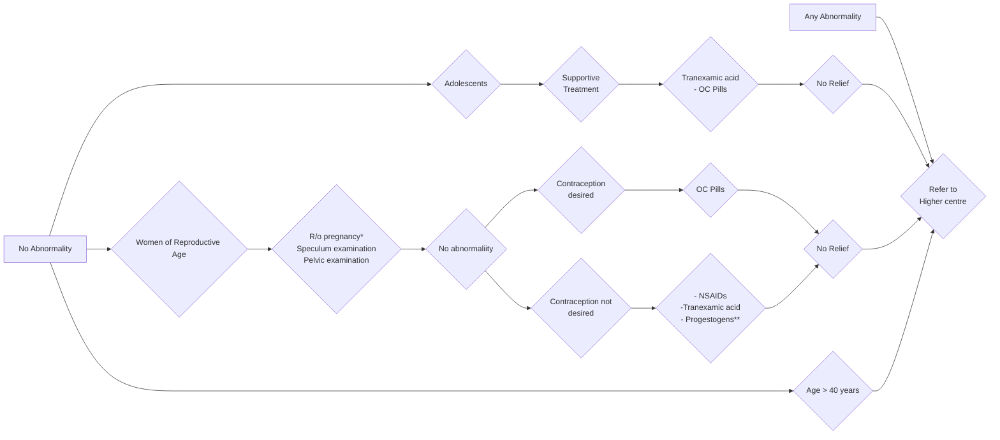

```markdown
Department of Health Research
Ministry of Health and Family Welfare, Government of India
October/ 2019

# Standard Treatment Workflow (STW) for the Management of
**HEAVY MENSTRUAL BLEEDING (HMB)**
ICD-10-H90.5

**TO DO AT ALL LEVELS**

## HISTORY
*   Age
*   Parity
*   Detailed menstrual history including irregularities
*   Other medical illness: thyroid disorder,
    coagulopathy, jaundice etc
*   IUCD use
*   Lactation
*   Drug intake

## EXAMINATION
*   General
    *   Evaluate pallor
    *   Calculate BMI
*   Systemic
    *   CVS, RS and hepatosplenomegaly
*   Local examination (where indicated)
    *   P/S and P/V

## SUPPORTIVE TREATMENT
*   Reassurance
*   Hematinics
*   Tranexamic acid during episode of
    heavy bleeding

## MANAGEMENT OF HMB AT PRIMARY LEVEL
### HISTORY AND EXAMINATION


### INVESTIGATIONS
*   Hemoglobin
*   Complete Blood
    Count (CBC) with
    peripheral smear
*   Bleeding time /
    Clotting time
    (BT/CT)

* R/o Pregnancy in doubt especially in all women of reproductive age group after appropriate consent
** Amongst progestogens Norethisterone provides the best hemostasis

## MANAGEMENT OF HMB AT SECONDARY LEVEL (CHC)
### HISTORY AND EXAMINATION
```mermaid
graph LR
    A[Adolescents] --> B{Married <40 years};
    A --> C{Married >40 years};
    A --> D{Post Menopausal};
    B --> E{Endometrial thickness\n< 12 mm};
    B --> F{ET>12mm or\nHigh Risk for endometrial\ncancer*};
    C --> G{Secretory/ Non Secretory\nendometrium without hyperplasia};
    C --> H{Hyperplasia without\natypia};
    C --> I{Hyperplasia with atypia/\nmalignancy};
    D --> J{Refer to higher\ncentre};
    E --> J;
    F --> K{Do endometrial sampling and send\nfor histopathological examination};
    G --> L{- NSAIDs\n- Tranexamic Acid\n- Combined OC Pills\n- Progestogens\n- LNG IUS};
    L --> M{If no relief,\nrefer to higher centre};
    H --> N{- Progestogens\n- Levonorgestrel-\nreleasing intrauterine\nsystem (LNG IUS)\nHormonal therapy to\ncontinue for 6 months};
    I --> J;
    K --> J;
    N --> M;
```

### INVESTIGATIONS
*   Hemoglobin
*   CBC with peripheral smear
*   BT / CT
*   ABO and Rh typing
*   Thyroid function test
*   USG of Abdomen & Pelvis

## MANAGEMENT OF HMB AT TERTIARY LEVEL
### HISTORY, EXAMINATION AND ULTRASONOGRAPHY
```mermaid
graph LR
    A[No structural abnormality] --> B{Married <40 years};
    A --> C{Married >40 years};
    A --> D{Thickened\nendometrium};
    A --> E{Fibroids &\npolyps};
    B --> F{Treat underlying cause\nif present\n(thyroid disorders,\njaundice, coagulopathy\netc)};
    B --> G{In absence of obvious\ncause\n- NSAIDs\n- Tranexamic Acid\n- OC Pills\n- Progestogens};
    C --> H{- NSAIDs\n- Tranexamic Acid\n- OC Pills\n- Progestogens\n- LNG IUS\n- Ormeloxifene\n- Ablative Techniques};
    D --> I{Endometrial sampling - D&C/\nHysteroscopic guided};
    E --> J{Fibroid &\nPolyps STW};
    F --> G;
    G --> K{No Relief\nRefer to higher centre};
    H --> K;
    I --> L{-Conservative modalities\n- Progestogens\n- LNG IUS\n- Ormeloxifene\n- Ablative\ntechniques};
    J --> L;
    L --> K;
```

### INVESTIGATIONS
*   ABO and Rh typing
*   TSH
*   USG of Abdomen & Pelvis

### TREATMENT FOR ACUTE
### BLEEDING EPISODE
*   IV Tranexamic acid 1g stat
    slowly followed by oral
    Tranexamic acid 0.5-1g,
    6-8 hourly for 5 days
*   Blood transfusion if
    indicated

### HORMONE THERAPY
*   Norethisterone (max daily
    dose 40 mg)
    OR
*   Medroxyprogesterone
    acetate (max daily dose
    40 mg)
    Hormone therapy should
    be given orally daily in
    divided doses from the
    fifth day of the cycle for
    three weeks and repeated
    in a cyclical manner for
    total of 4-6 cycles of
    treatment

### HIGH RISK FOR ENDOMETRIAL
### CANCER
*   Patient having:
    *   Obesity
    *   Diabetes
    *   Hypertension
    *   PCOD

## COUNSELLING IS AN IMPORTANT ADJUNCT TO MANAGEMENT
## KEEP A HIGH THRESHOLD FOR INVASIVE PROCEDURES

This STW has been prepared by national experts of India with feasibility considerations for various levels of healthcare system in the country. These broad guidelines are advisory, and
are based on expert opinions and available scientific evidence. There may be variations in the management of an individual patient based on his/her specific condition, as decided by
the treating physician. There will be no indemnity for direct or indirect consequences. Kindly visit our web portal (stw.icmr.org.in) for more information.
© Indian Council of Medical Research and Department of Health Research, Ministry of Health & Family Welfare, Government of India.
stw.icmr.org.in
```