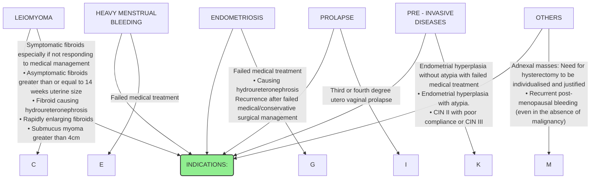

```markdown
October/2019
सत्यमेव जयते
Department of Health Research
Ministry of Health and Family Welfare, Government of India
अनुसंधान
MEDICAL RESEARCH
NEW DELHI
icma
INDIAN COUNCIL OF
MEDICAL RESEARCH
Serving the nation since 1911

# Standard Treatment Workflow (STW) for
HYSTERECTOMY FOR BENIGN GYNAECOLOGICAL CONDITIONS

IN WOMEN AGED LESS THAN 40 AND/OR LOW PARITY IT IS MANDATORY TO HAVE A SECOND
OPINION FROM A QUALIFIED GYNAECOLOGIST

HYSTERECTOMY TO BE CONSIDERED ONLY WHEN CHILD BEARING IS COMPLETED & RARELY IN YOUNGER PATIENTS

## INDICATIONS:

* **LEIOMYOMA**
    * Symptomatic fibroids especially if not responding to medical management
    * Asymptomatic fibroids greater than or equal to 14 weeks uterine size
    * Fibroid causing **hydroureteronephrosis**
    * Rapidly enlarging fibroids
    * Submucus myoma greater than 4cm
* **HEAVY MENSTRUAL BLEEDING**
    * Failed medical treatment
* **ENDOMETRIOSIS**
    * Failed medical treatment
    * Causing **hydroureteronephrosis**
    * Recurrence after failed medical/conservative surgical management
* **PROLAPSE**
    * Third or fourth degree **utero vaginal prolapse**
* **PRE - INVASIVE DISEASES**
    * Endometrial hyperplasia without atypia with failed medical treatment
    * Endometrial hyperplasia with atypia
    * CIN II with poor compliance or CIN III
* **OTHERS**
    * Adnexal masses: Need for hysterectomy to be individualised and justified
    * Recurrent post-menopausal bleeding (even in the absence of malignancy)

Simple ovarian cysts less than 5 cm in size and without other significant/suspicious features
should be kept on observation and reviewed after 6 months

## ROUTES OF HYSTERECTOMY
* ABDOMINAL
* VAGINAL
    * Pelvic organ prolapse
    * Non descent hysterectomy
* LAPAROSCOPIC
    * In appropriately selected patients

## HYSTERECTOMY SHOULD NOT BE DONE FOR
* White discharge per vaginum
* Cervicitis
* Non specific abdominal or pelvic pain
* Minor degree of utero vaginal prolapse
* Fibroids which are small (less than 5 cm) or Asymptomatic (less than12 weeks size uterus)
* Simple ovarian cyst less than or equal to 5 cm

## COMPONENTS OF PRE OPERATIVE COUNSELLING AND INFORMED CONSENT
* Need for **hysterectomy**
* Alternative treatment options
* Risks and benefits
* Potential complications of the procedure
* Removal/conservation of ovaries & tubes
* Route of hysterectomy
* Possible need for post operative Hormone therapy in selected cases

## INVESTIGATIONS
* Complete Blood Count
* Blood grouping & cross matching
* Fasting Blood Sugar & Post Prandial Blood Sugar
* Renal Function Test
* Liver Function Test
* Urine Routine & Microscopy
* Electrocardiogram
* X ray chest
* Others as indicated

## COMPLICATIONS TO BE EXPLAINED
* Risk of Infection
* Bleeding (primary/ reactionary/ secondary)
* Injury to bladder/ bowel/ ureter
* Pain
* Fever
* Hernia (rare and late complication)

## FOLLOW UP
* Discharge summary with operative details
* Review for **histopathology** report
* Report if there is fever, bleeding or any other symptoms
* Avoid lifting heavy weight for 8 weeks
* Abstinence for eight weeks
* Adequate iron and calcium & Vitamin D3 supplements
* Evaluate need for hormones in very selected patients

Ovaries should be preserved in most pre-menopausal women unless diseased.
While doing hysterectomy for benign gynaecological conditions in pre-menopausal women, it is recommended to combine it with
bilateral salpingectomy with a view to minimise the risk of subsequent development of ovarian malignancy1.2

REFERENCES
1. Pérez-López FR et al, Interventions to reduce the risk of ovarian and fallopian tube cancer: A European Menopause and Andropause Society Postition Statement. Maturitas. 2017
2. Darelius A et al, Efficacy of salpingectomy at hysterectomy to reduce the risk of epithelial ovarian cancer: a systematic review. BJOG. 2017.

COUNSELLING IS AN IMPORTANT ADJUNCT TO MANAGEMENT
KEEP A HIGH THRESHOLD FOR INVASIVE PROCEDURES

This STW has been prepared by national experts of India with feasibility considerations for various levels of healthcare system in the country. These broad guidelines are advisory, and
are based on expert opinions and available scientific evidence. There may be variations in the management of an individual patient based on his/her specific condition, as decided by
the treating physician. There will be no indemnity for direct or indirect consequences. Kindly visit our web portal (stw.icmr.org.in) for more information.
Indian Council of Medical Research and Department of Health Research, Ministry of Health & Family Welfare, Government of India.
```