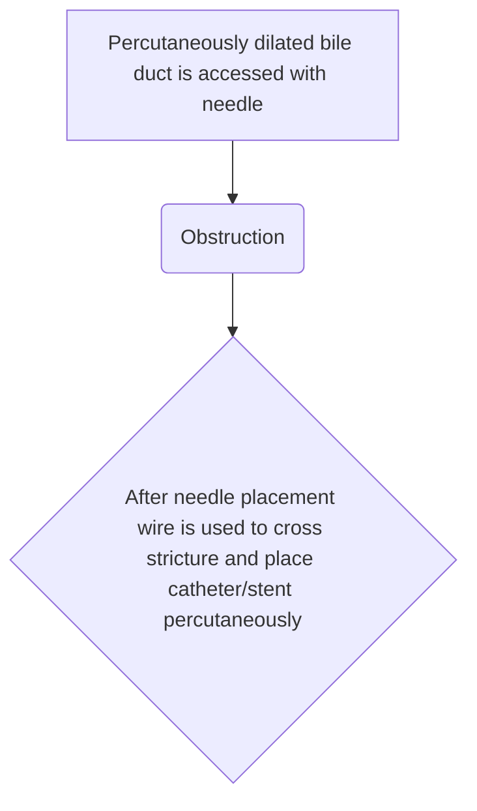

```markdown
# Standard Treatment Workflow (STW)
IMAGE GUIDED MANAGEMENT OF OBSTRUCTIVE JAUNDICE
ICD-10-K83.1

## CLINICAL PRESENTATION
*   Jaundice
*   Pruritus
*   Dark coloured urine & Pale stool

## COMMON ETIOLOGIES
*   **Non obstructive**: Hepatitis related- viral hepatitis (A,B,C,E,NASH, alcohol, auto-immune cirrhosis)
*   **Obstructive**: Mechanical obstruction
    *   **Benign**: stone, sludge, stricture, worm, primary sclerosing cholangitis, bilio-enteric anastomotic stricture (HJ stricture)
    *   **Malignant**: Carcinoma GB, hepatocellular carcinoma cholangiocarcinoma, hepatic metastasis, pancreatic head carcinoma, extrinsic compression by lymph node/mass, pseudotumor

## KEY TO DIAGNOSIS
*   In presence of jaundice
    *   High AST/ALT + relatively normal SAP/GGT suggests hepatitis
    *   Elevated SAP & GGT + relatively normal AST/ALT suggests obstructive etiology
*   USG* abdomen would mostly differentiate between obstructive and non-obstructive causes
*   Do not suspect obstructive jaundice if:
    *   AST/ALT elevation > 1000 IU
    *   ALP/GGT normal/mildly elevated (s/o hepatitis)
*   If non obstructive jaundice: refer to district hospital/tertiary care to be managed by physician (medicine/gastroenterologist/ hepatologist)

## RED FLAGS
*   Pain in right hypochondrium
*   Fever
*   Chills
*   Tachycardia & tachypnoea
*   Patients should be administered IV fluids & antibiotics- Cefoperazone + Sulbactam in a ratio of 1:1 administered IV 20-40 mg/kg/day in equal doses over duration of 6-12 hrs

## INVESTIGATIONS

|                      | ESSENTIAL                         | DESIRABLE                                                                        | OPTIONAL                                 |
|----------------------|-----------------------------------|-----------------------------------------------------------------------------------|------------------------------------------|
| **HEMATOLOGICAL**   | LFT, CBC, PT/INR                  | KFT, Screen for Hepatitis A/E markers                                             | Hepatitis B/C markers markers              |
| **IMAGING**           | USG Abdomen                       | MRCP, CECT Abdomen                                                                |                                          |

## PHC
Patient with clinical features and/or red flag signs

## CHC/DISTRICT HOSPITAL
*   Clinical examination; hematological investigations - LFT, CBC, PT/INR and Imaging - USG abdomen
*   If cholangitis is suspected - Fluid resuscitation and IV antibiotics and refer to tertiary level care for further management

## TERTIARY CARE
*   Clinical examination, repeat hematological investigations if > 2 weeks. Imaging - MRCP to confirm diagnosis & look for level of obstruction, CECT abdomen to decide for definitive vs palliative care
*   Suspected cholangitis - Fluid resuscitation & I/V antibiotics
*   Biliary drainage (**PTBD/ERCP**) to make patient fit for surgery/palliative care (chemotherapy/radiotherapy)
*   PTBD preferred for high CBD/hilar obstruction, ERCP preferred in low CBD obstruction

## BASIC HEMATOLOGICAL AND USG FINDINGS IN OBSTRUCTIVE JAUNDICE

|                        | FINDINGS                                                                                                                                                                   |
|------------------------|----------------------------------------------------------------------------------------------------------------------------------------------------------------------------|
| Serum bilirubin        | Elevated                                                                                                                                                                 |
| AST/ALT                | Normal to elevated                                                                                                                                                        |
| ALP/GGT                | Markedly elevated (**ALP>GGT**)                                                                                                                                      |
| CBC                    | Hb: Normal to low, TLC: Normal to elevated, PT/INR: Normal to elevated                                                                                                  |
| USG ABDOMEN            | Gall bladder stone/mass, Dilatation of Common bile duct/intrahepatic biliary radicles                                                                                      |

## MANAGEMENT

### COMMON CAUSES OF BILIARY OBSTRUCTION

*   GB mass/cholangiocarcinoma causing biliary radicle dilatation (obstruction)
*   GB/CBD stone causing biliary dilatation
*   Periampullary mass causing biliary dilatation(obstruction)

### CLINICAL FEATURES
*   LFT
    *   Raised serum bilirubin with
    *   Markedly raised ALP and/or GGT
    *   Normal/mildly raised AST/ALT
*   If signs of cholangitis:
    *   Jaundice with fever, rigor, pain
        *   Urgent referral to higher centre

### MEDICAL MANAGEMENT FOLLOWED BY USG/MRCP
*   USG
    *   CBD/IHBR dilatation
    *   GB stone/Mass
*   MRCP
    *   Lower CBD obstruction: ERCP
    *   Higher common bile duct/Hilar Obstruction PTBD#
Ascertain level and cause of obstruction in the biliary tree
*   Lower CBD obstruction: ERCP preferred
*   High CBD obstruction: PTBD# preferred
*   Choledocholithiasis/other benign cause needing bile drainage
    *   ERCP
        *   PTBD# (If ERCP not possible)
*   Biliary tract malignancy
    *   CECT ABDOMEN
        *   Identify the malignancy and extent of disease
        *   Decide for definitive vs palliative care
        *   *USG ABDOMEN
            *   Gall bladder stone/mass
            *   Dilatation of Common bile duct/intrahepatic biliary radicles

Once the bilirubin starts reducing, the patient can be:
*   taken up for surgery or
*   chemo/radiotherapy
or refer back to regional cancer centre

### SCHEMATIC DIAGRAM OF PTBD


### PERCUTANEOUS TRANSHEPATIC BILIARY DRAINAGE (PTBD)#
*   **INDICATIONS**
    *   Decrease bilirubin to commence appropriate therapy (surgical/palliative)
    *   Cholangitis (draining infected bile)
    *   Intense pruritus
*   **DAYS OF HOSPITALISATION**
    *   1-3 days (non-infected/no cholangitis cases)
    *   7-14 days (Cholangitis, can be prolonged in severely septic patients)
*   **CONTRAINDICATIONS**
    *   Deranged coagulation (correct before procedure)
    *   Emergent cases: infuse fresh frozen plasma (FFP) - 10ml/kg body weight prior to the procedure
    *   Elective cases: I/V vitamin K injection (5-10 mg) - 3 to 5 days
    *   Ascites (to be dried before therapy)
*   **PROCEDURAL DETAILS**
    *   External drainage for infected cases (aim to establish internal drainage with or without biliary stenting, once the infection is treated. In cases of long-term external drainage - electrolytes should be replaced for ongoing bile salt loss)
    *   Internal drainage using internal external drainage catheter for non infected cases else may be considered for primary biliary stenting

**#PTBD IN CHOLANGITIS**: IV antibiotics** and fluids to be started before the procedure: Cefoperazone+Sulbactam in 1:1 ratio, 20-40 mg/kg/day in equal doses after duration of 6-12 hrs; Piperacillin 4 gm +Tazobactam 0.5 gms every 8 hrs
*   External drainage till cholangitis subsides (normalization of leucocytosis, and draining bile to become clear - golden brown or light green)
*   Establish internal drainage once infection is treated
*   Plan for definitive/palliative therapy and manage same as described for non-infected patients
*   **OUTCOME MEASURES**
    *   Normal bile drainage through the catheter
*   **EXPECTED OUTCOMES**
    *   Reduction in bilirubin to make patient fit for required therapy
*   **AFTER CARE**
    *   Appropriate antibiotics**: Ofloxacin/Cefixime 200 mg 12 hrly for 3-5 days
    *   LFT & CBC
    *   Clinically stable patient with reducing bilirubin can be planned for biliary stenting/definitive surgery/discharge as per the requirement and suitability
*   **FOLLOW UP**
    *   Follow-up with IR in case of non-reducing or rise in bilirubin/sign of cholangitis/ stent block

## DEFINITIVE TREATMENT
*   PTBD followed by surgery

## PALLIATIVE TREATMENT
*   PTBD# followed by Biliary stenting
*   Chemotherapy/Radiotherapy
Patients to follow with respective physician (surgeon/medical or radiation oncologist) after successful biliary drainage and normalization of bilirubin

**Respective contraindications, risks and precautions, pediatric dose of antibiotics to be considered before prescription

*Patients with obstructive jaundice having no/ minimal IHBRD with distended GB may be considered for percutaneous cholecystostomy in emergent situations. Similarly, cholecystostomy may be a bridge to surgery in patients with pyocele/mucocele of GB

## ABBREVIATIONS

| Abbreviation | Meaning                                                                   |
|--------------|---------------------------------------------------------------------------|
| ALP          | Alkaline Transferase                                                      |
| ALT          | Alanine Aminotransferase                                                  |
| AST          | Aspartate Aminotransferase                                                |
| CBC          | Complete Blood Count (Hemogram)                                         |
| CBD          | Common Bile Duct                                                          |
| CECT         | Contrast Enhanced Computed Tomography                                     |
| GB           | Gall Bladder                                                              |
| GGT          | Gamma Glutamyl Transferase                                              |
| IHBRD        | Intrahepatic Biliary Radicle Dilatation                                  |
| IR           | Interventional Radiology                                                  |
| KFT          | Kidney Function Test                                                      |
| LFT          | Liver Function Test                                                       |
| MRCP         | Magnetic Resonance Cholangiopancreatography                               |
| NASH         | Non Alcoholic Steatohepatitis                                            |
| PT/INR       | Prothrombin Time/International Normalized Ratio                           |
| PTBD         | Percutaneous Transhepatic Biliary Drainage                               |
| SAP          | Serum amyloid P                                                           |
| USG          | Ultrasonography                                                         |

## REFERENCES
1.  Collier, J.D. and Webster, G. (2010) Liver and Biliary Tract Disease. In: Nicki, R., Brian, R., Stuart, H., et al., Eds., Davidson's Textbook of Medicine, 21st Edition, Churchill Livingstone, New York, 926-933.
2.  Perez-Johnston R, Deipolyi AR, Covey AM. Percutaneous Biliary Interventions. Gastroenterol Clin North Am. 2018 Sep;47(3):621-641. doi: 10.1016/j.gtc.2018.04.008. Epub 2018 Jul 7. PMID: 30115441.
3.  Yadav, Ankusha & Condati, Naveen & Mukund, Amar. (2018). Percutaneous Transhepatic Biliary Interventions. Journal of Clinical Interventional Radiology ISVIR. 02. 027-037. 10.1055/s-0038-1642105.
4.  Funaki B. Percutaneous biliary drainage. Semin Intervent Radiol. 2007 Jun;24(2):268-71. doi: 10.1055/s-2007-980050. PMID: 21326804; PMCID: PMC3036415.
5.  Madhusudhan KS, Gamanagatti S, Srivastava DN, Gupta AK. Radiological interventions in malignant biliary obstruction. World J Radiol. 2016 May 28;8(5):518-29. doi: 10.4329/wjr.v8.i5.518. PMID: 27247718; PMCID: PMC4882409.

CHOLANGITIS IN OBSTRUCTIVE JAUNDICE NEEDS AN EARLY BILIARLY DRAINAGE

This STW has been prepared by national experts of India with feasibility considerations for various levels of healthcare system in the country. These broad guidelines are advisory, and are based on expert opinions and available scientific evidence. There may be variations in the management of an individual patient based on his/her specific condition, as decided by the treating physician. There will be no indemnity for direct or indirect consequences. Kindly visit the website of ICMR for more information: (icmr.gov.in) for more information. Indian Council of Medical Research, Ministry of Health & Family Welfare, Government of India.
```