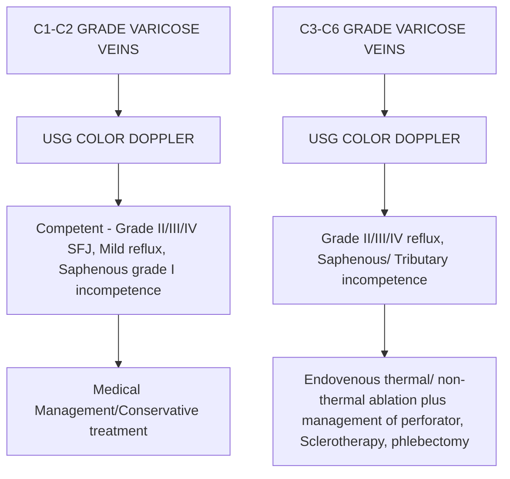

```markdown
# Standard Treatment Workflow (STW)
IMAGE GUIDED MANAGEMENT OF VARICOSE VEINS
(CHRONIC VENOUS INSUFFICIENCY)
ICD-10-183.89

## CLINICAL PRESENTATION

### SYMPTOMS
*   Heaviness/tiredness/aching of the legs
*   Itching in legs
*   Nocturnal cramps in calf
*   Swelling around ankle
*   Symptoms worsened after prolonged standing
*   Skin discoloration near the ankles
*   Abnormal dilated veins in leg
*   Bleeding from varicosities in leg
*   Non healing leg ulcer

### SIGNS (CEAP- CLASSIFICATION)
*   C1: Telangiectasias or reticular veins
*   C2: Varicose veins
*   C3: Edema
*   C4a: Pigmentation or eczema
*   C4b: Lipodermatosclerosis or atrophie blanche
*   C5: Healed venous ulcer
*   C6: Active venous ulcer

### RED FLAGS
*   Bleeding from superficial veins
*   Venous ulcer
*   Recurrent history of superficial vein thrombophlebitis /Cellulitis

### CEAP- Classification C1
*   TELANGIECTASIAS
    *   Intradermal spider veins (web-like), <1mm
*   RETICULAR VEINS
    *   Subdermal reticular veins, <3mm
*   CEAP-CLASSIFICATION C2
    *   Great Saphenous vein with pronounced chronic venous insufficiency in medial ankle area
    *   Circumflex vein: Lateral branch of the greater saphenous vein
    *   Small saphenous vein varicosity

### CEAP-C3 CEAP-C4 CEAP-C6, C5= Healed ulcer

## INVESTIGATIONS

### ESSENTIAL
*   Imaging
    *   USG color doppler
*   Hematological
    *   CBC
    *   PT/INR
    *   APTT
    *   HBs Ag
    *   HIV
    *   KFT
    *   HCV

If there is proximal obstruction in common iliac vein, CTV or MRV is needed

### USG COLOR DOPPLER
*   Rule out **DVT**/Deep vein reflux
*   Doppler evaluation in standing
*   Define and grade reflux at **SFJ/SPJ**
*   Identify segmental intrinsic reflux in **GSV/SSV**
*   Locate incompetent/ pathological perforators
*   Diameter of **GSV**
*   Evaluate truncal and superficial vein varicosities and dilated tributaries

Incompetent **SFJ** - retrograde reflux venous flow lasting more than 0.5 sec
Abnormal **GSV** - ≥ 4 mm on standing
Incompetent perforator - ≥ 3.5 mm/reflux on release of distal compression

### Duration of Reflux

## MANAGEMENT

### MEDICAL/CONSERVATIVE
Mostly adjuvant to endovenous thermal ablation.
*   Life style modification
*   Graded compression stockings
*   Limb elevation, Limb massage, calf pumping exercise
*   Micronized purified flavonoid fraction (**MPFF**)
*   Wound care - Unna boots, hydrocolloid dressing, silver coated dressing

### IMAGE GUIDED THERAPY
*   Primary modality of treating varicose veins
*   Percutaneous endovenous Thermal Ablation Therapy: laser/RFA
*   Percutaneous endovenous Non-thermal Ablation Therapy: MOCA/Glue/ catheter guided sclerotherapy
*   Percutaneous ablation of Perforators - Laser/RFA
*   Percutaneous Guided Sclerotherapy.

### SURGICAL
*   Limited role
    *   Subfascial Endoscopic Perforator Surgery
    *   Phlebectomy

## ALGORITHM FOR DIAGNOSIS, REFERRAL AND MANAGEMENT

```mermaid
graph TD
    A[PHC];
    B[CHC/DISTRICT HOSPITAL];
    C[TERTIARY CARE];
    D[Signs and symptoms of varicose veins];
    E[Clinical examination, USG Color Doppler, Exclude DVT/Deep vein reflux];
    F[In appropriate imaging setting];
    G[Symptomatic patient with Red flag sign (Bleeding, Venous ulcer) Refer to higher centre];
    H[Clinical examination, USG color doppler, Endovenous thermal ablation, Adjuvant medical management];

    A --> D;
    D --> G;
    D --> B;
    B --> E;
    E --> F;
    F --> H;
```

## VARICOSE VEINS: IR MANAGEMENT

*   Procedural details:
    *   Performed in IR suite
    *   Under conscious sedation or spinal anaesthesia or local anaesthesia
    *   Sterile precautions
    *   Percutaneous **GSV** access
    *   Perivenular anaesthesia
    *   Thermal ablation about 2 cm from **SFJ** unction
    *   Management of pathological perforator, **SSV**, accessory **GSV**, tributaries and superficial vein as and when required

## MANAGEMENT OF RED FLAG SIGN

*   Bleeding from superficial varicose veins:
    *   Leg elevation higher than the heart.
    *   Application of pressure over the bleeding site followed by a pressure dressing
    *   Referred to tertiary centre for endovenous ablation treatment

## RECOMMENDATION

*   For treatment of **GSV** reflux in patient with symptoms and sign of chronic venous disease endovenous thermal ablation technique is recommended in preference to surgery and foam sclerotherapy
*   For treatment of **SSV** reflux in patient with symptoms and sign of chronic venous disease endovenous thermal ablation technique should be considered. Access to **SSV** should be gained no lower than midcalf
*   Foam sclerotherapy should be considered as primary treatment in patient with recurrent varicose veins
*   When performing endovenous thermal ablation for saphenous reflux trunk, adding concomitant phlebectomy should be considered

## VENOUS ULCER

*   Wound care/Dressing
*   Compression Therapy
*   Leg elevation
*   Referred to tertiary centre for endovenous ablation treatment

## ALGORITHM: VARICOSE VEINS



## ABBREVIATIONS

*   **APTT**: Activated Partial Thromboplastin Time
*   **CTV**: Computed Tomography Venography
*   **DVT**: Deep Vein Thrombosis
*   **GSV**: Great Sephanous Vein
*   **Hb**: Haemoglobin
*   **HCV**: Hepatitis c Virus
*   **INR**: International Normalized Ratio
*   **IR**: Interventional Radiology
*   **KFT**: Kidney Function Test
*   **MOCA**: Mechanical Occlusion Chemically Assisted Ablation
*   **MRV**: Magnetic Resonance Venography
*   **PT**: Prothrombin Time
*   **RFA**: Radio-frequency Ablation
*   **SPJ**: Sapheno-popliteal junction
*   **SFJ**: Sapheno-Femoral Junction
*   **SSV**: Short Sephanous Vein
*   **USG**: ULTrasonography

## REFERENCES

1.  Wittens C, Davies AH, Bækgaard N, Broholm R, Cavezzi A, Chastanet S, de Wolf M, Eggen C, Giannoukas A, Gohel M, Kakkos S, Lawson J, Noppeney T, Onida S, Pittaluga P, Thomis S, Toonder I, Vuylsteke M, Esvs Guidelines Committee, Kolh P, de Borst
    GJ, Chakfé N, Debus S, Hinchliffe R, Koncar I, Lindholt J, de Ceniga MV, Vermassen F, Verzini F, Document Reviewers, De Maeseneer MG, Blomgren L, Hartung O, Kalodiki E, Korten E, Lugli M, Naylor R, Nicolini P, Rosales A. Editor's Choice -
    Management of Chronic Venous Disease: Clinical Practice Guidelines of the European Society for Vascular Surgery (ESVS). Eur J Vasc Endovasc Surg. 2015 Jun;49(6):678-737. doi: 10.1016/j.ejvs.2015.02.007. Epub 2015 Apr 25. Erratum in: Eur J Vasc
    Endovasc Surg. 2020 Mar;59(3):495. PMID: 25920631.
2.  Teruya TH, Ballard JL. New approaches for the treatment of varicose veins. Surg Clin North Am. 2004 Oct;84(5):1397-417, viii-ix. doi: 10.1016/j.suc.2004.04.008. PMID: 15364562.
3.  Labas P, Cambal M. Profuse bleeding in patients with chronic venous insufficiency. Int Angiol. 2007 Mar;26(1):64-6. PMID: 17353890.
4.  Marchiori A, Mosena L, Prandoni P. Superficial vein thrombosis: risk factors, diagnosis, and treatment. Semin Thromb Hemost. 2006 Oct;32(7):737-43. doi: 10.1055/s-2006-951459. PMID: 17024602.
5.  Rigby KA, Palfreyman SJ, Beverley C, Michaels JA. Surgery versus sclerotherapy for the treatment of varicose veins. Cochrane Database Syst Rev. 2004 Oct 18;2004(4):CD004980. doi: 10.1002/14651858.CD004980. PMID: 15495134; PMCID: PMC8786268.
6.  Eklöf B, Rutherford RB, Bergan JJ, Carpentier PH, Gloviczki P, Kistner RL, Meissner MH, Moneta GL, Myers K, Padberg FT, Perrin M, Ruckley CV, Smith PC, Wakefield TW; American Venous Forum International Ad Hoc Committee for Revision of the
    CEAP Classification. Revision of the CEAP classification for chronic venous disorders: consensus statement. J Vasc Surg. 2004 Dec;40(6):1248-52. doi: 10.1016/j.jvs.2004.09.027. PMID: 15622385.

SAVE LIMBS SAVE LIFE

This STW has been prepared by national experts of India with feasibility considerations for various levels of healthcare system in the country. These broad guidelines are advisory, and are based on expert opinions and available scientific evidence. There may be variations in the management of an individual patient based on his/her specific condition, as decided by the treating physician. There will be no indemnity for direct or indirect consequences. Kindly visit the website of ICMR for more information: (icmr.gov.in) for more information. @Indian Council of Medical Research, Ministry of Health & Family Welfare, Government of India.
```