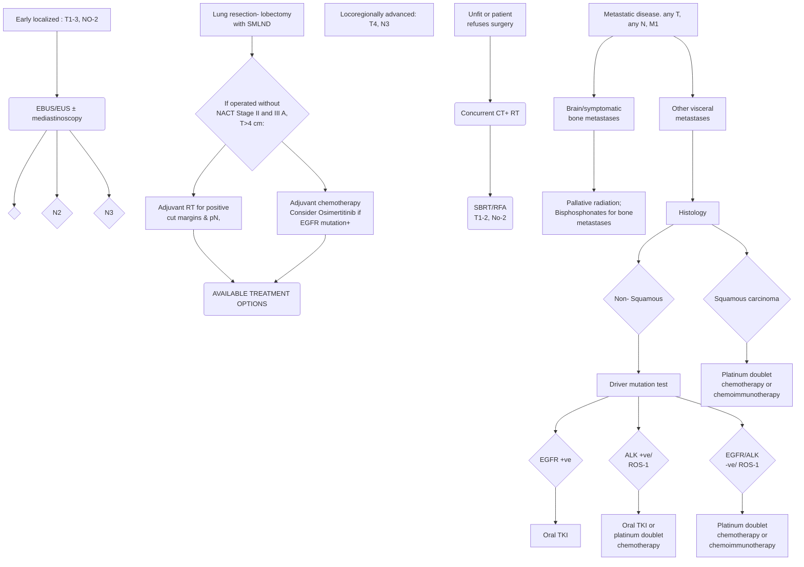

```markdown
July/2020

icma
INDIAN COUNCIL OF
MEDICAL RESEARCH
सत्यमेव जयते
Department of Health Research
Ministry of Health and Family Welfare, Government of India
NEW DELHI

# Standard Treatment Workflow (STW)
## LUNG CANCER
ICD-10-C34.90

Evaluation and management by multidisciplinary team (MDT) of oncology experts

WHEN TO
SUSPECT
## PRESENTATION
*   Cough
*   Chest pain
*   Hemoptysis
*   Hoarseness
*   Breathlessness
*   Non resolving pneumonia
*   Mass lesion
*   Symptoms persist even
after treating pneumonia
## IMPORTANT ASSESSMENT PARAMETERS
*   Pulmonary function
*   Clinical examination:
    *   Age and
    *   comorbidities
*   Performance
status
*   Palpable lymph nodes
*   Chest wall tenderness
*   Skeletal tenderness
*   Pleural effusion
## INITIAL EVALUATION
*   CXR
*   Sputum cytology
*   Pulmonary reserve:
    *   Effort tolerance
    *   Walk test
*   Pulmonary function tests (PFT)

## LIMITED DISEASE
*   CECT thorax and upper abdomen
*   Obtain tissue for diagnosis
    *   percutaneously by image guidance or
    *   by bronchoscopy
## DIAGNOSTIC
CONFIRMATON
## ADVANCED DISEASE
*   Pleural fluid cytology
*   Pleural biopsy (image guidance if available)
*   Cervical lymph node aspiration cytology/biopsy

**All lung shadows are not tuberculosis ! Obtain diagnostic investigations before starting empirical ATT !**

## PATHOLOGY ASSESSMENT
Biopsy/ cell block/smear
*   **Histopathology**
    *   adenocarcinoma, squamous
    *   carcinoma, poorly differentiated
    *   carcinoma, small cell carcinoma
*   **Immunohistochemistry**
    *   TTF 1, p40, synaptophysin/
    *   chromogranin
*   Preserve tissue for molecular
    analysis
*   Molecular tests for
    adenocarcinoma: EGFR, ALK,
    ROS-1

## SMALL CELL LUNG CARCINOMA
Do CECT thorax and abdomen
*   Non metastatic disease T1-4, N0-3, MO
    *   Metastatic work up: PET CT &
    MRI brain
    *   Consider surgery for T1-2, No
    *   Concurrent CT + RT
*   Metastatic disease Any T, any N, M1
    *   Prophylactic cranial irradiation
    *   Symptomatic & supportive care
    *   Palliative chemotherapy
    *   carboplatin + etoposide

## NON SMALL CELL LUNG CARCINOMA
Do CECT thorax and abdomen
*   Non metastatic disease: TI-4, No-3
    *   Metastatic work up: PET CT and MRI brain
*   Metastatic disease: Any T, any N, M1
    *   Symptomatic & supportive care
    *   Refer to oncology centre
    *   Palliative chemotherapy (platinum doublet
    in fit patients, single agent chemotherapy
    for PS 2)
    *   Oral TKI if target mutation detected
    *   Immunotherapy may be an option in
    some patients

### MANAGEMENT OF NSCLC
METASTATIC WORKUP* PET-CT SCAN AND MRI BRAIN


### AVAILABLE TREATMENT OPTIONS
*   Chemotherapy doublet:
    *   Carboplatin or cisplatin with pemetrexed or paclitaxel or gemcitabine or
    etoposide
*   EGFR mutation positive: gefitinib, afatinib, osimertinib, erlotinib, dacomitinib
*   Immune checkpoint inhibitors: nivolumab, atezolizumab,
    pembrolizumab, ipilimumab
### PALLIATIVE CARE
*   Opioids: morphine, tramadol, oxycodone
*   Paracetamol, nonsteroidal anti-inflammatory drugs
*   Cough suppressants
*   Treatment of chronic obstructive pulmonary disease
*   Treatment of anemia, anorexia, electrolyte abnormalities

ALK: Anaplastic lymphoma kinase
ATT: Anti tubercular therapy
CECT: Contrast-enhanced computed tomography
COPD: Chronic obstructive pulmonary disease
CT: Computed tomography
CXR: Chest X Ray
PFT: Pulmonary function test
## ABBREVIATIONS
EBUS: Endobronchial ultrasound
EGFR: Epidermal growth factor receptor
NACT: Neoadjuvant chemotherapy
NGS: Next generation sequencing
NSCLC: Non-small cell lung cancer
PET CT: Positron emission tomography
pN2: Pathological node
RFA: Radiofrequency ablation
ROS: Ros proto-oncogene 1
RT: Radiotherapy
SMLND: Systematic lymph node dissection
T, N, M: Tumour (T), Nodes (N), and Metastases (M)
TKI: Tyrosine kinase inhibitors
SBRT: Stereotactic body radiotherapy

**KEEP A HIGH THRESHOLD FOR INVASIVE PROCEDURES.**

This STW has been prepared by national experts of India with feasibility considerations for various levels of healthcare system in the country. These broad guidelines are advisory, and
are based on expert opinions and available scientific evidence. There may be variations in the management of an individual patient based on his/her specific condition, as decided by
the treating physician. There will be no indemnity for direct or indirect consequences. Kindly visit the website of DHR for more information: (stw.icmr.org.in) for more information.
Department of Health Research, Ministry of Health & Family Welfare, Government of India.
```