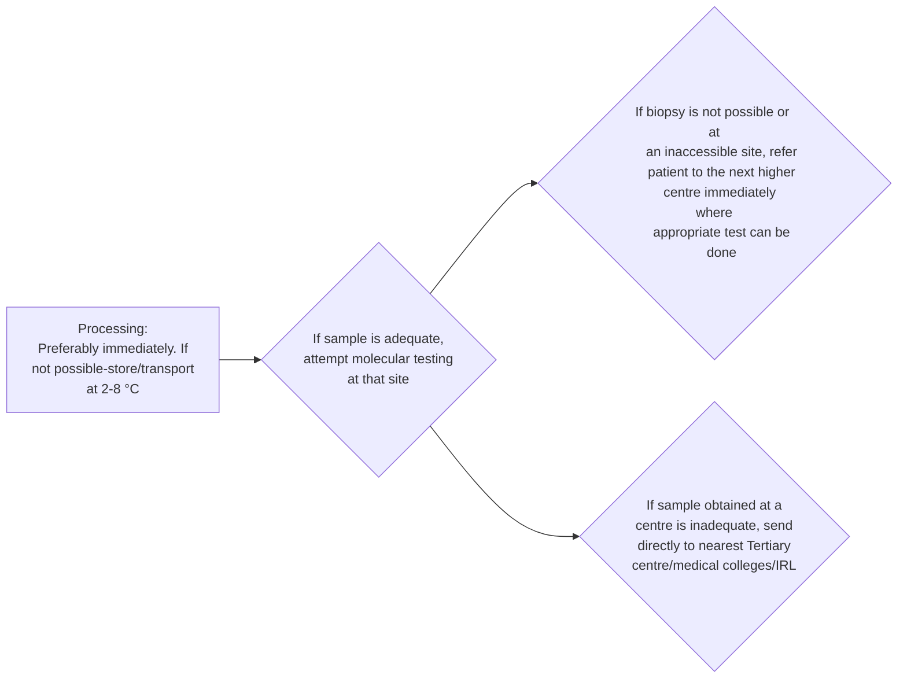

```markdown
# Standard Treatment Workflow (STW) of
MICROBIOLOGICAL WORK-UP FOR ADULT EXTRAPULMONARY TUBERCULOSIS

## LOGISTICS INVOLVED IN SAMPLE COLLECTION AND TRANSPORTATION
*   Collect Samples for Microbiological work-up in sterile containers before treatment is started. (Mention date & time of collection)
*   Specimens to be sent in sterile saline (NOT in formalin)
*   Establish linkages between peripheral centres, District centres and Tertiary centre/medical colleges/IRL. Specify details of person to be contacted, department and contact number during referrals
*   Transportation at 2-8 °C
*   Maximum time for transportation in cold chain should be 5 days from time of collection
*   Quantity of sample mentioned is only for microbiological work-up. Tests like histopathology, cytology, ADA, glucose, protein, etc will require additional sample
*   Microbiological tests for TB (smear, molecular tests, culture) will be performed as per availability and preparedness of site
*   PHC and CHC should perform smear microscopy and molecular diagnostic tests. If sample less than 500 µl, refer directly to Tertiary centre/medical colleges/IRL for culture. Residual sample in the needle and syringe used to collect the specimen can be used for smear
*   MGIT to be used for culture. However, if MGIT is not available, LJ medium should be used

## REJECTION OF SAMPLES
*   Unlabelled samples (All specimens MUST be labelled & have a unique patient identifier)
*   Have no collection date indicated
*   Insufficient quantity - No specimen in container
*   Damaged - Specimen leaked or broken in transit
*   Samples greater than 3 days old at room temperature and more than 5 days in refrigeration are unreliable specimens for testing

Precious samples should be transported to IRL.

Diagnostic algorithm of NTEP to be followed in the Microbiology labs

## MICROBIOLOGICAL GUIDANCE FOR COMMON TYPES OF EXTRAPULMONARY TUBERCULOSIS

### OSTEOARTICULAR/ MUSCULOSKELETAL
*   Sample: Tissue, pus, synovial fluid
*   Sample amount: Biopsy: Specimen material 1 cm x 1 cm biopsies. Any caseous area should be sampled. Add 0.5-2 ml sterile saline to biopsy depending on its size to avoid drying of tissue specimen
*   Optimum fluid/pus: 2-3ml.
*   Swabs are sub-optimal samples

### PLEURAL
*   Sample: Pleural fluid
*   Sample amount: 10-15 ml

### MENINGITIS
*   Sample: CSF:
*   Sample amount: 3-5 ml

### LYMPHADENITIS
*   Sample: FNA/Biopsy
*   Sample amount: Specimen material 1 cm x 1 cm biopsy. Add 0.5-2 ml sterile saline to biopsy depending on its size to avoid drying of tissue specimen
*   Optimum FNA sample: 2 ml

### UROGENITAL
*   Sample: urine
*   Sample amount: Entire early morning urine sample (3-5 days)

### FEMALE GENITAL
*   Sample: Endometrial curettage/biopsy
*   Sample amount: Biopsy: Specimen material 1cm x 1 cm biopsies. Any caseous area should be sampled. Add 0.5-2 ml sterile saline to biopsy depending on its size to avoid drying of tissue specimen

### GASTROINTESTINAL
*   Sample: Tissue, pus, peritoneal fluid
*   Sample amount: Biopsy: Specimen material 1 cm X 1cm biopsy (Atleast 6 biopsies for microbiological diagnosis including any caseous area). Any caseous area should be sampled. Add 0.5-2 ml sterile saline to biopsy depending on its size to avoid drying of tissue specimen
*   Optimum fluid/pus: 5-10ml



Microbiological procedures:
*   AFB Smear Microscopy except in GI TB
*   NAAT
*   Culture (MGIT. If MGIT is not available LJ medium should be used)
*   Drug susceptibility testing, if culture is positive

## ABBREVIATIONS
ADA: Adenosine Deaminase
AFB: Acid fast bacilli
FNA: Fine needle aspirate
LJ medium: Lowenstein Jensen medium
CHC: Community Health Centre MGIT: Mycobacteria Growth Indicator tube (Liquid culture medium for mycobacteria) IRL: Intermediate Reference laboratory
NAAT: Nucleic Acid Amplification Tests-Xpert MTB/RIF/TrueNat

## REFERENCES
1.  National TB Elimination Programme, Central TB Division. Training Modules for programme managers & Medical Officers. Ministry of Health & Family Welfare, Government of India.
    https://tbcindia.gov.in/index1.php?lang=1&level=1&sublinkid=5465&lid=3540 Last access on 15 March, 2022.
2.  Guidelines for programmatic management of drug resistant tuberculosis in India March 2021. National TB Elimination Programme, Central TB Division, Ministry of Health & Family Welfare, Government of India accessed at https://tbcindia.gov.in/showfile.php?lid=3590 Last access on 15 March, 2022.

This STW has been prepared by national experts of India with feasibility considerations for various levels of healthcare system in the country. These broad guidelines are advisory, and are based on expert opinions and available scientific evidence. There may be variations in the management of an individual patient based on his/her specific condition, as decided by the treating physician. There will be no indemnity for direct or indirect consequences. Kindly visit our web portal (stw.icmr.org.in) for more information.
Indian Council of Medical Research and Department of Health Research, Ministry of Health & Family Welfare, Government of India.
PHC: Primary health Centre
TB: Tuberculosis
```