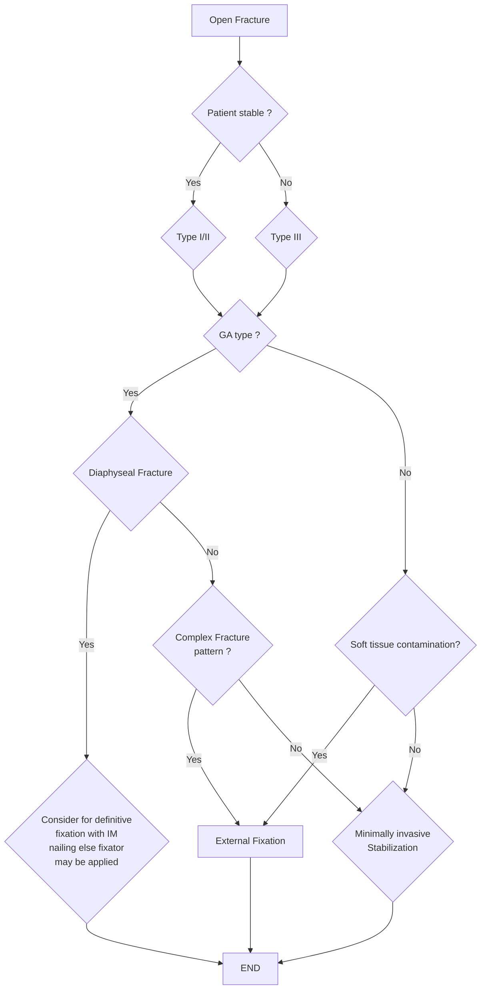

```markdown
# Standard Treatment Workflow (STW)
OPEN FRACTURES 
ICD-10-S82.891B
Department of Health Research
Ministry of Health and Family Welfare, Government of India

A fracture is considered 
open when there is 
communication 
between the fracture 
and/or the fracture 
hematoma and the 
external environment

## CLINICAL EXAMINATION 
Management of patient as per ATLS protocols
Systematic inspection of each limb is critical 
Expose the entire extremity
∙ Size of skin wounds 
∙ Muscle crush or loss 
∙ Periosteal stripping or bone loss 
∙ Contamination
∙ Clinical photography of wound is a must
∙ Neurovascular status assessment 

## GOALS OF TREATMENT
First Preserve life
Preserve limb
Preserve function
Prevention of infection
Fracture stabilization 
Soft tissue coverage

## MANAGEMENT
### *ANTIBIOTIC - WHICH, WHEN AND FOR HOW LONG?
Single most important factor in reducing the infection 
rate - early administration of antibiotics - ideally within 
1 hour of injury
* Cephalosporin (cefuroxime 1.5 gm) 3 doses 8 hours 
apart 
* Type III - Add aminoglycoside (gentamycin 5mg/kg 
every 24 hours)
* Duration - 3 days after wound closure 
* Potential soil contamination - Add metronidazole 
500 mg IV every 8 hours
* Consider Aspirin in case of prolonged immobilisation 
* Look for signs of **DVT** and embolism

### INITIAL EMERGENCY TREATMENT
OBVIOUS BLEED
No obvious bleed Apply local pressure Controlled
Antibiotics* and Tetanus prophylaxis
Remove gross contamination 
with gentle saline wash
Cover with saline gauze
Do not debride/suture in ED
Assess Neurovascular status
Reduction, realignment, splintage 
Reassess Neurovascular status
Does not stop
Pack the wound
Look for Compartment 
syndrome
Pain on passive stretching
Pallor
Paraesthesia
Paralysis
Pulselessness
If suspected 
urgent referral 
to higher centre 
for immediate 
fasciotomy

GET X-RAY TO ASSESS UNDERLYING 
FRACTURE (IF POSSIBLE)

### GUSTILO-ANDERSON CLASSIFICATION
| | I | II | III-A | III-B | III-C |
|---|---|---|---|---|---|
| Energy of mechanism | Low | Moderate | High | High | High |
| Wound size | <1 cm | 1 to 10 cm | >10 cm | >10 cm | >10 cm |
| Soft tissue injury | Low | Moderate | Extensive | Extensive | Extensive |
| Contamination | No | Low | Severe | Variable | Variable |
| Fracture pattern/ comminution | Simple /no | Simple/ Some | Complex /Severe | Complex /Severe | Complex /Severe |
| Soft tissue coverage | Yes | Yes | Yes | No | Variable |
| Vascular injury | No | No | No | No | Yes |

### GA TYPE III B/III C
Managed at tertiary centre
Multidisciplinary approach - ‘Orthoplastic’
III C injuries may require CT angiogram/doppler study

### SURGICAL WOUND DECONTAMINATION
* Prior to formal debridement the wound should be 
handled only to remove gross contamination
* ‘Mini-washouts’ outside the operating theatre 
environment are not indicated
* Debride all devitalized structures – skin, muscle, bones 
(‘When in doubt, take it out)
* Irrigation: Low to medium pressure; normal saline
* Rule of 3 (Type 1 – 3L; Type 2 – 6L; Type 3 – 9L)
* Send cultures
* Fracture stabilization with fresh instruments once 
debridement is complete
* Grade I to IIIA - Early internal fixation – With definitive 
skin cover
* Grade IIIA and IIIB - Provisional stabilization of fracture 
with wound management when definitive skin cover is 
not possible

### WOUND CLOSURE
* Recommendation is primary closure of Type I, Type II 
and a few selected Type IIIA fracture – but avoid 
tension at closure site
* Coverage of III A and III B - after proper debridement 
and cleaning. May require one or two or more formal 
debridements
* Definitive soft tissue closure or coverage should be 
aimed within 72 hours of injury if it cannot be 
performed at the time of debridement



### REFERRAL 
At primary centre after initial management is done
Ensure Splintage is done, Analgesic IV/IM Diclofenac 
single dose is given. Patient is kept NPO and IV fluid 
(RL) is started
GA Type I to III A
Refer to secondary centre
GA Type III B
Refer to tertiary centre

## ABBREVIATIONS
ATLS: Advanced Trauma Life Support GA: Gustilo Anderson NPO: Nil Per Oral 
CT: Computed Tomography IM Nail: Intramedullary Nail RL: Ringer's Lactate 
ED: Emergency Department IV/IM: Intravenous/Intramuscular 

## REFERENCES
1. Sagi HC, Patzakis MJ. Evolution in the Acute Management of Open Fracture Treatment? Part 1. J Orthop Trauma. 2021 Sep 1;35(9):449-456. doi: 10.1097/BOT.0000000000002094. PMID: 34415869.
2. Sagi HC, Patzakis MJ. Evolution in the Acute Management of Open Fracture Treatment? Part 2. J Orthop Trauma. 2021 Sep 1;35(9):457-464. doi: 10.1097/BOT.0000000000002095. PMID: 34415870.
3. Berner JE, Ali SR, Will PA, Tejos R, Nanchahal J, Jain A. Standardising the management of open extremity fractures: a scoping review of national guidelines. Eur J Orthop Surg Traumatol. 2023 
Jul;33(5):1463-1471. doi: 10.1007/s00590-022-03324-w. Epub 2022 Jul 10. PMID: 35819519; PMCID: PMC10276057.
4. Eccles, Simon & Handley, Bob & Khan, Umraz & Nanchahal, Jagdeep & Nayagam, Selvadurai & McFadyen, Iain. (2020). Standards for the Management of Open Fractures. 
10.1093/med/9780198849360.001.0001.

July/ 2024
This STW has been prepared by national experts of India with feasibility considerations for various levels of healthcare system in the country. These broad guidelines are advisory, and 
are based on expert opinions and available scientific evidence. There may be variations in the management of an individual patient based on his/her specific condition, as decided by 
the treating physician. There will be no indemnity for direct or indirect consequences. Kindly visit the website of ICMR for more information: (icmr.gov.in) for more information. ©Indian 
Council of Medical Research, Ministry of Health & Family Welfare, Government of India.

EARLY ADMINISTRATION OF ANTIBIOTICS AND REFERRAL AS PER RESOURCE SETTING
```