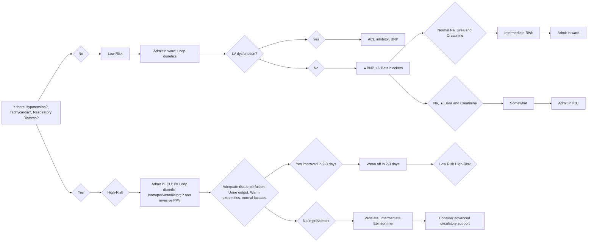

# Standard Treatment Workflow (STW)
## PEDIATRIC HEART FAILURE
ICD-10-150.9

**DEFINITION**

Clinical and pathophysiological
syndrome that results from
inability of the heart to function
adequately to meet the metabolic
demands of the body

**CLINICAL SPECTRUM**

*   Acute decompensated HF
*   Chronic compensated HF
*   Acute exacerbation of chronic HF

**MODIFIED ROSS CLASSIFICATION OF HEART FAILURE**

*   Class I: No symptoms/limitations
*   Class II: Mild tachypnea/sweating during feeds in infants/
dyspnoea on exertion in older children but no growth
failure
*   Class III: Significant tachypnea or sweating during
feeds/marked dyspnoea on exertion/prolonged feeding
time with growth failure
*   Class IV: Symptoms (tachypnoea, retractions, grunting
and sweating) even at rest with growth failure

**HEART FAILURE OFTEN HAS A TREATABLE CAUSE IN MOST CHILDREN. IDENTIFYING AND TREATING
THE CAUSE IS THEREFORE THE MOST IMPORTANT PRIORITY**

| Category | Specific Conditions | Category | Specific Conditions |
| --- | --- | --- | --- |
| Shunt lesions | VSD, PDA, AP window, AVCD, TGA, Truncus, TAPVC | Inflammatory | Myocarditis and other immunoinflammatory conditions |
| Obstructive lesions | Critical AS, PS, coarctation/aortic interruption | Abnormal rate/rhythm | Tachycardiomyopathy, bradycardia, AV dyssynchrony |
| Regurgitant lesions | Congenital- AV canal defect, Ebsteins anomaly Acquired- RHD, IE, post-operative | Ischemic | Anomalous coronary artery from pulmonary artery, Coronary artery occlusion from other causes |
| Primary Myocardial dysfunction | Dilated cardiomyopathy, Inborn errors of metabolism, muscular dystrophy, drug induced | Post- cardiac surgery | Variety of causes (cardiopulmonary bypass, Myocardial preservation etc.) |
| Fetal/Neonatal | First Week | Abnormal homeostasis | Hypoxia, hypocalcemia, hypoglycemia, sepsis, hypothermia |
|  | Duct dependent systemic circulation • HLHS • Critical AS • Critical Co A • Interrupted arch Severe Tricuspid regurgitation Vein of Galen malformation Fetal/Neonatal myocarditis Congenital MR |  | 7-30 Days |
|  |  |  | VSD with Coarctation Large AP window Persistent truncus arteriosus Single ventricle physiology with no PS TGA-VSD/PDA Large VSD or PDA especially in preterm infants All cases listed for the first week |
|  | 3-6 Months |  | 6 Months - 1 Years |
|  | Large post tricuspid L-R shunts • VSD • PDA • AV canal defects ALCAPA Myocarditis/DCM All examples listed for the 7-30 days category |  | Large post tricuspid L-R shunts • VSD • PDA • AV canal defect Myocarditis/DCM ALCAPA |
|  | 1-10 Years |  | Heart valve disease (RHD) Myocarditis/DCM Aortoarteritis Palliated CHD Post KD coronary arteriopathy Idiopathic PAH |

**SYMPTOMS**

|  | Neonate | Infant | Older children |
| --- | --- | --- | --- |
|  | • Lethargy • Fast breathing Poor suck | Rapid and labored breathing Poor growth Feeding difficulties Reduced urine output | Breathlessness Effort intolerance Excessive sweating Growth retardation Frequent chest infections Abdominal distension |
|  |  | Excessive sweating (suck-rest-suck cycles) Puffiness of face, extremities Cold extremities |  |

**SIGNS**

*   Tachypnea and labored respiratory efforts with intercostal and subcostal recession (RR>60/min in less than 1 year old and >50/min in 1-2 year old)
*   Tachycardia (HR>160/min in less than 1 year old, >140/min between 1-2 year old)
*   Hepatomegaly
*   Auscultation-Crackles at lung bases (limited sensitivity and specificity)
*   S3 gallop, murmurs
*   Raised JVP (not useful in infants)
*   Peripheral edema

**RED FLAGS**

*   Reduced peripheral perfusion
*   Reduced urine output
*   Elevated lactate levels
*   Altered sensorium
*   Sepsis

**HEART FAILURE MIMICS**

*   Sepsis
*   Respiratory distress syndrome
*   Inborn errors of metabolism
*   Bronchiolitis (infants)

**ESSENTIAL INVESTIGATIONS**

**Chest x-ray**

Information on cardiac silhouette,
pulmonary vasculature, pulmonary
artery dilatation and associated
skeletal abnormalities

**ECG**

Diagnosis of treatable causes of heart
failure such as persistent
tachyarrhythmia, ALCAPA and,
hypocalcemia. Other specific causes
such as Pompe's disease, specific
forms of cardiac muscle involvement
in muscular dystrophy have ECG
manifestations

**Echocardiogram**

Critically important to accurate
diagnosis and tailoring response to
therapy

## PEDIATRIC HEART FAILURE (Continued)

| Essential blood tests to be performed in all | Utility |
| --- | --- |
| Complete blood count; CRP | Identifying Sepsis, Anemia |
| Electrolytes and urea, creatinine | Elevated urea, creatinine may indicate decompensated HF or may result from medication side effects. Electrolyte imbalance is a common association of HF and diuretic use. Hypocalcemia can cause ventricular dysfunction leading to HF |
| Liver function test | Elevated bilirubin, liver enzymes and prolonged prothrombin time points towards congestive hepatopathy. Hypoalbuminemia points to chronic HF and poor nutrition |

| Optional tests to be decided based on clinical situation |
| --- |
| Arterial blood gas with lactate | Lactic acidosis- as a marker of tissue perfusion and helps monitor response to treatment; It is also elevated in specific inborn errors of metabolism |
| Thyroid function test | Thyroid hormone imbalance could be a primary cause or may lead to worsening of symptoms |
| Brain Natriuretic Peptide (BNP) | It helps differentiate HF from respiratory disease. Useful in monitoring response to therapy |
| Cardiac enzymes (troponin I, T, CKMB) and Viral Panel | In suspected cases of myocarditis |

**Management Goals**

*   Correct the underlying cause
*   Reduce associated morbidity and mortality
*   Improve functional status and quality of life

**General Measures**

*   **Fluid restriction**
    *   In acute HF with lung congestion,
    peripheral edema despite diuretics
    and in presence of hyponatremia
*   **Rest and restriction of activity**
    *   Activity as tolerated for older children
    with chronic compensated HF
*   **Correction of Anaemia**
    *   Hematinics; Blood transfusion only for
    severe anemia (Hb < 7gm/dl)
*   **Nutrition**
    *   NG feeds for infants in acute severe HF.
    *   In infants calorie intake of 120-
    150kcal/kg/with a fluid intake of 100
    ml/kg/day. (thickening of feeds or by
    adding coconut oil/medium chain
    triglyceride). In older children increase
    protein content of diet while
    optimizing the fat and carbohydrate
    intake. Supplement Ca and Vit D3;
    *   Dietary restriction of sodium is
    generally not recommended in
    children unless there is severe edema
    unresponsive to diuretic therapy
*   **Supplementary oxygen**
    *   May be necessary when there is
    respiratory distress but must be used
    with caution in L-R shunts and
    avoided in neonates with duct
    dependent lesions

**Inotropes should be physiologically appropriate:**

Avoid vasodilators in presence of fixed outflow obstruction (AS); use vasodilators for regurgitant lesions, pump
failure and large shunts

Avoid using very high doses for sustained periods (Preferably adrenaline < 0.1; dopamine or dobutamine < 15
mcg/g/min)

**ABBREVATIONS**

*   ACEI: Angiotensin Converting Enzyme Inhibitor
*   ALCAPA: Anomalous Origin of Left Coronary Artery from
Pulmonary Artery
*   AP Window: Aorto-Pulmonary Window
*   AS: Aortic Stenosis
*   AVCD: Atrio-Ventricular Canal Defect
*   AVCD: Atrio-Ventricular Canal Defect
*   CoA: Coarctation of the Aorta
*   CKMB: Creatine Kinase Myoglobin Binding
*   CRP: C-reactive Protein
*   HF: Heart Failure
*   DCM: Dilated Cardiomyopathy
*   HLH: Hypoplastic Left Heart
*   HR: Heart Rate
*   IE: Infective Endocarditis
*   JVP: Jugular Venous Pressure
*   KD: Kawasaki Disease
*   LV: Left Ventricle
*   MR: Mitral Regurgitation
*   NG: Naso-Gastric
*   PAH: Pulmonary Arterial Hypertension
*   TAPVC: Total Anomalous Pulmonary Venous Connection
*   PDA: Patent Ductus Arteriosus
*   PPV: Positive Pressure Ventilation
*   PS: Pulmonary Stenosis
*   RHD: Rheumatic Heart Disease
*   RR: Respiratory Rate
*   TGA: Transposition of Great Arteries
*   VSD: Ventricular Septal Defect

**REFERENCES**

1.  Venkatesh S, Kumar RK, Heart Failure in Children. IAP specialty Series on Pediatric Cardiology, 3rd edition. Jaypee Brothers Medical Publishers,
    New Delhi; 2022. pp. 351-76.
2.  Hinton RB, Ware SM. Heart Failure in Pediatric Patients With Congenital Heart Disease. Circ Res. 2017 Mar 17;120(6):978-994. doi:
    10.1161/CIRCRESAHA.116.308996. PMID: 28302743; PMCID: PMC5391045.

**PEDIATRIC HEART FAILURE IS BEST MANAGED IN CONSULTATION WITH A PEDIATRIC CARDIOLOGIST**

This STW has been prepared by national experts of India with feasibility considerations for various levels of healthcare system in the country. These broad guidelines are advisory, and are based on expert opinions and available scientific evidence. There may be variations in the management of an individual patient based on his/her specific condition, as decided by the treating physician. There will be no indemnity for direct or indirect consequences. Kindly visit the website of ICMR for more information: (icmr.gov.in) for more information. Indian Council of Medical Research, Ministry of Health & Family Welfare, Government of India.
