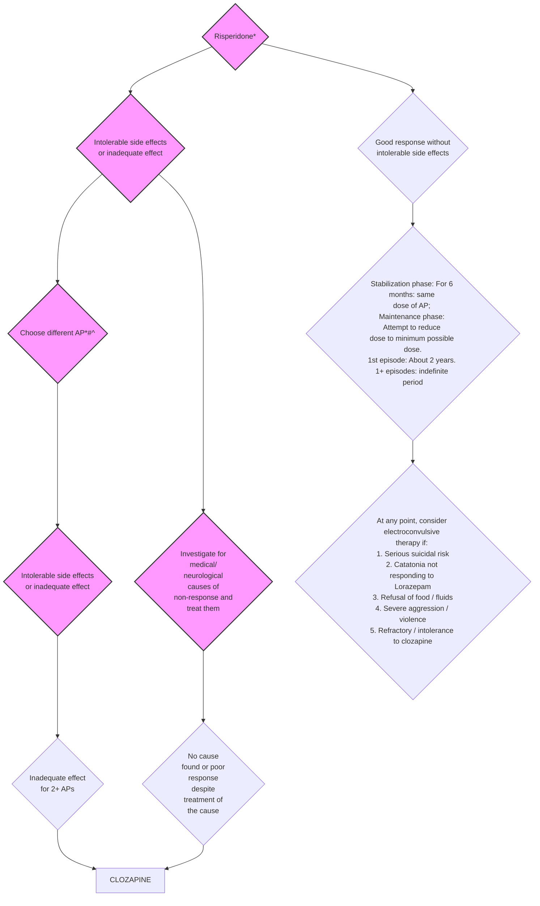

```markdown
# Standard Treatment Workflow (STW) for the Management of
PSYCHOSIS
ICD10-F20-29

```mermaid
graph TD
    A[DIAGNOSIS] --> B{Presence of 
    delusions 
    (suspiciousness 
    and fear without 
    obvious 
    explanation)};
    B --> C{Hallucinations
    (talking, 
    smiling or 
    laughing to 
    self)};
    C --> D{Disorganized 
    behaviour & 
    poor self-care};
    D --> E{Social and 
    occupational
     dysfunction};
    E --> F[PRIMARY CARE LEVEL];
    
```

## WELLNESS CENTERS

Identify, educate and refer to PHC
If immediate threat to self/ others, 
refer to Taluk / District center

FOLLOW-UP AND REHABILITATION:
* Monitor & manage challenges in 
treatment continuation
* If unsatisfactory outcome despite 
regular treatment:
    * Liaise with higher centers for 
optimal outcome
    * Liaise with social welfare 
    department for disability
     certification & welfare benefits if 
    continued poor outcomes

## MANAGEMENT
PHC

### INDICATION
FOR REFERRAL
FROM PHC

* Diagnostic 
confusion
* Poor response 
to Risperidone
* Intolerance 
to 
Risperidone
* Poor 
adherence to 
treatment
* Comorbid 
conditions
* Challenging 
situations
* Rehabilitation 
needs
* Pregnancy

## SECONDARY CARE (TALUK/DISTRICT HOSPITALS) #

Clarify 
diagnosis; 
neuroimaging 
if organicity is 
suspected

Positive symptoms: 
Follow algorithm

Negative symptoms:
* Rule out or manage 
depression/ anxiety 
and extrapyramidal 
symptoms;
* Family counseling if 
understimulated/ 
over-protected
* Consider 
less-sedating 
antipsychotics and 
adding SSRIs*

## TERTIARY CARE CENTERS
INTERVENTION CONTEXT IN WHICH USEFUL
Psychoeducation Poor adherence; high family expressed emotions
Family therapy High family expressed emotions; family discord
Cognitive remediation Poor neuro and social cognitive functions
Cognitive behavior therapy
Depression, anxiety, obsessions, persistent 
psychotic symptoms
Social skills training
Poor social skills
Vocational rehabilitation and 
supported education
Poor occupational functioning, challenges in 
studying or getting / pursuing gainful occupation
Day care with interventions including 
vocational training, recreational 
activities, living-skill training, etc. 
Negative symptoms, poor socio-occupational 
functioning, combination of other symptoms 
listed in the table 
Interventions for substance-use Hazardous use of substance or substance use 
disorder
Pregnancy – puerperium services
Pre-pregnancy, pregnancy and post-partum 
advise and interventions Pre-pregnancy, 
pregnancy and post-partum advise and 
interventions 

INITIATE TREATMENT:
* T. **Risperidone** 
 2mg HSx1 week f/b 
 3 – 4 mg HS + 
**Trihexyphenidyl** 
(THP) 2mg(morning)
 * Psychoeducation:
     * medical model of 
psychosis
     * address 
misconceptions & 
build hope
    * inform about 
possible adverse 
effects of 
medications

FOLLOW UP:
* 2 weeks after initial contact: Check for 
changes in symptoms and adverse effects 
(excess sleep, **extrapyramidal symptoms (EPS)**, 
tiredness) adjust the dose of risperidone and 
THP accordingly; address questions if any; 
advise gradual return to work/school; give 
specific follow-up date; liaise with wellness 
center for ensuring continuity of care
* Once in 1 – 2 months: Check for symptoms, 
functioning and adverse effects (**EPS**, 
weight-gain, menstrual/sexual dysfunction); 
adjust the dose of Risperidone (range: 2 – 8 
mg/day) and THP (range 2 – 6 mg/day); liaise 
with wellness center for ensuring continuity of 
care

REASONS FOR REFERRAL TO TALUK / DISTRICT LEVEL:
* Diagnostic confusion / suspicion of 
organic condition
* Substantial risk of harm to self or others 
and catatonic symptoms 
* Comorbid substance use, 
depression/anxiety, intellectual disability 
* Poor symptom-control or functioning 
despite regular treatment or poor 
treatment adherence
* Significant adverse effects: weight-gain, 
metabolic adverse effects, tardive 
dyskinesia
* Questions regarding marriage, 
pregnancy, sexual dysfunction

*Encourage 
follow up in 
primary care 
after 
addressing 
referral issues 
* Watch for 
adverse 
effects as 
SSRIs may 
increase 
serum levels 
of 
antipsychotics
Follow
algorithm
* Assessment 
of factors 
causing poor 
adherence & 
specific 
manage ment
* Consider 
depot anti psychotics
* Liaise with 
primary care 
for assertive 
follow up

* Depression/ 
anxiety: 
Brief 
psychological 
intervention; 
consider SSRIs*
* Substance use:
Detoxification 
and brief 
interventions 
(see SUD 
module)
* Developmental 
disabilities: 
Behavioral 
assessment & 
management

* Suicidality: 
Inpatient 
care,
Crisis 
management, 
Management 
of 
comorbidity; 
Consider ECT
* Violence: 
Verbal 
de-escalation 
IV sedation, 
Brief 
inpatient care

* Assess disability & counsel 
about welfare benefits

* Rehabilitation counseling 
  * Family intervention for 
expressed emotions and 
attitudes & behaviors 
interfering with 
functioning
  * Brief interventions for 
cognitive & social-skill 
deficits
  * Address vocational/ 
educational challenges 
involving governmental/ 
non-governmental 
agencies

* Proactively 
address 
sexual and 
endocrine 
problems 
when 
relevant
* Educate 
about risk of 
obstetric 
outcomes, 
risk of 
relapse & 
risk of 
psychosis in 
the 
offspring
Referral to tertiary care if:
 1. Diagnostic confusion: 
 Inpatient observation for 
clarification of history, thorough 
neurological / mental status 
examination, diagnostic 
psychometry, brain CT Scan or MRI, 
neurology consultation and urine 
toxicology screen
2. Poor outcome: 
 Following psychosocial 
interventions may be offered in 
isolation or in combination 
depending on the context in 
inpatient, outpatient or 
day-boarding settings

## ALGORITHM FOR CHOOSING ANTIPSYCHOTIC MEDICATION (AP) FOR TREATMENT OF SCHIZOPHRENIA



* Treat with adequate dose as shown in table-1 for 6 – 8 
weeks to assess ecacy
#While choosing alternative AP, consider adverse effect 
profile and cost
^ At any point, if there is medication non-adherence, 
consider long-acting preparations in addition to other 
measures for managing non-adherence

 KEEP A HIGH THRESHOLD FOR INVASIVE PROCEDURES

This STW has been prepared by national experts of India with feasibility considerations for various levels of healthcare system in the country. These broad guidelines are advisory, and 
are based on expert opinions and available scientific evidence. There may be variations in the management of an individual patient based on his/her specific condition, as decided by 
the treating physician. There will be no indemnity for direct or indirect consequences. Kindly visit our web portal (stw.icmr.org.in) for more information.
© Indian Council of Medical Research and Department of Health Research, Ministry of Health & Family Welfare, Government of India.
```