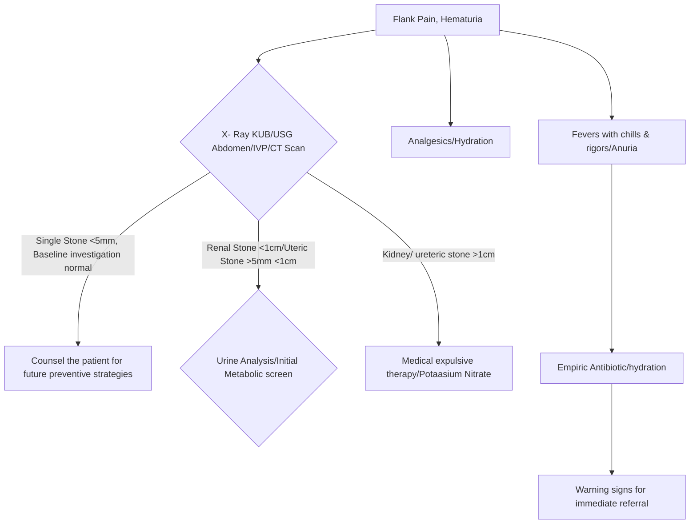

```markdown
# Standard Treatment Workflow (STW) for the Management of
RENAL AND URETERIC STONES
ICD N20.0

## HOW WILL YOUR PATIENT PRESENT AND WHAT TO SUSPECT

| CLINICAL SCENARIO | SUSPECT |
|---|---|
| Flank pain | Renal Stone |
| Colicky pain starting from back and radiating to front | Upper ureteric stone |
| Colicky pain starting from back & radiating upto groin | Mid ureteric stone |
| Colicky pain starting from back & radiating to upper thigh & scrotum/vulva | Lower ureteric stone |

SYMPTOMS

### Renal Pelvic Stone
### Upper Ureteric Stone

*   Haematuria may be present with stone at any location
*   Lower ureteric stones may also present with difficulty in passing urine
*   Colics may be associated with nausea and vomiting
*   Can present as **anuria** in bilateral ureteric stones, ureteric stone in a solitary kidney
*   History of site & type of pain, associated symptoms hint towards possible site of stones. Remember to take past history of stone diseases, medications, family history etc

## INVESTIGATION
RADIOLOGY

| NAME | ADVANTAGES AND DISADVANTAGES | TIPS FOR ORDERING INVESTIGATIONS |
|---|---|---|
| X-KUB | Readily available, inexpensive, minimal radiation but needs preparation hence may not be the preferred test in emergency settings | Order X-KUB and Ultrasound in all patients of suspected renal stones (90% of renal stones are radio-opaque). |
| USG | Readily available, no radiation, safe test in pregnancy, detects radiolucent stones, high sensitivity for hydronephrosis. Can miss a ureteric calulus | In acute colic NCCT should be preferred if available |
| IVP | Anatomical and functional imaging, aids in planning surgery but high radiation and needs preparation. Not useful in poor renal function | Once the stone is detected, get Intravenous pyelography if stone is seen on X-ray |
| CT Scan | No contrast required, highly sensitive and specific, detect radiolucent stones, detect other causes of flank pain, but risks higher radiation and cost | CT urography if stone is radiolucent to aid further treatment |

### METABOLIC EVALUATION

| Initial biochemical evaluation in all stone formers | Extended Evaluation |
|---|---|
| Urine analysis, serum creatinine, electrolytes namely calcium, phosphorous and uric acid. Intact parathyroid hormone and stone analysis are preferrable | To be done in recurrent stone former, stone in children, bilateral stones, family history of stone, history of gut surgery, solitary kidney and cysteine stones. Typically to be done at 3-4 weeks after stone clearance |
|  | Should include initial metabolic evaluation plus 24-hour urinary levels of calcium,uric acid, and creatinine. Preferable to do urinary oxalate and citrate levels too |

## MANAGEMENT ALGORITHM


*   Increase daily fluid intake to ensure a urine output >2 lit/day
*   Restrict extra salt intake and increase dietary fibre
*   Do not restrict calcium intake
*   Increase citrate rich food such as lemon, orange juice etc
*   Decrease consumption of food rich in oxalates like spinach, nuts, beet root, potato chips, French fries
*   Avoid purine rich foods like animal protein, alcoholic drinks like beer

### Warning signs for immediate referral
*   **Anuria**
*   Fever with chills and rigors
*   Suspected renal failure
*   Persistent haematuria

### Medical Expulsive Therapy (MET)
*   Alpha blockers such as **Tamsulosin (0.4mg/day); Alfuzocin(10mg/day); Doxazocin(4mg/day); Silodocin(8mg/day)**
*   MET should be offered
    *   In Ureteric stones <10mm
    *   In the absence of infection, obstruction or deranged renal function
    *   MET can be tried for upto 4 weeks

## KEEP A HIGH THRESHOLD FOR INVASIVE PROCEDURES

This STW has been prepared by national experts of India with feasibility considerations for various levels of healthcare system in the country. These broad guidelines are advisory, and are based on expert opinions and available scientific evidence. There may be variations in the management of an individual patient based on his/her specific condition, as decided by the treating physician. There will be no indemnity for direct or indirect consequences. Kindly visit our web portal (stw.icmr.org.in) for more information.
Indian Council of Medical Research and Department of Health Research, Ministry of Health & Family Welfare, Government of India.
```