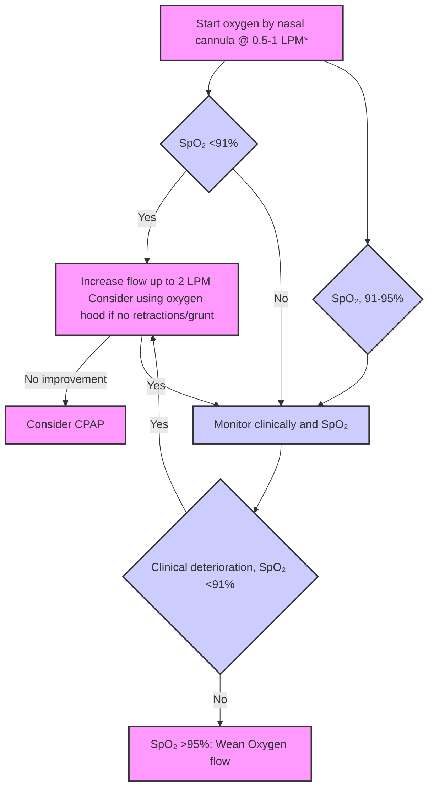

```markdown
July/2020
सत्यमेव जयते
Department of Health Research
Ministry of Health and Family Welfare, Government of India
NEW DELH
icma
INDIAN COUNCIL OF
MEDICAL RESEARCH
Serving

# Standard Treatment Workflow (STW)
## RESPIRATORY DISTRESS IN NEONATES
ICD-10-P22.0

Presence of any one:
Tachypnea (RR >60
bpm), OR lower
chest retractions,
nasal flaring,
grunting OR
cyanosis

## ACTIONS
* Rapid assessment of TABC (temperature, airway, breathing, circulation) and stabilize
the baby
* Admit the baby in SNCU/NICU
* Nurse in a radiant warmer/incubator; monitor with continuous pulse oximetry
* Quantify the severity of RD using Silverman Anderson Score [SAS]
* Closely monitor RR, SAS, SpO2, and CFT
* Most neonates with RD can be fed enterally (by breastfeeding [if RR<70 bpm and not
on respiratory support] or orogastric tube). Those with severe distress or any
contraindication to enteral feeding should be given IV fluids

## GOALS
* To alleviate the work of breathing by providing appropriate respiratory support
* To maintain oxygen saturations from 91% to 95%
* Identify and treat the underlying cause

| Grade | 0              | 1               | 2               |
|-------|----------------|-----------------|-----------------|
| UPPER CHEST       | SYNCHRONIZED | JUST VISIBLE    | SEE-SAW         |
| LOWER CHEST       | NO Retractions | JUST VISIBLE    | MARKED          |
| XIPHOID RETRACTIONS | NONE           | MINIMAL         | MARKED          |
| NARES DILATATION  | NONE           | MARKED          | MARKED          |
| EXPIRATORY GRUNT   | NONE           | HEARD WITH STETHOSCOPE | AUDIBLE         |
SILVERMAN ANDERSON SCORE (SAS)

## RESPIRATORY SUPPORT
* **SpO2< 91%**: Oxygen by nasal prongs(NP) 0.5 -1.0 Lpm
(max. 2 Lpm)
* Gestation ≥ 32 weeks: CPAP if_SAS 4 >, OR no
improvement with NP oxygen
* Gestation < 32 weeks: CPAP if **SpO2< 91%** OR SAS 1-3
* Those with severe RD (SAS of 5 >; FiO2 of more than
60-70%), unresponsive to CPAP, having shock or
repeated episodes of apnea, may require mechanical
ventilation and referral (See STW on Transport)



**SpO2 <91%**

RESPIRATORY DISTRESS OR LOW SPO₂ (<91%)

Start oxygen by nasal cannula @ 0.5-1 LPM*

Sp0, 91-95%

Monitor clinically and SpO2

Increase flow up to 2 LPM
Consider using oxygen hood if no
retractions/grunt

No improvement

Consider CPAP

Clinical deterioration,
SpO2 <91%

SpO2 >95%: Wean
Oxygen flow

*Consider early CPAP if gestation <32 weeks, AND SPO, <91% OR
SAS 3 or more

## ASSESS AND TREAT THE UNDERLYING CAUSE
* **RESPIRATORY DISTRESS SYNDROME (RDS)**: Consider surfactant replacement therapy as per indication
* **PNEUMONIA-SEPSIS**: Treat with antibiotics as per unit's protocol (refer to sepsis STW)

## WHAT NOT TO DO
* DO NOT let SpO2 exceedc 95% while supplementing oxygen. High oxygen saturation is a risk factor for
retinopathy of prematurity
* DO NOT give unnecessary IV fluids, antibiotics, blood products or drugs
* DO NOT perform unnecessary investigations (CBC, CRP, routine ABG)
* DO NOT do routine chest X-ray in all neonates with RD. Perform chest X-ray if RD is persisting beyond 6
hours of age, there is worsening or a diagnostic dilemma

## ABBREVIATIONS
BW: Birth weight
GA: Gestational age
RR: Respiratory rate
CPAP: Continuous positive airway pressure
IV: Intravenous
SAS: Silverman Anderson score
CFT: Capillary filling time
RD: Respiratory distress

## REFERENCES
1. Oxygen therapy in neonates, and Surfactant Replacement therapy in neonates. Evidence-based Clinical Practice Guidelines. National
Neonatology Forum India. Available at www.nnfi.org/cpg

## PREVENT HYPOXIA AND HYPEROXIA
This STW has been prepared by national experts of India with feasibility considerations for various levels of healthcare system in the country. These broad guidelines are advisory, and
are based on expert opinions and available scientific evidence. There may be variations in the management of an individual patient based on his/her specific condition, as decided by
the treating physician. There will be no indemnity for direct or indirect consequences. Kindly visit the website of DHR for more information: (stw.icmr.org.in) for more information.
Department of Health Research, Ministry of Health & Family Welfare, Government of India.
```