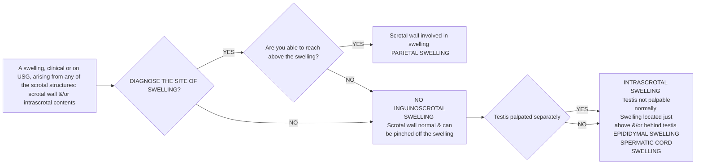

```markdown
October/2019

सत्यमेव जयते
Department of Health Research
Ministry of Health and Family Welfare, Government of India

अनुसंधान
OF MEDICAL RESEARCH
NEW DELHI
icma
INDIAN COUNCIL OF
MEDICAL RESEARCH
Serving the nation since 1911

# Standard Treatment Workflow (STW) for the Management of
**SCROTAL SWELLING**
ICD-10-N50.89

## HOW TO MAKE A CLINICAL DIAGNOSIS?



**AS PER NATURE DIAGNOSE THE NATURE**  PAINFUL Fever Present Acute infection
OF SWELLING?
Fever Absent Traumatic
• Ischaemic
PAINLESS (e.g. torsion)
Cystic Fluid accumulation, (e.g. Hydrocele, epididymal cyst)
→ Solid Ch. inflammatory, (e.g. Filariasis, TB)
Tumors

## MAKE A CINICAL DIAGNOSIS

| PARIETAL (SCROTAL WALL) SWELLINGS |  | INTRASCROTAL SWELLINGS |
|---|---|---|
| | BILATERAL | Testicular | Epididymal | Spermatic cord |
| Ac. Inflammation | • Cellulitis <br> • Fournier gangrene | Cystic | Hydrocele | • Epididymal cyst <br> • Spermatocele | Varicocele |
| Traumatic | Contusional | Painless | Painless | Painless |
| Ch. Inflammation | Filarial Elephantiasis | Solid | Testicular tumor | • Ch. Filarial | Lipoma cord |
| Fluid Accumulation | • Edema in anasarca, <br> IVC thrombosis <br> • Urinary extravasation | UNILATERAL <br> • Reactionary to <br> epididymo- orchitis <br> • Furuncle Abscess <br> • Blunt trauma | Painful | • Torsion testis <br> • Orchitis epididymitis | Painful <br> • Ch. Tuberculous <br> Epididymitis <br> • Adenomatoid tumor | Painful <br> • Funiculitis |
| Neoplasm | Scrotal wall cysts <br> Melanoma, Scrotal <br> Carcinoma <br> Dermatofibroma |  |  |  |

### RED FLAG SIGNS

| PAINFUL SWELLING | TORTION TESTIS <br> (More common in adolescents) | CONFIRM BY |
|---|---|---|
| * Sudden onset <br> * O/E tender enlarged testis, pain increases on elevating testis <br> * Severe pain <br> * Vomiting <br> * No fever | TORTION TESTIS <br> (Testicular Tumor) | * Scrotal doppler <br> ATTEMPT <br> Manual detorsion if patient reports early |
| PAINLESS SWELLING |  | REFER URGENTLY FOR EXPERT CONSULTATION |
| Solid testicular swelling is felt |  |  |

REFER ALL CASES FOR EXPERT CONSULTATION

### INVESTIGATIONS

| SUSPECTING AC. INFLAM DISEASE | SUSPECTING CH. INFLAMMATORY DIS. | SUSPECTING TESTICULAR TUMOR | SUSPECTING TORSION | SUSPECTING VARICOCELE |
|---|---|---|---|---|
| Essential <br> * TLC/DLC <br> * Blood sugar | Essential <br> * TLC/DLC <br> * ESR | Essential <br> * Beta hCG <br> * Scrotal USG <br> * Alfa feto protein <br> Serum LDH | Essential <br> * TLC/DLC | Essential <br> * Scrotal doppler |
| Desirable <br> * Anti filarial antibody | Desirable <br> * Anti filarial Ab <br> * TB Gold test <br> * Scrotal USG | Desirable <br> * Abdomino - <br> Pelvic CECT Scan | Desirable | Desirable |

## HOW TO TREAT COMMON CONDITIONS?

### PARIETAL SWELLINGS

* FURUNCLE/ABSCESS
    * Broad Spectrum Antibiotic
    * Amoxy + Clavulinic acid
    * Consider drainage if fluctuations+ or impending rupture
    * REFER
        * If abscess appears part of underlying disease
        * Nonresponders
        * Immunocompromised patient

* FILARIAL ELEPHANTIASIS
    * DEC 100 mg TDS x 20 days
    * Doxycycline 100 mg BD x 20 days
    * Scrotal Elevation/support
    * REFER
        * Non responders
        * Huge size

### INTRASCROTAL SWELLINGS

* AC. EPIDIDYMO-ORCHITIS
    * If patient had a urinary tract instrumentation or dysuria suspect bacterial type, treat by - antibiotic and support
    * REFER If no response in 48 hrs
    * Treat all other cases as filarial by - DEC 100 mg x TDS x20 days Doxycycline 100 mg x BD x 20 days
    * Give anti inflammatory drugs to all

* HYDROCELE
    * Small size - no treatment
    * Moderate to large -Do hydrocelectomy
    * Aspiration can be performed under asceptic precautions in select cases
    * REFER if not trained to do the surgery

* CHRONIC EPIDIDYMO-ORCHITIS
    * Mostly filarial in origin but if
        * Patient has had H/O UTI or urethral catheterization, suspect bacterial
        * Patient has H/O TB, suspect tuberculosis
        * Treat by DEC 100 mg TDS + Doxycycline 100 mg BD for 20 days
    * REFER if
        * No response to treatment
        * Epididymal abscess or local sinus discharging syrup like pus

* VARICOCELE
    * Counsel for semen analysis (2-3 times)
    * REFER if 'discrepancy in size of testis' and/or 'abnormal semen parameters present'
    * Rest all cases be given symptomatic treatment

## KEEP A HIGH THRESHOLD FOR INVASIVE PROCEDURES

This STW has been prepared by national experts of India with feasibility considerations for various levels of healthcare system in the country. These broad guidelines are advisory, and are based on expert opinions and available scientific evidence. There may be variations in the management of an individual patient based on his/her specific condition, as decided by the treating physician. There will be no indemnity for direct or indirect consequences. Kindly visit our web portal (stw.icmr.org.in) for more information.

Indian Council of Medical Research and Department of Health Research, Ministry of Health & Family Welfare, Government of India.
```