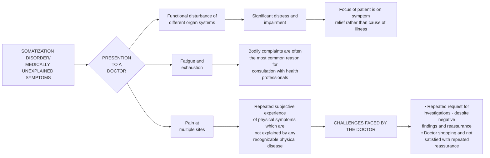
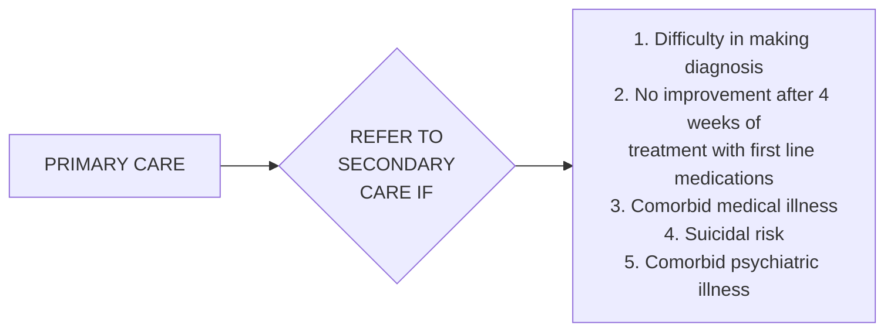
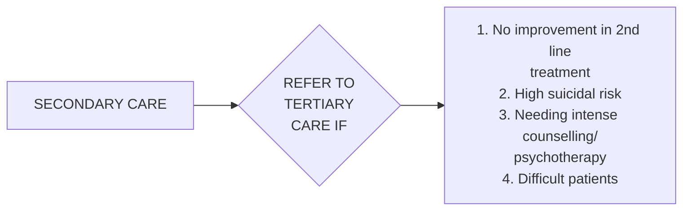

```markdown
October/2019
OF MEDICAL
i
जयते
Department of Health Research
RESEARCH
NEW DELHI
Ministry of Health and Family Welfare, Government of India
/cm²
INDIAN COUNCIL OF
MEDICAL RESEARCH
Serving the
1911
# Standard Treatment Workflow (STW) for the Management of
**SOMATOFORM DISORDER (SD)**
ICD10-F45



## DIAGNOSTIC CRITERIA

### INITIAL ASSESSMENT
*   Detailed clinical examination - to rule out any medical illnesses which might explain the symptoms
*   Complete history of the onset of all symptoms, exacerbating and relieving factors
*   Assessment for any other psychiatric illness such as depression or anxiety disorders

### PSYCHOSOCIAL ASSESSMENT
*   Encourage to talk about psychosocial stressors if any
    *   Individual factors - poor copying skills, anxiety, life events, health anxiety, medical illnesses
    *   Family related factors - Substance use in family, interpersonal relationship with family, financial status
    *   Environmental factors - support system, peer relationship, work environment

### DIAGNOSTIC CRITERIA

A. One or more somatic symptoms that are distressing or result in significant disruption of daily life.

B. Excessive thoughts, feelings, or behaviours related to the somatic symptoms or associated health concerns as manifested by at least one of the following:
1.  Disproportionate and persistent thoughts about the seriousness of one's symptoms
2.  Persistently high level of anxiety about health or symptoms
3.  Excessive time and energy devoted to these symptoms or health concerns

C. Although only one somatic symptom may not be continuously present, the state of being symptomatic is persistent (typically more than 6 months)
A persistent course is characterized by severe symptoms, marked impairment, and long duration (more than 6 months)

Severity:
Mild - only one of the symptoms specified in criterion B is fulfilled
Moderate - Two or more of the symptoms specified in criterion B is fulfilled
Severe - Two or more of the symptoms specified in criterion B are fulfilled, plus there are multiple somatic symptoms (or one very severe somatic symptom)

## MANAGEMENT

Following list include the commonest symptoms
1.  Pain symptoms at multiple sites (such as abdominal, back, chest, dysmenorrhea, dysuria, extremity, head, joint, rectal) is often present
2.  Gastrointestinal sensations (pain, belching, regurgitation, vomiting, nausea)
3.  Abnormal skin sensations (itching, burning, tingling, numbness, soreness) and blotchiness
4.  Sexual and menstrual complaints (ejaculatory or erectile dysfunction, hyperemesis of pregnancy, irregular menses, menorrhagia, sexual indifference) are also common

### PRIMARY CARE
*   Detailed physical examination
*   Management of anemia and nutritional deficiencies
*   Avoid irrational use of pain medications
*   Low dose of antidepressant medications - **Amitriptyline 12.5 mg to 50 mg (max) night dose**
    *   Explain that onset of medication effect will take 2-3 weeks
*   Validate the somatic symptoms
*   Advise to engage in routine activities, physical exercise and relaxation techniques like deep breathing
*   Discuss with family members that the symptom, distress and disability are genuine
*   Strengthen supports
*   Regular follow up



### SECONDARY CARE
*   Investigations - to rule out any medical illnesses that might explain the symptoms
*   Complete history with behavioural observation
*   Use 2nd line medications - **SSRIs (Escitalopram 10-20 mg, Sertraline 50-100 mg, Fluoxetine 20 mg) and SNRIs (Venlafaxine 75 - 150 mg, Duloxetine 30-60 mg)**
*   Combination of two psychotropic medications (might be required if poor response to single medication)
*   Brief counselling
*   Psycho education - focusing on relationship between stress and physical symptoms
*   Relaxation training, regular exercise, yoga and meditation

### TERTIARY CARE
*   Inpatient care if needed
*   Combination of two psychotropic medications (when required)
*   Add on second and third line medications - Duloxetine, Mirtazapine, anticonvulsants (Lamotrigine, Pregabalin). Use of Gabapentin, Carbamazepine if chronic pain symptom predominates
*   Structured Cognitive Behavioural Therapy, Cognitive restructuring, Mindfulness and acceptance based approach
*   Use of alternative medicine approach - Yoga
*   Collaborative approach - involve Physician, Neurology team and Pain Clinic referral (where indicated)
*   Vocational rehabilitation if needed
*   Physical therapies - guided exercise and physiotherapy



## REFERENCES
*   Desai G & Chaturvedi SK. Medically Unexplained Somatic Symptoms & Chronic Pain - assessment & management. A primer for Healthcare professionals. 1st Edition 2017. Paras medical publisher, Hyderabad, India.
*   World Health Organization. (2017). mhGAP training manuals for the mhGAP intervention guide for mental, neurological and substance use disorders in non-specialized health settings - version 2.0 (for field testing). World Health Organization. http://www.who.int/iris/handle/10665/259161.
*   Agarwal V, Srivastava C & Sitholey P. Clinical Practice Guidelines for the Management of Paediatric Somatoform disorders. Indian Psychiatric Society - Practice guidelines 2018.
    Guidance for health professionals on medically unexplained symptoms (MUS) - https://www.rcpsych.ac.uk/pdf/CHECKED%20MUS%20Guidance_A4_4pp_6.pdf
    Jacob KS. A simple protocol to manage patients with unexplained somatic symptoms in medical practice. Natl. Med. J. India. 2004; 17: 326-8

**KEEP A HIGH THRESHOLD FOR INVASIVE PROCEDURES**

This STW has been prepared by national experts of India with feasibility considerations for various levels of healthcare system in the country. These broad guidelines are advisory, and are based on expert opinions and available scientific evidence. There may be variations in the management of an individual patient based on his/her specific condition, as decided by the treating physician. There will be no indemnity for direct or indirect consequences. Kindly visit our web portal (stw.icmr.org.in) for more information.
Indian Council of Medical Research and Department of Health Research, Ministry of Health & Family Welfare, Government of India.
```