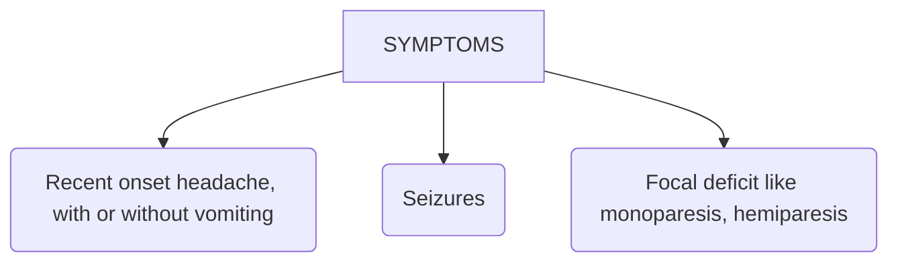
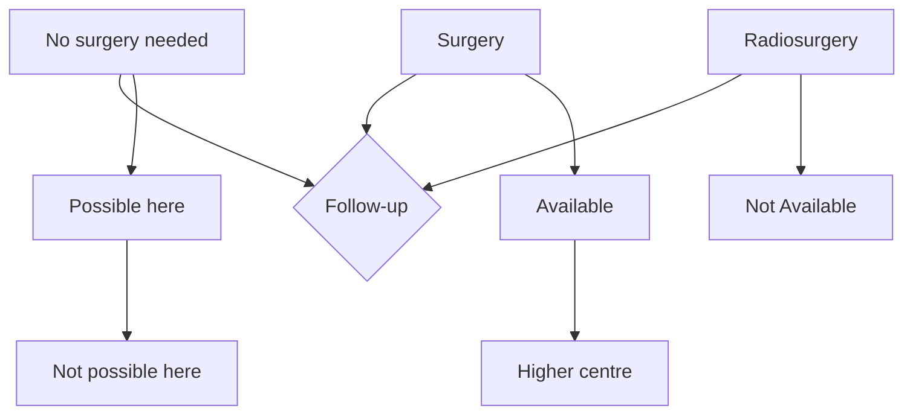

# Standard Treatment Workflow
SUSPECTED BRAIN TUMORS
ICD-C71, D33

July/2024
Brain tumors are seen with equal
frequency in males and females

## DEMOGRAPHICS
Astrocytoma is the commonest brain tumor
in children followed by embryonal tumor

Meningioma is the commonest
tumor in adults followed by glioma

## CLINICAL PRESENTATION OF BRAIN TUMORS



*   Recent onset
headache, with or
without vomiting

*   Seizures

*   Focal deficit like
monoparesis,
hemiparesis

*   Gradual vision
loss (unilateral/
bilateral)

*   Cranial nerve
deficits (eg. hearing
loss)

*   Increasing head-size
(children with open
fontanalle)

**HIGH INDEX OF SUSPICION FOR BRAIN TUMOR WHEN
PATIENT HAS:**

*   Adult onset seizures
*   Progressive symptoms
*   Focal neurological deficits
*   Severe headache
*   Recurrent vomitings
*   Blurring of vision
*   Drowsy or altered sensorium
*   Recurrent seizures
*   Pupillary asymmetry - **Anisocoria**
*   Abnormal posturing
*   Respiratory distress, abnormal breathing patterns
*   Bradycardia and hypertension

**IF RED FLAG SIGNS PRESENT**

*   Give Inj **Dexa 4mg** IV
*   Loading dose of antiepileptic to prevent seizure
*   200ml (to adult patients or as per weight to children) 20% mannitol IV over 30 minutes (only if
systolic BP > 90 mmHg) and refer to higher centre immediately after stabilisation of ABC

## AT PHC LEVEL

```mermaid
graph TD
    A[Seizures] --> B(Metabolic workup (including Serum sodium, Blood sugar));
    C[Headache, vomiting • Focal deficit (monoparesis/ hemiparesis) Vision loss Cranial nerve deficit] --> B;
    B --> D{Negative};
    B --> E{Positive};
    E --> F(• Phenytoinization (if seizures are present), Airway protection (If patient has altered sensorium));
    D --> G[Refer to higher centre for CT Scan];
```

## AT CENTRE WITH MRI SCAN FACILITY & NEUROSURGERY

```mermaid
graph TD
    A[MRI SCAN] --> B{Study D};
    A --> C{Study T};
    B --> D[Medical management];
    C --> E[Refer to higher centre for further workup (Medical College / Cancer Hospital, with neurosurgery and MRI Scan facility];
```

MRI image of Meningioma
MRI image of Glioblastoma

## MEDICAL COLLEGE/CANCER HOSPITAL WITH NEUROSURGERY AND MRI SCAN FACILITY

### GENERAL PRINCIPLES OF MANAGEMENT



## REFERENCES

1.  Jaiswal J, Shastry AH, Ramesh A, Chickabasaviah YT, Arimappamagan A, Santosh V. Spectrum of primary intracranial tumors at a tertiary care neurological
institute: A hospital-based brain tumor registry. Neurol India. 2016 May-Jun;64(3):494-501. doi: 10.4103/0028-3886.181535. PMID: 27147159.
2.  Dasgupta A, Gupta T, Jalali R. Indian data on central nervous tumors: A summary of published work. South Asian J Cancer. 2016 Jul-Sep;5(3):147-53. doi:
10.4103/2278-330X.187589. PMID: 27606302; PMCID: PMC4991137.

**KEEP A HIGH THRESHOLD FOR INVASIVE PROCEDURES**

This STW has been prepared by national experts of India with feasibility considerations for various levels of healthcare system in the country. These broad guidelines are advisory, and are
based on expert opinions and available scientific evidence. There may be variations in the management of an individual patient based on his/her specific condition, as decided by the
treating physician. There will be no indemnity for direct or indirect consequences. Kindly visit the website of ICMR for more information: (icmr.gov.in) for more information. ©Indian
Council of Medical Research, Ministry of Health & Family Welfare, Government of India.
