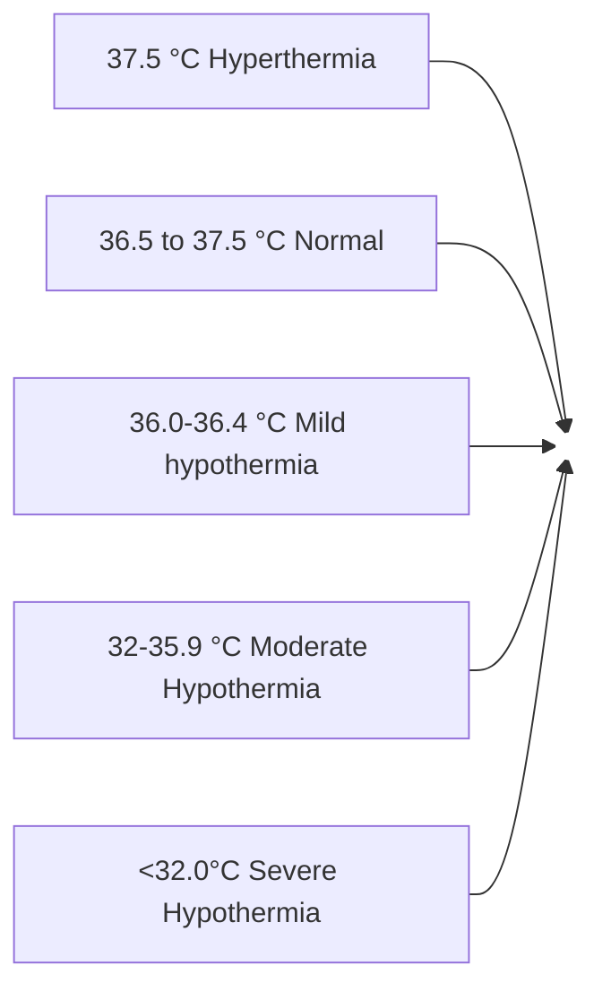

```markdown
July/2020

# Standard Treatment Workflow (STW)
## THERMAL CARE OF NEWBORN
ICD-10-P81.8

*Delivery room - in the first
hour after delivery

*Prior to and during transport

*At the time of admission

*Continuous monitoring for all
babies nursed in radiant
warmer/incubator

*At-risk neonates staying with
mother e.g. - LBW, preterms -
every 4 hourly

Temperature
measurement
for neonates is
mandatory in
the given
settings to
diagnose
hypothermia

STANDARD TECHNIQUE FOR MEASUREMENT OF
TEMPERATURE
* Use a standard digital thermometer
* Place the tip in the neonate's axilla
keeping it parallel to the neonate's trunk
* Read once the beep sound is heard



REGULARLY MONITOR TEMPERATURE AND DOCUMENT

```mermaid
graph LR
    A[Is it <36.5 °C?] -- NO --> B[YES];
    A -- YES --> C[Check for possible cause of hypothermia Assess for risk factors & clinical features of sepsis (Refer to sepsis STW) Check room temperature];
```

### MILD HYPOTHERMIA: 36 °C-36.4 °C

* Ensure room temperature 25-28 °C
* Provide skin-to-skin (STS) contact
* Continue breastfeeding
* If sick, nurse under radiant warmer

* RECHECK TEMPERATURE IN 1 HOUR:
    * If normal, wrap properly
    * If still <36.5 °C then treat as moderate
    hypothermia

### MODERATE HYPOTHERMIA: 32°C-35.9 °C

* Nurse under radiant warmer in servo mode with
temperature probe attached to neonate
* Continue skin-to-skin contact till warmer is
available ensuring mother-neonate dyad is
covered with pre-warmed linen
* Start O₂ if SpO₂<91%
* Check blood sugar, if <45 mg/dL then follow STW
on Hypoglycemia
* Recheck temperature every 15 minutes till it
normalizes
* Continue feeding if stable and abdominal
examination is normal

### SEVERE HYPOTHERMIA: <32 °C

* Manage as per moderate
hypothermia
* Make nil per oral
* Start IV fluids (refer to STW on
Feeds and fluids)
* Give Inj. Vitamin K
* Refer to higher centre if develops
shock or respiratory failure (refer to
STW on Neonatal Transport)

## PREVENTION OF HYPOTHERMIA- MAINTENANCE OF WARM CHAIN

### DELIVERY ROOM (DR)
* Radiant warmer is must in Neonatal Care Corner
* Area should be air draught free
* All DRs should have room thermometer
* Maintain DR temperature >25 °C
* Switch on radiant warmer 20-30 minutes before delivery
* Radiant warmer should be in manual mode with heater
output being 100%
* Pre-warm two to three sterile towels by keeping them
under radiant warmer for 20 minutes
* Practice early skin-to-skin contact for stable neonates
for 1 hour or at least till first breastfeeding
* Dry newborn immediately after birth
* Remove wet linen immediately
* Weighing and checking temperature should be done
after breastfeeding

### POSTNATAL WARDS
* Cover neonate adequately
* Practice rooming-in 24x7
* Avoid air draughts by closing
windows, doors, and switching
off fans and air conditioners
* Start Kangaroo Mother Care
(KMC) as early as possible for
eligible neonate
* Promote exclusive breastfeeding
* Delay bath till after discharge
* Remove wet clothes as early as
possible
* Educate mother regarding
identification of hypothermia
using touch method

### WARM CHAIN DURING TRANSPORT

*Without external heat source:
    * A fully wrapped neonate with cap can
be transported in an adult's arms in a
closed vehicle
    * Neonate can be transported in
skin-to-skin contact
    * Ensure that the neonate is in upright
position and covered snuggly with the
person's clothes and a blanket
*With external heat source:
    * A thermal mattress or a transport
incubator
    * Indigenous insulated boxes can be
used in resource-limited settings
    * No neonate should be placed naked in
a trolley or bed without an external
heat source

Early skin-to-skin contact

Adequate clothing & rooming-in

Kangaroo Mother Care

Radiant warmer

HYPERTHERMIA
Neonates may become hyperthermic due to high environmental temperature and/or overclothing
Differentiate from sepsis: If both trunk & extremities are hot, an environmental cause is likely. If trunk is hot & extremities are cold, consider sepsis
If baby is hyperthermic, move to cooler environment and decrease clothing. Ensure adequate breastfeeding and check weight loss
If still hyperthermic, needs further evaluation

REFERENCES
1. World Health Organization. Maternal Health and Safe Motherhood Programme & Meeting of Technical Working Group on Thermal Control of the Newborn (1992
:Geneva, Switzerland). (1993). Thermal control of the newborn: a practical guide. World Health Organization. https://apps.who.int/iris/handle/10665/60042

HYPOTHERMIA IN NEWBORNS INCREASES MORTALITY. PREVENT HYPOTHERMIA - MAINTAIN WARM CHAIN
This STW has been prepared by national experts of India with feasibility considerations for various levels of healthcare system in the country. These broad guidelines are advisory, and
are based on expert opinions and available scientific evidence. There may be variations in the management of an individual patient based on his/her specific condition, as decided by
the treating physician. There will be no indemnity for direct or indirect consequences. Kindly visit the website of DHR for more information: (stw.icmr.org.in) for more information.
Department of Health Research, Ministry of Health & Family Welfare, Government of India.
```