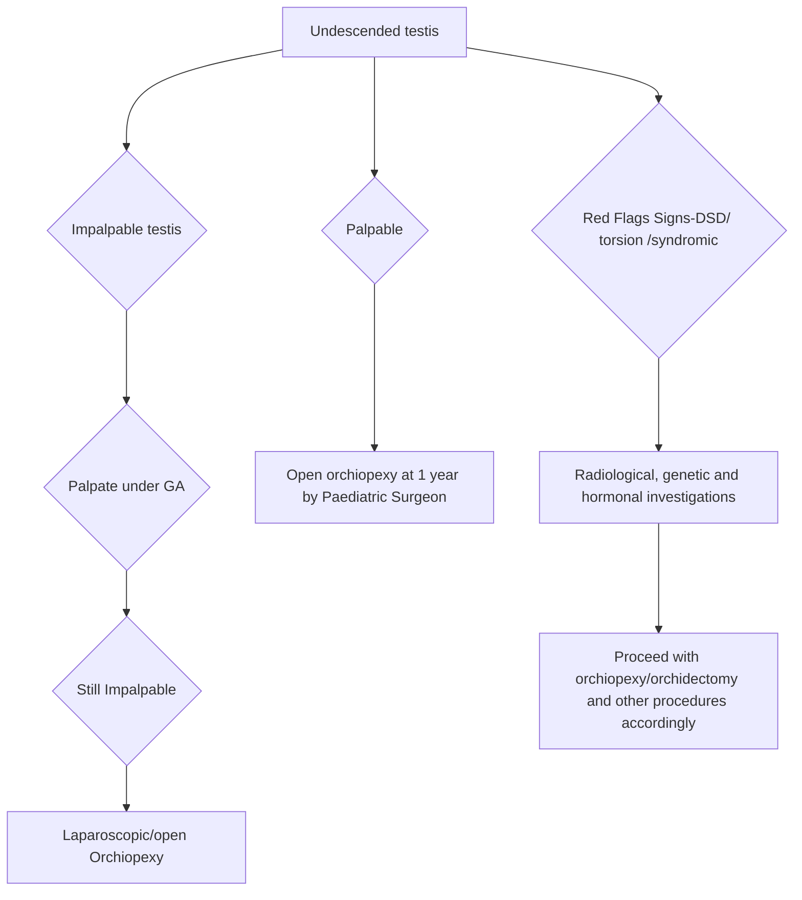

```markdown
# Standard Treatment Workflow (STW)
UNDESCENDED TESTIS (CRYPTORCHIDISM)
ICD-10-Q53.9

## WHAT IS CRYPTORCHIDISM?
*   Absence of one or both testis in the scrotum
*   Cryptorchidism can be:
    *   True undescended testis arrested along normal line of descent
    *   Ectopic Testis: arrested outside line of normal descent

## WHAT TO ASK?
*   Testis are absent in scrotum since birth or present initially and later disappeared
*   Any history of torsion-redness/ pain or bulge in the inguinal region/ lower abdomen

## WHAT TO SEE?
*   Testis palpable anywhere along normal line of descent:
    *   Superficial inguinal ring, Inguinal canal, Deep inguinal ring
*   Testis palpable outside the normal line of descent:
    *   Pubic tubercle, Perineum, Thigh, Opposite scrotum, Penis
*   Testis not palpable (impalpable undescended testis)
*   Associated anomalies: hernia, hydrocele, hypospadias, ambiguous genitalia, poorly developed ipsilateral scrotum, contralateral testicular hypertrophy
*   Rule out retractile testis (which does not require surgery): If testis manoeuvrable into the scrotum and stays there by itself. Needs regular follow up to confirm continuing descended position of testis

## RED FLAGS REQUIRING SPECIAL MANAGEMENT
*   Possibility of **Disorders of Sexual Differentiation (DSD)** to be considered if:
    *   Bilateral undescended testis with hypospadias
    *   Unilateral undescended testis with severe hypospadias
    *   Undescended testis with torsion - red painful lump in the undescended testis
    *   Undescended testis with large inguinal hernia

## INVESTIGATIONS
### ESSENTIAL INVESTIGATIONS
*   No investigation is essential for diagnosis or localisation of testis.
*   Routine blood and urine investigations required for anaesthetic fitness

### OPTIONAL INVESTIGATIONS
*   Hormonal test (HCG stimulation test for bilateral undescended testis)
*   MRI scan in cases suspected to be DSD
*   Diagnostic laparoscopy in impalpable UDT (can be combined with therapeutic procedure)

### SPECIAL SITUATIONS
*   **DSD**: hormonal assay, USG, genitogram, karyotyping
*   Syndromic child: genetic assessment, karyotyping, hormonal assays
*   Undescended testis with torsion: USG Doppler

## MANAGEMENT
Guiding Principle: Diagnosis made at birth and reconfirmed at 3 and 6 months.
Further management if descent has not occurred.

### UNDESCENDED TESTIS MANAGEMENT FLOWCHART


### MANAGEMENT AT

|                         | PHC/DISTRICT HOSPITAL                                                                                                                                                                                                                                                                                                                                              | TERTIARY CARE HOSPITAL                                                                                                                                                                                                                                                                                                                                     |
|-------------------------|-------------------------------------------------------------------------------------------------------------------------------------------------------------------------------------------------------------------------------------------------------------------------------------------------------------------------------------------------------------------|--------------------------------------------------------------------------------------------------------------------------------------------------------------------------------------------------------------------------------------------------------------------------------------------------------------------------------------------------------------------|
|                         | Diagnose in newborn and reconfirm at 3 and 6 months:                                                                                                                                                                                                                                                                                                          | Diagnose or confirm diagnosis (if referred) early                                                                                                                                                                                                                                                                                                 |
|                         | • If uncomplicated, counsel regarding timing of surgery and red flags                                                                                                                                                                                                                                                                                         | Carry out open orchiopexy for palpable testis and laparoscopic exploration for impalpable testis under general anaesthesia at appropriate age                                                                                                                                                                                                  |
|                         | • Basic lab investigations for anaesthesia fitness                                                                                                                                                                                                                                                                                                              |                                                                                                                                                                                                                                                                                                                                                    |
|                         | Refer to centre with paediatric surgeon and paediatric anaesthesia facilities for surgery between 6m-1 yr                                                                                                                                                                                                                                                        |                                                                                                                                                                                                                                                                                                                                                    |
|                         | Assess for special situations - if present, refer immediately to centre with paediatric surgeon                                                                                                                                                                                                                                                                  |                                                                                                                                                                                                                                                                                                                                                    |
|                         | After surgery follow-up atl month, 3 month, 1 year and annually till puberty                                                                                                                                                                                                                                                                                      |                                                                                                                                                                                                                                                                                                                                                    |
| Surgery (orchiopexy)    |                                                                                                                                                                                                                                                                                                                                                                  | Identify red flag situations and investigate, counsel and operate accordingly                                                                                                                                                                                                                                                                  |
| between 6 months- 1 year |                                                                                                                                                                                                                                                                                                                                                                  | Follow-up- immediate and first week follow up                                                                                                                                                                                                                                                                                                      |
| Palpable testis         | open orchiopexy under general anaesthesia (may be done as day care procedure)                                                                                                                                                                                                                                                                                   |                                                                                                                                                                                                                                                                                                                                                    |
| Impalpable              | Diagnostic laparoscopy: Absent testis- no intervention; Atrophic testis: orchidectomy; if vas and vessels going into the deep inguinal ring: inguinal exploration; intra- abdominal tests: single or two stage orchidopexy. Inguinal exploration if access to laparoscopy is not available                                                                      |                                                                                                                                                                                                                                                                                                                                                    |

### SPECIAL SITUATIONS
*   **DSD**- needs complete evaluation and treatment planning based on genotype, phenotype and psychological counselling
*   Undescended testis with torsion - needs immediate exploration and orchiopexy/orchidectomy
*   Undescended testis with large inguinal hernia- needs early surgery before waiting for 6 months due to the risk of obstructed hernia

### FOLLOW UP
*   Open orchiopexy- Discharge same evening/ next day
*   Laparoscopic orchiopexy- Discharge within 24-48 hours
*   Further FU
    *   1st week- local edema/ hematoma/tenderness
    *   1st, 3rd month- ensure testis position in scrotum and normal size
    *   Annual examination – ensure position and adequate growth till adulthood
    *   Adult FU for fertility status

## ABBREVIATIONS
*   UDT: Undescended testes
*   DSD: Disorders of sexual differentiation
*   FU: Follow up
*   GA: General anaesthesia

**KEEP A HIGH THRESHOLD FOR INVASIVE PROCEDURES**

This STW has been prepared by national experts of India with feasibility considerations for various levels of healthcare system in the country. These broad guidelines are advisory, and are based on expert opinions and available scientific evidence. There may be variations in the management of an individual patient based on his/her specific condition, as decided by the treating physician. There will be no indemnity for direct or indirect consequences. Kindly visit the website of DHR for more information: (stw.icmr.org.in) for more information. Department of Health Research, Ministry of Health & Family Welfare, Government of India.
```