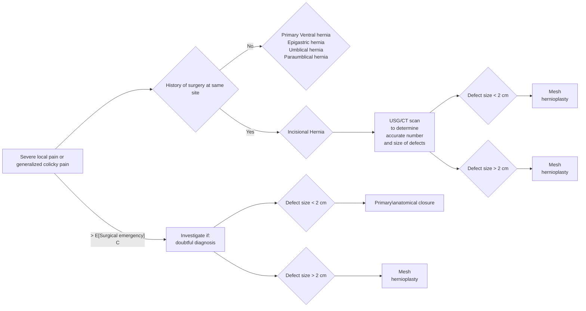

```markdown
July/2022

सत्यमेव जयते
Department of Health Research
Ministry of Health and Family Welfare, Government of India

OF MED
अनुसंधान
EDICAL R
icma
INDIAN COUNCIL OF
MEDICAL RESEARCH
Serving the nation since 1911
NEW DELHI

# Standard Treatment Workflow (STW)
## INCISIONAL/ VENTRAL HERNIA
ICD-10-K43.9

Symptoms:
1) Swelling on anterior abdominal wall
2) Cough impulse
3) Reduces on lying down (especially during early phase)



*   Generally indicative of complications:
    *   **Obstruction**
    *   **Incarceration**
    *   **Strangulation**

## RED FLAG SIGNS NEEDING REFERRAL TO HIGHER CENTRE

|      |                                                                    |
| :--- | :----------------------------------------------------------------- |
| 1)   | Large hernias (>8-10cm), requiring component separation             |
| 2)   | Parastomal hernias                                                 |
| 3)   | Comorbidities                                                    |
| 4)   | Loss of domain                                                     |
| 5)   | Non availability of mesh, for hernias >2cm in size - to be checked |

## POST OP COMPLICATIONS

*   Seroma
*   Infection, including mesh infection
*   Skin necrosis
*   Recurrence

Mesh
placement:
sublay manner
preferred. Drains
recommended

## CLINICAL EVALUATION

1.  Swelling on anterior abdominal wall
2.  Cough impulse +
3.  Reduces on lying down
4.  Severe local pain or generalized colicky pain or fever: generally sign of complications
    *   Colicky abdominal pain and irreducible hernia: intestinal obstruction. Immediate surgery for relief of obstruction. Hernia repair
        may or may not be done at same time
    *   Local redness and severe pain with fever: strangulation. Immediate surgery is needed, and the hernia repair should be deferred
        for a later date
5.  Rule out other diseases or complications on history, particularly related to respiratory system (as raised intra-abdominal pressure can
    worsen the respiratory condition)
6.  Features of swelling: Reducibility of hernia, size and number of defects

## MANAGEMENT

*   In general, ventral hernias should be repaired, as untreated hernias are at risk of life threatening complications.
    Exceptions: untreated ascites especially with portal hypertension, severe comorbidities precluding safe surgery, large hernias where
    repair may cause more morbidity such as bowel injury.
*   Small midline primary hernias less than 2cm diameter may be closed primarily (anatomical repair). Larger hernias and all incisional
    hernias should undergo mesh reinforcement

## CHOICE OF REPAIR

| DEFECT SIZE        | PROCEDURE                                                                                                                                                 |
| :----------------- | :-------------------------------------------------------------------------------------------------------------------------------------------------------- |
| < 2cm              | Anatomical repair, IPOM (Open Intraperitoneal onlay mesh)                                                                                                 |
| 2-4 cm             | IPOM, open sublay repair, onlay repair                                                                                                                     |
| 4-8 cm             | IPOM plus, open sublay repair, pnlay repair                                                                                                                 |
| More than 8 cm     | Component separation will be required. Can be anterior component separation or posterior component separation, depending on available expertise. Botox can be used as an adjunct in case of loss of domain |
| Subxiphoid hernias | Mesh overlap will extend below diaphragm in case of IPOM or extraperitoneal repairs                                                                         |
| Suprapubic hernias | Mesh should extend behind pubic bones in case of extraperitoneal repair. IPOM should be done after dividing peritoneum so that lower end of mesh is in retropubic space                                                |
| Parastomal hernia  | If stoma can be closed, then perform delayed repair, In case of permanent stoma, a 'Sugarbaker' technique is generally advisable                                                                                   |

*   Refer to higher centre
    *   if defect size > 6 cms as it might need component separation
    *   uncommon site, eg subxiphoid, suprapubic, large lateral hernias
    *   loss of domain
*   Laparoscopic hernia repair suitable for
    *   defect size <6 cms
    *   absence of skin complications

**KEEP A HIGH THRESHOLD FOR INVASIVE PROCEDURES**

This STW has been prepared by national experts of India with feasibility considerations for various levels of healthcare system in the country. These broad guidelines are advisory, and
are based on expert opinions and available scientific evidence. There may be variations in the management of an individual patient based on his/her specific condition, as decided by
the treating physician. There will be no indemnity for direct or indirect consequences. Kindly visit the website of DHR for more information: (stw.icmr.org.in) for more information.
Department of Health Research, Ministry of Health & Family Welfare, Government of India.
```